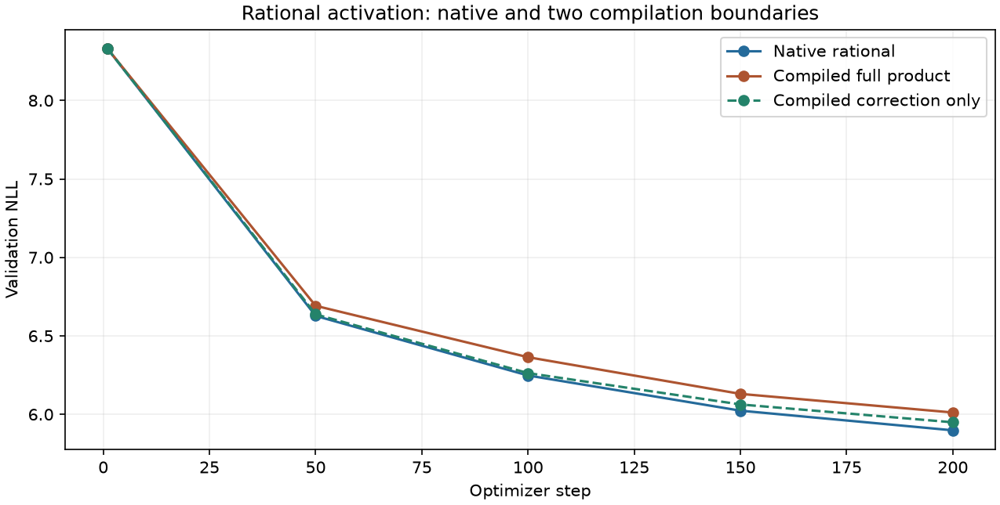

# Correction-only compilation: full training repeat

**Frozen decision: FAIL.** The correction-only repeat finishes at NLL 5.949104037, versus native rational 5.898002606 (+0.866419%). Allocated training peak is 714.704 MiB.

This is a fresh 200-step, seed-17, BF16 WikiText run from the same initialization, with 409,600 sampled training tokens and 322,688 validation targets. Only the rational correction is compiled; SiLU and gate multiplication retain native forward/backward. All learning rates, optimizer groups, parameter/data hashes and token counts are checked. The earlier full-product failure is retained separately.

| Execution | Final NLL | Peak allocated MiB |
|---|---:|---:|
| Native rational | 5.898002606 | 883.174 |
| Compiled full product | 6.011564258 | 714.954 |
| Compiled correction only | 5.949104037 | 714.704 |

## Frozen gates

| Gate | Result |
|---|---|
| at_least_70_percent_fewer_ffn_weights | PASS |
| beats_calibrated_narrow | FAIL |
| within_one_percent_full_swiglu | PASS |
| memory_within_ten_percent_full_swiglu | PASS |
| within_one_percent_full_gelu | FAIL |
| memory_within_ten_percent_full_gelu | PASS |
| at_least_point_two_percent_better_than_own_base | PASS |
| within_point_two_percent_native_rational_nll | FAIL |

Correction-only minus native NLL at steps 1, 50, 100, 150, 200: `[0.0, 0.00993271017774422, 0.015187344632419553, 0.039612387059841936, 0.0511014309254767]`. The maximum absolute recorded trajectory difference is 0.051101431. This is measured trajectory agreement at these checkpoints, not a mathematical long-run guarantee.

The source verifier confirms identical training-loop AST, initial validation within 1e-7, unchanged warmup parameters, zero optimizer updates or sampling during compile warmup, matching optimizer groups and final sampling RNG, all finite recorded diagnostics and an intact archived checkpoint. Native diagnostics temporarily bypass compilation and restore it; validation uses the selected backend. Compilation overhead is separately recorded and excluded from steady training peaks. Serial timing is not paired speed evidence.

The [local execution audit](activation_correction_execution_results.md) reduced measured gradient relative L2 from 0.00078429 to 3.95e-8 by changing the compilation boundary. The full repeat is the stronger evidence for this implementation. It does not establish compiler behavior across devices, seeds, precision modes, scales or future software versions.

[Frozen repeat plan](activation_correction_repeat_plan.md), [raw verification](../results/activation_correction_repeat_v1/result.json), [native shape study](learnable_activation_results.md), and [simpler affine result](affine_activation_results.md). The original gold research goal still needs independent seeds, convergence, scale/corpus controls, throughput and credible novelty.
