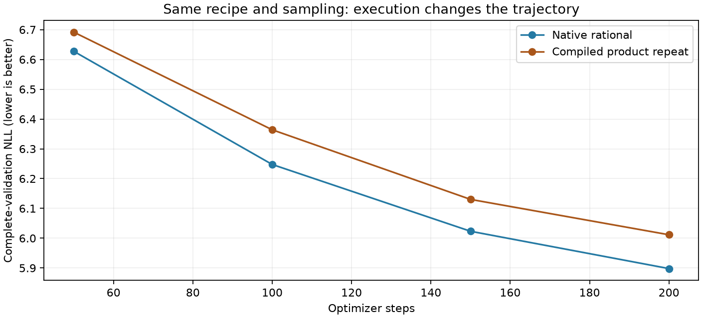

# Rational activation: compiled full-training repeat

**The frozen full-training repeat is FAIL.** Compiled-product training finishes at NLL 6.011564, versus native rational 5.898003 (+1.925%). Its memory limit passes, but the quality improvement does not survive this execution change.

Read the [frozen repeat plan](activation_training_repeat_plan.md), [native activation results](learnable_activation_results.md), [isolated memory audit](activation_execution_results.md) and [raw repeat checks](../results/activation_training_repeat_v1/result.json).

| Execution | Final NLL | Allocated training peak MiB | FFN weights |
|---|---:|---:|---:|
| Native rational | 5.898003 | 883.17 | 2,801,984 |
| Compiled product repeat | 6.011564 | 714.95 | 2,801,984 |

## Frozen decisions

| Gate | Decision |
|---|---|
| at least 70 percent fewer ffn weights | PASS |
| beats calibrated narrow | FAIL |
| within one percent full swiglu | FAIL |
| memory within ten percent full swiglu | PASS |
| within one percent full gelu | FAIL |
| memory within ten percent full gelu | PASS |
| at least point two percent better than own base | FAIL |
| within point two percent native rational nll | FAIL |

## Reproduction checks

The training-step loop AST matches the archived native loop. Model dimensions, optimizer groups, sampling configuration, train/validation hashes and token budgets match. All initial parameters survive compilation warmup unchanged, initial complete-validation NLL matches, and the final sampling RNG state matches the native run. Source archives, real parameter counts, all recorded gradients/activations and the final checkpoint were checked. No source checkpoint was overwritten.

Compiler preparation uses one zero-token forward/backward and zero optimizer updates. It consumes no sampling RNG. Recorded preparation time is 16.17 seconds and allocated peak through that stage is 640.15 MiB. Training peak resets after initial validation/diagnostics, consistent with the shared protocol. Diagnostics temporarily use native pointwise functions and restore compiled execution; recorded validation uses the compiled product.

## What the failure means

The earlier isolated audit had exact sampled logits, global gradient relative L2 error 0.000784 and activation-gradient error 0.000169, and passed full-validation fidelity at the selected checkpoint. Those local checks did not ensure equivalent optimization over 200 updates. The full trajectory is decisive for accepting an execution backend for training.

Rounding/reduction differences are a plausible contributor, but no particular compiler operation has been isolated as the cause. The limited activation derivative bounds do not bound the complete training trajectory. The native rational result remains a single-seed quality finding with excessive eager memory. The compiled product remains an optional experimental backend; it is not the recommended training recipe and earns no longer-budget promotion.

## Simpler mechanism to test next

A post-hoc straight-line fit to each native rational correction captures 99.768% of its squared magnitude on a uniform [-6,6] grid. Residual RMS after that fit is 0.000833 versus correction RMS 0.017315. The [shape audit](../results/verification/activation_affine_shape_audit_v1.json) is neither data-weighted nor a retrained affine control. Together with the 0.00562% reset cost, it motivates testing a simple learned affine correction and isolating compilation of only that correction before attributing the gain to flexible curvature.

These experiments establish neither a new primitive nor multi-seed, convergence, broad-transfer or full-network stability claims.
