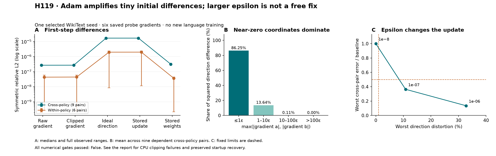

# H119 — Adam first-update sensitivity

**The fixed near-zero amplification prediction passes on this fixture. The
overall numerical audit fails its CPU clipping gate. Neither larger-epsilon
ablation passes the fixed low-distortion criterion.** No training recipe is
promoted, and H117's WikiText/two-corpus quality failure remains failed.

Across all nine cross-policy pairs, tiny clipped-gradient differences grow
**61.21–63.51x** in Adam's ideal first update direction.
At least **99.888%** of squared direction difference comes from coordinates
whose two gradient magnitudes are at most 10 epsilon. The independent NumPy
calculation agrees with every reported pair and distortion metric.

The resulting direction difference is still only **0.00164–0.00171% relative L2**.
This is evidence of a local amplification mechanism, not exploding gradients,
a convergence theorem or proof of the later NLL gap's cause.

## Question, inputs and controls

[H118](training_variability_results.md) measured inconsistent magnitudes of the
failed WikiText seed101's chunked/native gap across repeat executions. The
[prospective plan](adam_update_sensitivity_plan.md) asks whether Adam can amplify
the tiny initial differences before any long-horizon feedback occurs.

Six saved initial **probe** gradients are used: native and chunked FP32 from
H117 (N0/C0) and H118 repetitions 1 and 2 (N1/C1/N2/C2). These are repeated
executions of one deliberately selected seed, not six independent training
seeds or nine independent samples. No gradient, initial state or batch is
regenerated. Probe gradients need not be bitwise identical to the actual
first training gradients; these disposable steps are counterfactuals.

Each input is replayed once on CPU and once on CUDA using the maintained
Transformer and parameter groups, identical saved step-zero weights and empty
Adam state. The model has 9,099,648 parameters, including 2,801,664 FFN parameters
(width384/FFN456/eight layers/six heads/vocabulary4096). Native AdamW retains
LR0.0006, betas(0.9,0.95), epsilon1e-8, matrix decay0.1/no norm-weight decay and
global norm clipping1. All weights, gradients and moments are FP32. Automatic
foreach/fused selection stays unchanged. Four CPU threads and disabled TF32
match the UV-managed Python3.12.9/PyTorch2.14.0+cu132 environment on the RTX4070
Laptop GPU. CPU and CUDA are allowed to choose their native kernels.

## Derivation and its practical limit

With empty moments, exact arithmetic and bias correction, the first adaptive
direction and decoupled weight update are

    h_e(g) = g / (|g| + e)
    theta_1 = (1 - eta * lambda) theta_0 - eta * h_e(g).

For e>0, the derivative (also continuous at zero) is

    h'_e(g) = e / (|g| + e)^2 <= 1/e.

For two gradients of the same sign, subtraction gives exactly
`|h_e(a)-h_e(b)| = e|a-b| / ((|a|+e)(|b|+e))`. The derivative bound and mean
value theorem give a global 1/e Lipschitz bound. Near zero that absolute
sensitivity can be high; far from zero the normalized direction saturates.
The measured relative amplification also depends on the norms in its denominator.

This follows directly from existing [Adam](https://arxiv.org/abs/1412.6980) and
[AdamW](https://docs.pytorch.org/docs/2.14/generated/torch.optim.AdamW.html)
equations. It is not a new optimizer or theorem. Native moment arithmetic and
rounding when subtracting from FP32 weights are checked separately; a bound
on this one ideal step cannot explain an 800-step trajectory by itself.

## All cross-policy pairs at the actual epsilon

Distance is `||a-b|| / max((||a||+||b||)/2, 1e-12)`, computed on CPU in FP64.
Clipped gradients here are the ones produced by CUDA norm clipping. The fixed
prediction requires amplification>=10 and near-zero error share>=50% in every
one of the nine cross-policy pairs. All nine pass both thresholds.

| Pair | Clipped-gradient distance | Ideal-direction distance | Amplification | Error share at <=10 epsilon |
|---|---:|---:|---:|---:|
| N0 / C0 | 2.688729e-07 | 1.676856e-05 | 62.366x | 99.8906% |
| N0 / C1 | 2.688729e-07 | 1.676853e-05 | 62.366x | 99.8906% |
| N0 / C2 | 2.685933e-07 | 1.644173e-05 | 61.214x | 99.8880% |
| C0 / N1 | 2.687152e-07 | 1.706703e-05 | 63.513x | 99.8966% |
| C0 / N2 | 2.688937e-07 | 1.687156e-05 | 62.744x | 99.8914% |
| N1 / C1 | 2.687150e-07 | 1.706702e-05 | 63.513x | 99.8966% |
| N1 / C2 | 2.684085e-07 | 1.673388e-05 | 62.345x | 99.8941% |
| C1 / N2 | 2.688937e-07 | 1.687153e-05 | 62.744x | 99.8914% |
| C2 / N2 | 2.686248e-07 | 1.655118e-05 | 61.614x | 99.8891% |

| Metric, nine dependent pairs | Mean | Median | Sample variance (n-1) |
|---|---:|---:|---:|
| clipped_distance | 2.6873223e-07 | 2.6871519e-07 | 2.8494939e-20 |
| direction_distance | 1.6793447e-05 | 1.6768556e-05 | 4.3634525e-14 |
| amplification | 62.491241 | 62.366103 | 0.58377065 |
| near_zero_error_share | 0.99892049 | 0.99891379 | 9.5063806e-10 |

These variances are descriptive, not confidence intervals. Every cross-policy
pair has only three coordinates with opposite nonzero signs out of 9,099,648.
The near-zero result is not a count of sign flips or a claim that all small
gradients are unstable. All six within-policy pairs, four error-contribution
bins, counts and both larger epsilons are retained in the
[45-row table](../results/adam_update_sensitivity_v1/direction_pairs.csv.gz) and
[complete analysis](../results/adam_update_sensitivity_v1/analysis.json.gz).

Realized CUDA update distances are
1.644605e-05–1.707131e-05;
the final stored-weight distances are
3.074448e-07–3.191335e-07.
Updates are subtracted from the shared initial weights in FP64 for this
comparison. A large amplification ratio is compatible with small absolute
changes in stored parameters.

## Larger epsilon: reduced discrepancy, changed update

Only the closed-form direction is evaluated at alternative epsilon. There
are no native optimizer steps or language runs with those alternatives.
The criterion requires all cross-pair errors to fall by at least half AND all
six directions to remain within 1% of their epsilon1e-8 direction.

| Epsilon | Worst error / baseline | Worst direction distortion | Fixed criterion |
|---|---:|---:|---|
| 1e-07 | 0.364210 | 10.7935% | FAIL |
| 1e-06 | 0.135034 | 32.7639% | FAIL |

Both alternatives reduce discrepancy but change the direction too much.
Reject them as low-distortion fixes under this definition. This does not
prove that larger epsilon would hurt or help language quality; that was not
measured. Installing one in the maintained trainer is not justified here.

## Independent numerical audit: retain the failed gate

A separate NumPy FP64 implementation checks all 12 saved states, first/second
moments, clipping and formulas. It independently recomputes all 45 direction
pairs, 12 distortions, 15 raw/native pairs and six CPU/CUDA comparisons.
Every metric agrees within the fixed relative1e-8/absolute1e-12 tolerances;
coordinate counts agree exactly. All tensors are finite and all moment steps
are exactly one. Nine elementary scalar formula witnesses pass.

| Device, six cases | Worst clipping relative error | Worst parameter relative error | Worst parameter absolute error |
|---|---:|---:|---:|
| CPU | 6.872452e-06 | 3.232277e-08 | 5.963131e-08 |
| CUDA | 3.008198e-08 | 3.231222e-08 | 5.964743e-08 |

All six CUDA cases pass every numerical gate. **All six CPU cases fail only
the clipping tolerance of 1e-6**, reaching about 6.87e-6 relative error versus
FP64 clipping. Thus the combined audit is **FAIL**, even though all 12 parameter
updates pass their relative1e-6/absolute2e-7 bounds and both moments pass their
relative1e-6 bound (worst moment error 4.011384e-08). The native step agrees
with the formula evaluated on its own saved clipped gradient; that does not
make its clipping agree with the FP64 reference.

No tolerance is relaxed and no CPU step is repeated. CPU/CUDA clipping differs
by about6.89e-6, while their realized updates differ by only about4.9e-7. This
shows that a near-uniform clipping-scale discrepancy need not be amplified in
the same way as coordinatewise differences near zero. This explanation is an
inference from the measured maps, not an independently isolated causal test.
[PyTorch's numerical accuracy guidance](https://docs.pytorch.org/docs/2.14/notes/numerical_accuracy.html)
also does not promise bitwise agreement across devices or reduction kernels.

## Failure, continuation and complete resource accounting

The original stage completed six CPU steps, then stopped because CUDA was
already initialized when the CPU-to-GPU guard expected otherwise. The original
log, traceback, exit1 and CPU artifacts are preserved. The separately frozen
[recovery plan](adam_update_sensitivity_recovery_plan.md) imported the original
`run_case` unchanged into a fresh process and executed only the six remaining
GPU cases. No scientific recipe or case was repeated.

The pinned installed Adam implementation calls an accelerator capture-health
check, whose installed optimizer implementation queries the accelerator's
current stream even for a CPU optimizer. This is a source-supported explanation
for initialization, not an instrumentally isolated runtime diagnosis.

Total: **12 disposable native optimizer steps, zero language-training updates,
zero forwards, zero backwards, zero training targets and zero validation scores**.
There are 24 new tensor artifacts, 24 recorded CUDA allocator intervals and
seven zero-allocation/reservation CUDA boundaries. The original stage's overall
wall time and CPU-phase allocator peaks are unrecorded. Continuation wall time
is 8.380s, excluding interpreter startup.

| CUDA input | Peak allocated MiB | Peak reserved MiB | Single unwarmed optimizer step ms |
|---|---:|---:|---:|
| N0 | 176.425 | 202.000 | 95.637 |
| C0 | 176.425 | 202.000 | 10.031 |
| N1 | 176.425 | 202.000 | 9.559 |
| C1 | 176.425 | 202.000 | 10.083 |
| C2 | 176.425 | 202.000 | 9.837 |
| N2 | 176.425 | 202.000 | 9.305 |

These steps do not include language data, attention, backward or evaluation.
They are not whole-job memory or inference benchmarks and cannot establish
new VRAM savings. Case timing includes one-time native overhead; it is not a
performance comparison. Driver/context allocation is excluded. CPU memory is
null/unmeasured, not zero.

## Decision and next research question

Keep the scoped first-step amplification observation and reject the tested
low-distortion epsilon remedies. Keep the CPU clipping audit failure and the
unchanged old quality failure. Initial-gradient agreement remains insufficient
to establish training equivalence. No new activation, layer, trainable
parameter reduction or literature-priority claim results from this study.

Further unchanged 800-step repeats are not allocated. The useful next memory
question is how much of the remaining complete-update peak comes from
optimizer temporaries versus persistent moments. PyTorch documents additional
foreach temporary storage; a separately planned phase-by-phase profile can
test whether this is a worthwhile target before a changed optimizer or another
training sweep. This is a proposed next diagnostic, not a result or allocation.

All 145 original frozen source hashes and 61 maintained hashes remain intact;
the recovery has a separate frozen manifest. The earlier 116-test pass remains
historical. New research scripts pass lint; maintained tests were not rerun.
The broad lower-VRAM/quality and architectural goals remain open.

[Plan](adam_update_sensitivity_plan.md) ·
[source guide](../results/adam_update_sensitivity_v1/source/README.md) ·
[summary](../results/adam_update_sensitivity_v1/summary.json) ·
[numerical audit](../results/adam_update_sensitivity_v1/audit.json.gz) ·
[evidence-verification receipt](../results/verification/adam_update_sensitivity_final_v1.json).
The final receipt checks faithful accounting; a passing receipt does not turn
the explicitly failed CPU clipping gate into a passing numerical qualification.
