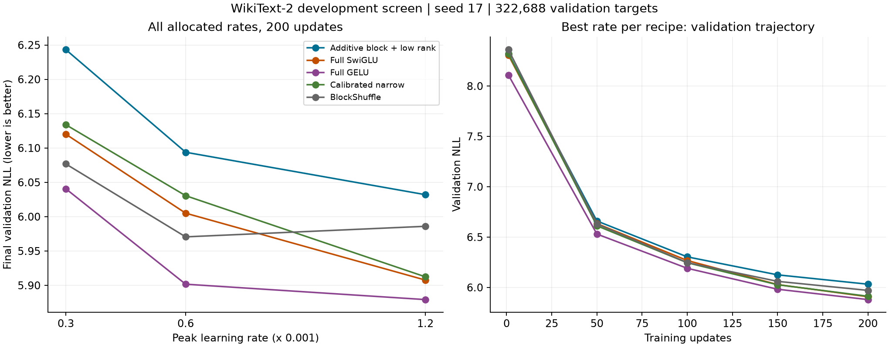

# H061: additive block/low-rank language screen

**REJECTED at the frozen 200-step budget; retired from the active shortlist.**
The selected recipe passes parameter and memory limits but fails every quality
gate. It earns no longer run, extra learning-rate search, or activation repair.
The mathematical construction remains valid within its stated scope.

## All allocated trials

Exactly three new WikiText-2 trials use seed 17, 200 updates, batch 16 and
context 128. The fixed model has width 384, eight layers, hidden width 1024,
eight blocks and rank 48. Initialization, perturbation LR multipliers, parameter
decay and native BF16 gate recomputation follow the
[frozen plan](additive_block_lowrank_screen_plan.md).

| Peak LR | Final validation NLL | Allocated peak MiB | Clipped updates | Training tokens/s |
|---:|---:|---:|---:|---:|
| 0.0003 | 6.243238495 | 617.806 | 54.5% | 25,983 |
| 0.0006 | 6.093808793 | 617.806 | 31.0% | 25,696 |
| 0.0012 | 6.032030429 | 617.806 | 10.0% | 25,580 |

Each trial samples 409,600 training targets: 1,228,800 total new targets and
600 optimizer updates. Every evaluation scores the same 322,688 validation
targets, including the nine-window final batch. All three finish on their first
training attempt. Histories, layer diagnostics, weights and optimizer moments
are finite; checkpoint steps and final CUDA sampler hashes match the protocol.
Initial NLL is identical across rates (8.386197395). Official test is unscored.

## Selected and matched comparisons

Each recipe selects its lowest final validation NLL from the same three-rate
grid. Additive selects the upper boundary, 0.0012; this does not establish an
optimal rate. The full and narrow controls select 0.0012, plain BlockShuffle
selects 0.0006. The twelve historical control artifacts are reused after
compatibility verification; they are not new training cells.

| Selected control | Control NLL | Additive relative NLL cost | Control peak MiB |
|---|---:|---:|---:|
| full_swiglu | 5.907693898 | +2.105% | 702.187 |
| full_gelu | 5.879277652 | +2.598% | 656.624 |
| calibrated_narrow | 5.912433568 | +2.023% | 516.280 |
| blockshuffle | 5.970604333 | +1.029% | 714.118 |

Both full-control 1% quality allowances fail, and additive loses to calibrated
narrow. The separate 0.2% narrow margin also fails. Additive loses to all four
controls at every matched rate as well:

| Matched peak LR | Full SwiGLU cost | Full GELU cost | Narrow cost | BlockShuffle cost |
|---:|---:|---:|---:|---:|
| 0.0003 | +2.011% | +3.353% | +1.782% | +2.739% |
| 0.0006 | +1.477% | +3.255% | +1.049% | +2.064% |
| 0.0012 | +2.105% | +2.598% | +2.023% | +0.769% |

[Export SVG](figures/additive_block_lowrank_screen.svg). The right panel starts
at update 1 and shows each recipe at its selected rate; it is not a convergence
comparison. These are validation-selected, one-seed development results.

## Resources and interpretation

The candidate has **2,801,664 FFN weights**, **9,099,648 total weights**:
**70.3125% FFN reduction**, but **42.1700% total-model reduction**. Its measured
training allocation is **617.806 MiB**, below both full controls and BlockShuffle,
but above narrow. Both 110% full-control memory limits pass.

Logical FFN forward matrix work is 5,603,328 FLOPs/token, compared with
18,874,368 for the full FFNs. The model matrix estimate is 19,759,104 versus
33,030,144; these counts exclude norms, softmax, nonlinearities, loss and
optimizer work. They do not establish a runtime advantage.

The table reports timed training excluding the first ten updates, evaluation
and checkpoints. Historical sessions have visibly different timing conditions;
their throughput is not used for a speedup claim. H060 already finds slower
synthetic steps than dense controls in the same session. Full-sequence forward
timing is also saved in metrics and is not autoregressive generation.

Reduced clipping at the higher rate does not rescue the quality deficit or
prove absence of vanishing gradients. The constructive quadratic and independent
perturbation calculation establish neither practical learnability nor language
quality. This result rejects this tested policy and budget, not every possible
block-plus-low-rank network. No architectural novelty is claimed.

## Verification, failure record and retirement

The full integrated suite passes **113 tests**. A preflight bookkeeping error
gave the probe output and process status the same filename; the output-exists
guard stopped before any candidate training. The
[failed attempt](../results/verification/additive_screen_preflight_v1.json) and
[repair record](../results/verification/additive_screen_repair_v2.json) remain.
Distinct filenames and a fresh v2 output root fix this collision. The three
screen tests pass again; model code, data, rates and gates are unchanged.

The corrected preflight compares twelve full-size controls across four archived
source snapshots: initial weights, optimizer groups, CPU FP32 logits/loss, every
gradient, one clipped AdamW update, and layer diagnostics match exactly. This
fixed training-prefix probe supports code compatibility; it is not proof of an
identical full BF16 trajectory. H060 separately preserves all six prior CPU/BF16
signatures. Shared training-update/evaluation/attention/forward source ASTs,
data bytes, control hashes, target order and actual optimizer membership pass.

[Preflight](../results/additive_screen_v2/preflight.json),
[protocol](../results/additive_screen_v2/protocol.json),
[machine-readable result](../results/additive_screen_v2/result.json), and
[executed source](../results/additive_screen_v2/source.zip) preserve this screen.
All corrected phases finish with unchanged sources. Every trial retains its
checkpoint, source snapshot, configuration, diagnostics and metrics.

The candidate, its two one-off drivers, two test files and recipe move to the
[archive](archive/README.md). H062 restores the six retained variants from their
verified pre-integration source and checks the active workflow again. This
retirement preserves every experiment and does not erase H060's scoped proofs.
The original research goal remains unmet.
