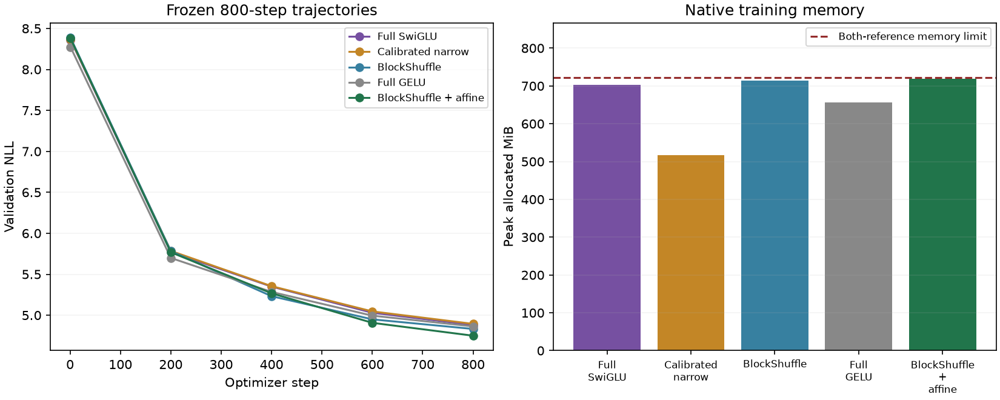
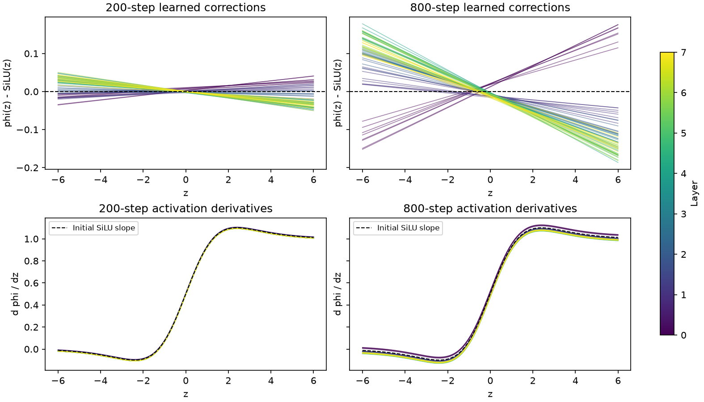

# Affine BlockShuffle at 800 WikiText steps

**Frozen promotion: PASS.** Affine BlockShuffle finishes at NLL 4.749982, versus 4.832481 for unmodified BlockShuffle and 4.894435 for calibrated narrow. This is one seed at a longer fixed budget, not established convergence or independent replication.

The five recipes each train for 1,638,400 sampled tokens from the same pinned WikiText cache. Final validation uses all 322,688 targets. The candidate has 2,801,792 FFN weights (70.3111% fewer than full models), 9,099,776 total weights (42.1692% fewer), and adds only 128 weights to unmodified BlockShuffle. Projection, attention and embedding dimensions are unchanged.

[Frozen plan](affine_activation_longer_plan.md), [raw result](../results/affine_longer_v2/result.json), [preflight](../results/affine_longer_v2/preflight.json), and [earlier short screen](affine_activation_results.md).

## All five final checkpoints

| Recipe | Peak LR | NLL | FFN weights | Peak MiB | Clipped steps | Train tokens/s |
|---|---:|---:|---:|---:|---:|---:|
| Full SwiGLU | 0.0012 | 4.880372 | 9,437,184 | 702.19 | 8.88% | 34705 |
| Calibrated narrow | 0.0012 | 4.894435 | 2,801,664 | 516.28 | 9.88% | 37236 |
| BlockShuffle | 0.0006 | 4.832481 | 2,801,664 | 714.12 | 28.12% | 26045 |
| Full GELU | 0.0012 | 4.863755 | 9,437,184 | 656.62 | 6.12% | 37584 |
| BlockShuffle + affine | 0.0012 | 4.749982 | 2,801,792 | 718.08 | 14.00% | 21779 |

Serial throughput is descriptive: these measurements do not establish a paired training-speed or inference-speed advantage. All execution is native BF16, with the existing BlockShuffle activation checkpointing. Matrix-work estimates exclude pointwise operations and do not imply measured speed.



## Frozen gates

| Gate | Decision |
|---|---|
| at_least_70_percent_fewer_ffn_weights | PASS |
| beats_calibrated_narrow | PASS |
| within_one_percent_full_swiglu | PASS |
| memory_within_ten_percent_full_swiglu | PASS |
| within_one_percent_full_gelu | PASS |
| memory_within_ten_percent_full_gelu | PASS |
| at_least_point_two_percent_better_than_unmodified_blockshuffle | PASS |

Candidate relative NLL changes: Full SwiGLU -2.6717%; Calibrated narrow -2.9514%; BlockShuffle -1.7072%; Full GELU -2.3392%.

Each peak learning rate was selected at 200 steps and frozen for this cohort. The warmup/cosine schedule is stretched to 800 steps and evaluations occur at steps 1, 200, 400, 600, 800. The 200-step and 800-step trajectories therefore use different schedules; their equal-step values are not continuation checkpoints. Most selected rates were at the search boundary, so longer-budget rate optima are not bracketed. No new rate search or best-intermediate-checkpoint selection is used.

## Optimization and learned shapes

BlockShuffle: final logged pre-clip gradient norm 0.986643; FFN-output standard deviation across layers ranges from 0.105902 to 0.358316 on the fixed diagnostic batch.

BlockShuffle + affine: final logged pre-clip gradient norm 0.995681; FFN-output standard deviation across layers ranges from 0.450286 to 3.128165 on the fixed diagnostic batch.
Sampled affine activation slopes have maximum absolute value 1.127171; all activation/shape diagnostics are finite, and maximum control saturation fraction is 0.000000. This is sampled local evidence, not a whole-network gradient bound.



Each color identifies a layer; thin curves show its eight channel groups. Corrections start at zero. The 200-step and 800-step curves come from independently trained models with the same seed and different schedule lengths. The shape plot is a uniform-grid visualization, not a data-weighted mechanistic test. It cannot by itself explain a gain or failure.

## Reproduction and qualification

All five archived control source/checkpoint hashes, model dimensions, optimizer groups, initialization metadata and data hashes are verified. Initial full-validation NLL matches each source within 1e-7, and final sampling RNG states agree across all five new runs. All history points, gradients and initial/final diagnostics are finite. The training-loop AST and the shared execution sources remain fixed across the cohort.

The first preflight stopped before training because a historical FLOP-counting change was mistaken for an execution change. Inspection showed that only the count formula changed to exclude activation parameters. Training/evaluation AST and all archived matrix-work counts reproduce. The failed launch and its explicit qualification are retained in [affine_longer_v1](../results/affine_longer_v1/qualification.json); measurements are in affine_longer_v2.

This pass earns replication at seeds 29 and 43 with the same configurations, followed by TinyStories transfer and an activation-path ablation. It does not complete the gold research goal.

```powershell
uv run --extra compile --extra data python -m src.core.cli train --config configs/wikitext2_blockshuffle_affine_800.json --cache data/wikitext2_v1
uv run --extra compile --extra data python -m src.core.affine_longer_report
```

The ordinary CLI creates a new run. The archival five-worker audit deliberately refuses to overwrite existing fixed run names. The official WikiText test split remains unfetched and unscored.
