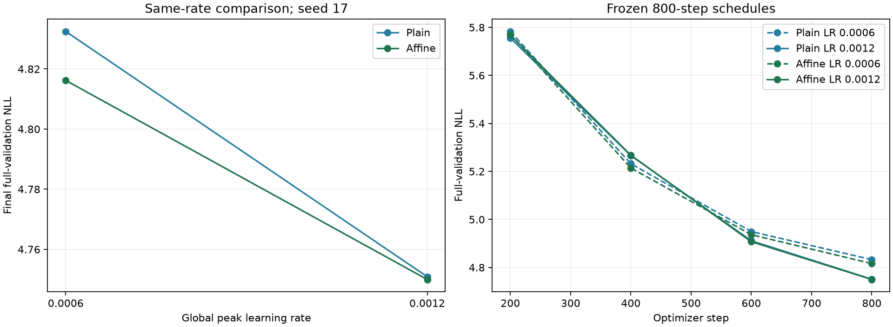

# Same-rate control for affine BlockShuffle

**Frozen two-rate robustness decision: FAIL.** The two missing 800-step seed-17 cells complete the plain/affine by 0.0006/0.0012 comparison. This addresses the learning-rate confound in the selected-recipe result. It remains one-seed evidence, with a separate gate-backward execution difference.

[Frozen H043 plan](affine_activation_rate_control_plan.md), [raw decisions](../results/affine_rate_control_v1/result.json), and [three-seed selected recipes](affine_activation_replication_results.md).

| Peak LR | Plain NLL | Affine NLL | Affine minus plain | Relative change | At least 0.2% better |
|---|---:|---:|---:|---:|---|
| 0.0006 | 4.832481097 | 4.816195449 | -0.016285648 | -0.3370% | PASS |
| 0.0012 | 4.750899752 | 4.749981965 | -0.000917787 | -0.0193% | FAIL |

## All four cells and quality/memory decisions

| Rate | Architecture | Training peak MiB | Clip fraction | All reference gates | Evidence |
|---|---|---:|---:|---|---|
| 0.0006 | blockshuffle | 714.12 | 28.125% | PASS | Original H039 |
| 0.0006 | blockshuffle_affine | 718.08 | 29.000% | PASS | New H043 |
| 0.0012 | blockshuffle_affine | 718.08 | 14.000% | PASS | Original H039 |
| 0.0012 | blockshuffle | 714.12 | 12.500% | PASS | New H043 |

Reference gates require >=70% fewer FFN weights, <=1% relative NLL cost against both full controls, beating calibrated narrow, and allocated training peak <=1.1 times each full control. Same-rate material benefit is assessed separately above.



## Interpretation

The >=0.2% benefit does not hold at both rates. Retain the H041 result as a comparison of selected recipes and qualify claims of activation-specific gain. Do not infer that 128 learned coefficients alone caused the three-seed difference. Inspect both rate-specific effects and the distinct recomputation/backward paths before adding gain/bias variants.

All four cells have exact final sampling-RNG equality. New trials change only peak LR within their source recipe; initial NLL, optimizer groups, initialization, critical computation hashes, validation targets, source archives and checkpoint/config metadata are verified. Each trial uses 1,638,400 sampled tokens and all 322,688 validation targets. Official test stays unscored. Rates and hypotheses were frozen before the two new results; no convergence or multi-seed same-rate claim is made.

TinyStories transfer, gain/bias retraining, deployment timing and broader novelty/convergence checks remain separate. The successful post-training removal experiment is not a substitute for these training controls.

```powershell
uv run --extra compile --extra data python -m src.core.affine_rate_report
```
