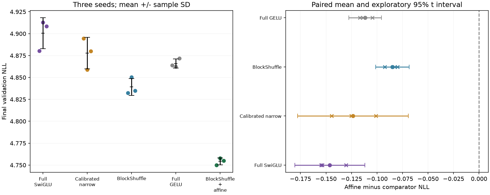

# Affine BlockShuffle: three-seed WikiText replication

**Later same-rate qualification:** [H043](affine_activation_rate_control_results.md) finds only 0.0193% affine benefit at LR0.0012 in seed17, versus 0.337% at LR0.0006. The selected-recipe advantage below compares different rates and is not an isolated activation gain. The [corrected three-seed result](affine_rate_replication_results.md) finds only0.101% mean affine benefit and2/3 wins, failing material promotion.

**Frozen replication decision: PASS.** Mean affine BlockShuffle NLL is 4.754207 +/- 0.003945 sample SD at 800 steps, seeds 17, 29 and 43. Every seed and gate is retained below. This is a fixed small-model, fixed-token-budget result, not established convergence or broad SOTA evidence.

The candidate uses 2,801,792 FFN weights and 9,099,776 total, adding only 128 weights to unmodified BlockShuffle. Full models use 9,437,184 FFN weights and 15,735,168 total: 70.3111% fewer FFN weights and 42.1692% fewer total weights. All five architectures use the same attention, vocabulary and depth. The two new seeds add ten training runs, 16,384,000 sampled tokens, with no architecture or rate changes.

[Frozen replication plan](affine_activation_replication_plan.md), [earlier 800-step cohort](affine_activation_longer_results.md), [raw decisions](../results/affine_replication_v1/result.json), and [preflight](../results/affine_replication_v1/preflight.json).

## Every final NLL

| Recipe | Seed 17 | Seed 29 | Seed 43 | Mean +/- sample SD | Max peak MiB |
|---|---:|---:|---:|---:|---:|
| Full SwiGLU | 4.880372 | 4.912696 | 4.908472 | 4.900513 +/- 0.017570 | 702.19 |
| Calibrated narrow | 4.894435 | 4.858727 | 4.880122 | 4.877761 +/- 0.017970 | 516.28 |
| BlockShuffle | 4.832481 | 4.850175 | 4.834795 | 4.839150 +/- 0.009617 | 714.12 |
| Full GELU | 4.863755 | 4.862277 | 4.871747 | 4.865926 +/- 0.005095 | 656.62 |
| BlockShuffle + affine | 4.749982 | 4.757794 | 4.754844 | 4.754207 +/- 0.003945 | 718.08 |

Candidate relative change against each mean: Full SwiGLU -2.9855%; Calibrated narrow -2.5330%; BlockShuffle -1.7553%; Full GELU -2.2960%.



## Frozen gates, separately by seed

| Gate | Seed 17 | Seed 29 | Seed 43 |
|---|---|---|---|
| at_least_70_percent_fewer_ffn_weights | PASS | PASS | PASS |
| beats_calibrated_narrow | PASS | PASS | PASS |
| within_one_percent_full_swiglu | PASS | PASS | PASS |
| memory_within_ten_percent_full_swiglu | PASS | PASS | PASS |
| within_one_percent_full_gelu | PASS | PASS | PASS |
| memory_within_ten_percent_full_gelu | PASS | PASS | PASS |
| at_least_point_two_percent_better_than_unmodified_blockshuffle | PASS | PASS | PASS |

## Paired evidence and its limits

Differences below are affine candidate minus comparator NLL; negative favors affine. Intervals are exploratory paired-mean 95% Student-t intervals (df=2), conditional on approximately normal independent seed differences. The first seed was used for selection and three samples cannot validate the normality assumption. These are not unqualified confirmatory intervals.

| Comparator | Paired differences (17,29,43) | Mean difference | Exploratory 95% t interval | One-sided sign p |
|---|---|---:|---|---:|
| Full SwiGLU | -0.130390, -0.154902, -0.153628 | -0.146307 | [-0.180585, -0.112028] | 0.125 |
| Calibrated narrow | -0.144453, -0.100933, -0.125278 | -0.123555 | [-0.177736, -0.069374] | 0.125 |
| BlockShuffle | -0.082499, -0.092381, -0.079951 | -0.084944 | [-0.101254, -0.068633] | 0.125 |
| Full GELU | -0.113773, -0.104483, -0.116903 | -0.111720 | [-0.127765, -0.095674] | 0.125 |

The exact sign test concerns the paired median and excludes exact ties. Three wins out of three give one-sided p=0.125; that alone does not meet a 0.05 threshold. Frozen per-seed engineering gates and statistical significance are separate claims. Method references: [NIST Student-t table](https://www.itl.nist.gov/div898/handbook/eda/section3/eda3672.htm) and [NIST sign test](https://www.itl.nist.gov/div898/software/dataplot/refman1/auxillar/signtest.htm).

## Optimization and execution

| Recipe | Mean clipped steps | Mean allocated peak MiB | Mean serial train tokens/s |
|---|---:|---:|---:|
| Full SwiGLU | 8.708% | 702.19 | 61774 |
| Calibrated narrow | 9.208% | 516.28 | 71298 |
| BlockShuffle | 26.250% | 714.12 | 50845 |
| Full GELU | 6.708% | 656.62 | 66910 |
| BlockShuffle + affine | 14.333% | 718.08 | 40582 |

All recorded gradients, activations and learned slopes are finite. This does not prove global nonvanishing gradients or well-conditioned full-network Jacobians. Serial timing is descriptive; rotated worker order does not create simultaneous paired speed measurements. The known full-product and correction-only compiler training failures remain separate; all runs here use native execution.

## Verification and next requirements

Each new configuration differs only in seed. Tiny CPU checks preserve all common non-FFN initial parameters across recipes and preserve affine/base initial logits, loss and common gradients exactly. Actual full-validation initial NLL agrees for affine and unmodified BlockShuffle within each seed. Final sampling RNG states agree across recipes within a seed and differ across seeds. All source archives, checkpoints, model/optimizer metadata, token counts and frozen data hashes are verified. No test split was downloaded or scored.

All models train for 1,638,400 sampled tokens and score the same 322,688 validation targets. Rates were selected at 200 steps; most were boundary winners and were not retuned for 800 steps or the new seeds. Historical architecture search, selected seed 17, the small tokenizer/model and repeated use of validation data constrain generalization claims.

The original frozen pass earned transfer and gain/bias studies. The later same-rate correction above takes precedence: its material-benefit gate fails, so those additional activation experiments are not promoted on the confounded selected-rate advantage.

```powershell
uv run --extra compile --extra data python -m src.core.cli train --config configs/wikitext2_blockshuffle_affine_800.json --cache data/wikitext2_v1 --seed 29
uv run --extra compile --extra data python -m src.core.affine_replication_report
```

The ordinary CLI creates a fresh run; archival audit names are protected against overwrite.
