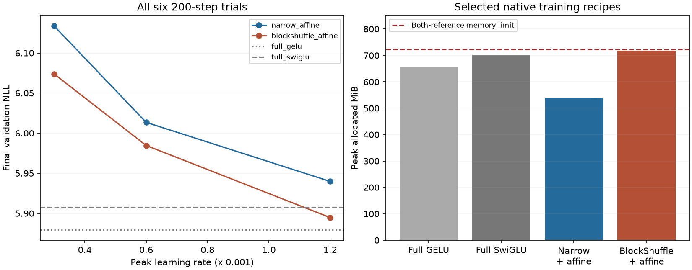

# Affine activation: retraining and mechanism ablation

**Frozen promotion: blockshuffle_affine.** Six new seed-17, 200-step WikiText trials test whether a learned linear and constant correction can reproduce the rational model's gain at lower cost. All six completed with finite recorded diagnostics. This is selection, not convergence or independent replication.

The activation is `SiLU(z) + 0.25*(tanh(theta_gain)*z + tanh(theta_bias))`, shared within eight channel groups and independent per layer. It adds **128 weights across eight layers**, for 2,801,792 FFN weights and 9,099,776 total: 70.3111% fewer FFN weights than full references. Both compressed bases preserve their initialization, optimizer calibration and zero-correction initial function. Native BF16 training only; BlockShuffle uses checkpoint recomputation.

See the [frozen protocol](affine_activation_plan.md), [equations and origin-Jacobian proof](archive/retired/src/learnable_activation_ffn/model.md), [preflight](../results/affine_activation_screen_v1/preflight.json), and [raw decisions](../results/affine_activation_screen_v1/result.json). The preflight reproduces all 26 old variants exactly and verifies archived control/data sources and the unchanged training-loop AST.

## Selected final checkpoints

| Recipe | Peak LR | NLL | Peak allocated MiB |
|---|---:|---:|---:|
| full_swiglu | 0.0012 | 5.907694 | 702.19 |
| full_gelu | 0.0012 | 5.879278 | 656.62 |
| calibrated_narrow | 0.0012 | 5.912434 | 516.28 |
| blockshuffle | 0.0006 | 5.970604 | 714.12 |
| calibrated_narrow_rational | 0.0012 | 5.909193 | 751.88 |
| blockshuffle_rational | 0.0012 | 5.898003 | 883.17 |
| calibrated_narrow_affine | 0.0012 | 5.939847 | 539.12 |
| blockshuffle_affine | 0.0012 | 5.894765 | 718.08 |

## All new trials

| Peak LR | Narrow + affine NLL | BlockShuffle + affine NLL |
|---:|---:|---:|
| 0.0003 | 6.133605 | 6.073763 |
| 0.0006 | 6.013476 | 5.984664 |
| 0.0012 | 5.939847 | 5.894765 |



## Frozen gates and effect sizes

**calibrated_narrow_affine:** NLL change +0.4637% versus selected unmodified base; +0.5187% versus selected native rational; +0.5443% versus full SwiGLU; +1.0302% versus full GELU. Failed gates: beats_calibrated_narrow, within_one_percent_full_gelu, at_least_point_two_percent_better_than_own_base, within_point_two_percent_of_selected_rational.

**blockshuffle_affine:** NLL change -1.2702% versus selected unmodified base; -0.0549% versus selected native rational; -0.2188% versus full SwiGLU; +0.2634% versus full GELU. Failed gates: none.

Grid-boundary winners: calibrated_narrow_affine, blockshuffle_affine. Rate selection uses final NLL, never the best intermediate step. All 322,688 validation targets are scored in each trial, including the last partial batch. Each recipe receives the same three-rate budget; historical architecture search remains unequal. Full-control optima were not bracketed. Serial speed measurements are not paired speed evidence.

## What the learned shapes explain

calibrated_narrow_affine: learned gains range [-0.010855, 0.004921], offsets [-0.001424, 0.008973]. Resetting both theta vectors while retaining every other trained weight changes full-validation NLL from 5.939847 to 5.939685 (-0.002731%).

blockshuffle_affine: learned gains range [-0.008410, 0.006369], offsets [-0.003003, 0.010608]. Resetting both theta vectors while retaining every other trained weight changes full-validation NLL from 5.894765 to 5.894839 (+0.001251%).

For the previous native rational BlockShuffle checkpoint, affine fits explain **96.3880%** of correction energy on actual training-prefix inputs, with fit-error RMS 0.00058558 and correction RMS 0.00308115. This uses 4,194,304 deterministic samples across 64 layer/group pairs from the first 1,024 training tokens. The earlier uniform-grid energy fraction was 99.7684%. This uncentered energy statistic is not centered R-squared; the small prefix is not guaranteed representative. Inputs are BF16 projection outputs; corrections are FP32 before the activation's BF16 cast. [Raw data-weighted fit](../results/activation_data_fit_v1/result.json).

A small fit error or small post-training reset cost does not prove why retraining succeeds or fails. The affine residual and rational residual have different parameterizations and optimization directions. The strict origin-Jacobian extension applies only to an isolated bias-free SwiGLU layer; it does not establish easier learning, universal data adaptation, or whole-network gradient stability.

## Reproduce

```powershell
uv run --extra compile --extra data python -m src.core.cli train --config configs/wikitext2_blockshuffle_affine_screen.json --cache data/wikitext2_v1 --learning-rate 0.0012
uv run --extra compile --extra data python -m src.core.affine_activation_report
```

The audit refuses to overwrite fixed run names. Use a separate checkout/output convention for an independent repeat; the report verifies the retained original artifacts. No official WikiText test data were downloaded or scored.
