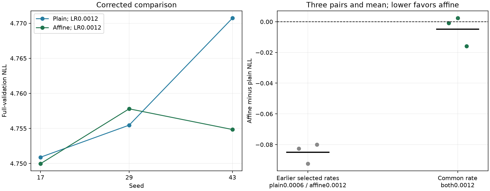

# Corrected three-seed activation comparison at the same rate

**Material activation benefit: FAIL. Stronger plain quality/memory gates: PASS in all three seeds.** At the common peak LR 0.0012, plain BlockShuffle mean NLL is 4.759029 +/- 0.010381; affine is 4.754207 +/- 0.003945 (sample SD). Affine changes mean NLL by -0.1013% relative to plain.

This corrects the interpretation of the earlier 1.755% selected-recipe advantage, which compared plain LR 0.0006 with affine LR 0.0012. Those historical measurements remain valid, but do not isolate an activation improvement. [H043](affine_activation_rate_control_results.md) showed only 0.0193% affine benefit at the higher rate in seed 17 and 0.337% at the lower rate.

[Frozen corrective replication](affine_rate_replication_plan.md), [raw results](../results/affine_rate_replication_v1/result.json), and [historical selected-recipe replication](affine_activation_replication_results.md).

## Every same-rate pair

| Seed | Plain NLL | Affine NLL | Affine minus plain | Relative affine change |
|---|---:|---:|---:|---:|
| 17 | 4.750899752 | 4.749981965 | -0.000917787 | -0.0193% |
| 29 | 4.755465254 | 4.757793810 | +0.002328557 | +0.0490% |
| 43 | 4.770721936 | 4.754844169 | -0.015877767 | -0.3328% |

Paired mean difference -0.004822333; exploratory 95% t interval [-0.028945557, +0.019300892]; 2/3 strict affine wins; exact one-sided sign p=0.500. The interval assumes approximately normal independent differences, which three observations cannot establish. Seed17 motivated the corrected control. These are exploratory summaries, not confirmatory population claims.



## Stronger plain control against full and narrow references

| Recipe | Mean NLL +/- sample SD | FFN weights | Maximum training peak MiB | Mean serial training tokens/s |
|---|---:|---:|---:|---:|
| full_swiglu | 4.900513 +/- 0.017570 | 9437184 | 702.19 | 61774 |
| full_gelu | 4.865926 +/- 0.005095 | 9437184 | 656.62 | 66910 |
| calibrated_narrow | 4.877761 +/- 0.017970 | 2801664 | 516.28 | 71298 |
| plain_blockshuffle_lr1200 | 4.759029 +/- 0.010381 | 2801664 | 714.12 | 26256 |
| affine_blockshuffle_lr1200 | 4.754207 +/- 0.003945 | 2801792 | 718.08 | 40582 |

Plain relative NLL change against the reference means: full_swiglu -2.8871%; full_gelu -2.1969%; calibrated_narrow -2.4342%; blockshuffle -1.6557%.

Plain uses 2,801,664 FFN weights, 9,099,648 total, a 70.3125% FFN reduction. Affine adds 128 weights. For EACH seed, the plain gate checks >=70% FFN reduction, <=1% NLL cost against both full controls, beating calibrated narrow and peak allocation <=1.1 times both full controls. Per-seed decisions remain in the raw result. Serial throughput is descriptive and is not a paired speed measurement.

## Decision and scope

The activation does not meet the predeclared >=0.2% mean improvement plus three strict wins. Do not promote more activation variants or TinyStories transfer using the confounded historical advantage. Keep the learned families, scoped expressivity proof and all positive/negative measurements as research artifacts. The stronger plain recipe is the simpler local control.

The two new runs differ from each seed's original plain recipe only in peak LR. Actual initial NLL, optimizer groups, data hashes, critical computation, histories, diagnostics, checkpoint/config metadata and final sampling RNG are verified. All fifteen original reference checkpoint/metrics hashes match their archived H039/H041 records. Each trial trains 1,638,400 sampled tokens and scores 322,688 validation targets. Official test remains unscored.

Plain still uses the custom native SiLU/product backward; affine uses checkpointed native autograd. Same-rate results therefore compare these complete recipes. The successful removal of affine corrections after training remains a valid checkpoint intervention, with no causal or deployment-speed inference. Existing fused-serving speed was measured on earlier TinyStories checkpoints, not these WikiText weights.

The broad goal remains open: equal extended tuning, convergence, stronger published comparators, trained scale, new mechanisms and full-network stability. A better learning rate for an established structured layer is useful engineering, not a new activation primitive.

```powershell
uv run --extra compile --extra data python -m src.core.affine_rate_replication_report
```
