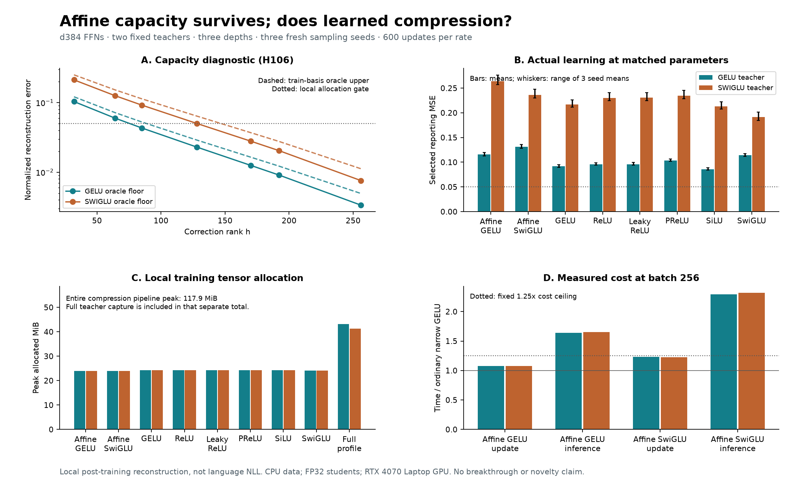

# H107: affine residual FFNs fail the matched-budget comparison

**Both fixed recipes are rejected.** They use over 70% fewer FFN parameters
and roughly 42-45% less local training allocation than full teacher profiles,
but reconstruct the teacher less accurately than strong narrow controls and
fail the raw-inference timing gate. Neither earns language insertion, longer
training, kernel work or integration. The broader VRAM/quality goal is unmet.

All **288 fits, 172,800 updates and 144 selections** completed in
12.98 minutes on one RTX 4070 Laptop GPU. Independent
verification recaptures all 18 datasets, recomputes **864 scores**, checks 144
initializations and validates all selected exports. Separate native Windows
postprocessing failures and their successful recovery are retained below.

## What was tested

[H106's capacity calculation](affine_residual_capacity_results.md) qualified
GELU h256 and SwiGLU h170 corrections after an explicit full-rank affine path:

\[f(x)=Wx+b+D\phi(Ux+a).\]

The gated form replaces phi(Ux+a) by SiLU(Ux+a) times (Vx+c). The full affine
path avoids H105's global output-rank restriction, but its d-by-d matrix consumes
parameters that an ordinary FFN can spend on additional nonlinear features.
The test asks whether decoupling the linear path compensates for those lost
features. It does not assume that a favorable matrix bound proves trainability.

Two existing seed-17, 3,200-update teachers supply depth 0/3/7 inputs/outputs.
All H105 windows are excluded. Seeds 71/83/97 receive disjoint new groups of
320 nonoverlapping 128-token windows: 256 for calibration, 32 for selecting
checkpoints and 32 for reporting. These are sampling/optimization replications,
not three independent teacher training seeds. The windows come from the original
WikiText-2 training cache, which the teachers already saw during training.
No claim of unseen-domain or official language-test performance follows.

Teacher capture uses BF16; stored BF16 outputs are the labels. Students use
FP32 with TF32 disabled. Training-only coordinate means/SDs normalize inputs;
a training-only global RMS normalizes centered outputs. Deployment folds these
constants into weights and biases. MSE below is divided by the training output
variance. H106 uses different windows and its recorded FP32 reference variance,
so the capacity and fitting plots are not a paired numerical gap estimate.

Every model receives a shared prefix of the same permuted teacher feature
bank, followed by CPU FP64 ridge fitting of its readout. Candidate designs jointly
fit inputs and hidden features; ordinary controls fit hidden features with the
same standardized-column ridge and unpenalized intercept. No reporting-label
oracle from H106 enters an initialization. All parameters then train using the
same sample stream, batch 256, 600 AdamW updates, clipping at norm 1, and rates
0.001/0.003. Selection considers initialization and both final checkpoints using
selection MSE only. Every endpoint is retained, including unsuccessful rates.

## Reconstruction at the same parameter budget

| Form | Parameters | Saving vs full FFN | GELU-teacher mean MSE | SwiGLU-teacher mean MSE |
|---|---:|---:|---:|---:|
| Affine + GELU h256 | 344,704 | 70.78% | 0.115527 | 0.263845 |
| Affine + SwiGLU h170 | 344,020 | 70.84% | 0.131584 | 0.236171 |
| GELU h448 | 344,896 | 70.76% | 0.091782 | 0.216755 |
| ReLU h448 | 344,896 | 70.76% | 0.095950 | 0.230112 |
| LeakyReLU h448 | 344,896 | 70.76% | 0.096135 | 0.230590 |
| PReLU h448 | 344,897 | 70.76% | 0.103694 | 0.234349 |
| SiLU h448 | 344,896 | 70.76% | 0.085553 | 0.212822 |
| SwiGLU h298 | 344,276 | 70.82% | 0.114044 | 0.191154 |

Each mean covers three depths and three sampling seeds. No form reaches the
0.05 mean allocation threshold for either teacher. SiLU is the best ordinary
control on the GELU teacher; SwiGLU is best on the SwiGLU teacher. Their relative
advantages are useful control evidence, not a promotion under a changed gate.

| Candidate | Teacher | Paired MSE ratio to best control | Raw inference / narrow GELU | Update / narrow GELU |
|---|---|---:|---:|---:|
| Affine + GELU h256 | gelu | 1.3555 | 1.637 | 1.075 |
| Affine + GELU h256 | swiglu | 1.3878 | 1.655 | 1.078 |
| Affine + SwiGLU h170 | gelu | 1.5661 | 2.290 | 1.229 |
| Affine + SwiGLU h170 | swiglu | 1.2352 | 2.316 | 1.224 |

Ratios above one are worse. Paired reconstruction ratios are geometric means
over matching depth/seed cells. Both candidates lose to the strongest control
in every seed aggregate and at every tested depth. Their quality, all-control,
all-seed, depth and inference gates fail for both teachers. Parameter count,
finite training, local training allocation and the 1.25x update-time ceiling pass.
All comparisons against all six controls are in the machine-readable summary.

| Teacher / form | Seed 71 mean | Seed 83 mean | Seed 97 mean | Nine-cell median | Nine-cell sample variance |
|---|---:|---:|---:|---:|---:|
| gelu / Affine + GELU h256 | 0.119628 | 0.114237 | 0.112717 | 0.097284 | 0.00573673 |
| gelu / Affine + SwiGLU h170 | 0.135945 | 0.130656 | 0.128150 | 0.112417 | 0.00703779 |
| gelu / GELU h448 | 0.095259 | 0.089961 | 0.090128 | 0.075283 | 0.00357261 |
| gelu / SiLU h448 | 0.088613 | 0.083795 | 0.084250 | 0.069011 | 0.00331439 |
| gelu / SwiGLU h298 | 0.117689 | 0.112748 | 0.111694 | 0.092715 | 0.00530946 |
| swiglu / Affine + GELU h256 | 0.276255 | 0.258056 | 0.257225 | 0.265283 | 0.00232265 |
| swiglu / Affine + SwiGLU h170 | 0.247721 | 0.229943 | 0.230847 | 0.232798 | 0.00257938 |
| swiglu / GELU h448 | 0.226351 | 0.212774 | 0.211140 | 0.220220 | 0.00189683 |
| swiglu / SiLU h448 | 0.222204 | 0.208984 | 0.207278 | 0.212092 | 0.00193742 |
| swiglu / SwiGLU h298 | 0.201845 | 0.187137 | 0.184479 | 0.188393 | 0.00168686 |

The nine-cell variance includes depth heterogeneity; it is not a teacher-seed
confidence interval. Mean, median, sample variance, range, every depth mean and
every endpoint are retained for all eight forms in the summary/CSV.

## Memory and compute

| Form | Mean local training peak MiB | Mean raw inference peak MiB | Parameters accounted |
|---|---:|---:|---|
| Affine + GELU h256 | 23.950 | 10.940 | All weights and biases |
| Affine + SwiGLU h170 | 23.940 | 10.938 | All weights and biases |
| GELU h448 | 24.280 | 10.691 | All weights and biases |
| ReLU h448 | 24.280 | 10.691 | All weights and biases |
| LeakyReLU h448 | 24.280 | 10.691 | All weights and biases |
| PReLU h448 | 24.282 | 10.691 | All weights and biases |
| SiLU h448 | 24.280 | 10.691 | All weights and biases |
| SwiGLU h298 | 24.170 | 10.978 | All weights and biases |
| Full gelu reference | 43.155 | 16.000 | 1,179,648 raw weights; normalization biases in training profile |
| Full swiglu reference | 41.297 | 17.000 | 1,179,648 raw weights; normalization biases in training profile |

These are peak **PyTorch tensor allocations**, not total process/driver VRAM.
The complete compression pipeline peaks at **117.908 MiB**,
including the full teacher during collection. All students require that common
capture step. The roughly 24 MiB fitting numbers do not establish a corresponding
end-to-end pipeline saving. Ordinary narrow controls already use about the same
local training allocation. Reserved-memory values are retained separately.

The original full FFNs have no biases. Algebraically equivalent normalized
full profiles add 1,920 GELU or 2,432 SwiGLU bias parameters, about 0.16%/0.21%
overhead, to absorb input/output normalization. They take 30 zero-learning-rate
AdamW steps per dataset, with 10 timing warmups, to allocate gradients and
optimizer states. The 18 profiles add 540 resource-only updates, not teacher
training or a matched quality experiment. Inference references use the original
bias-free full FFNs. Post-run no-gradient inference-memory profiles use batch
256, 10 warmup and 10 measured forwards, with no optimizer or dataset on GPU.
These additional measurements do not alter the frozen timing/quality decisions.

The affine-GELU and ordinary-GELU models both require 344,064 dense matrix
MACs per token. The two parameter-matched SwiGLU forms each require 343,296.
Thus the candidate does not reduce leading matrix arithmetic at this budget;
it trades nonlinear features for a separate affine matrix and output addition.
Scalar activations, biases, elementwise products, optimizer work and kernel
launches are excluded from that MAC count and included in measured timing.
No fused-kernel or large-batch speed claim is made.

Capture takes 5.31 seconds in total and CPU
initialization takes 112.37 seconds. Both rates
are charged even when a single endpoint is selected. Timings use synchronization
and warmup, but remain sequential measurements on one laptop GPU. The prototype
pipeline includes CPU-resident data and the existing CUDA runtime's allocation
overhead. It is not a complete Transformer training/serving memory benchmark.

## Optimization and verification

All 288 fits retain finite weights and Adam moments. The largest recorded
preclip gradient norm is 3.1474; the largest run-level
clipping fraction is 1.50%. This is bounded-run
evidence under clipping, not a proof against vanishing/exploding gradients at
arbitrary depth. Loss histories, activation distributions and parameter-gradient
snapshots at initialization and training checkpoints remain available.

Only the PReLU control learns a scalar activation parameter; its initial
and both final slopes are saved for each dataset. The candidates use fixed
GELU/SwiGLU and learn their projection matrices. No learned-curve novelty is
implied. The compact diagnostic archive includes 50-step loss/gradient summaries
and snapshots; unaggregated histories remain unchanged locally.

Ten qualification groups check all eight parameter counts, finite-difference
input and parameter gradients, FP64 normalization-folded outputs and input
gradients, independent augmented least-squares ridge solutions, normalized
teacher equivalence and shared row prefixes. The audit then independently
recaptures all 18 complete pair datasets, checks training-only statistics and
sampling streams, verifies 144 real ridge stationarity conditions and reconstructs
every checkpoint using direct tensor algebra with a different batch partition.

All 864 selection/report scores agree within the stated numerical tolerance;
the largest absolute discrepancy is 2.64e-08. All 144
selections and raw exports pass. Export verification covers every reporting and
selection row. Source/teacher/data/checkpoint hashes and all update records are
checked. The maintained suite still has 116 passing tests; no active model or
factory entry was added.

The first audit process failed during Torch import with a native Windows
access violation, before any dataset was checked. The first plot process failed
in Matplotlib font lookup. Their original logs, exit codes and source hashes
are retained. A separately recorded fresh-process recovery uses the same UV
Python 3.12.9 and installed packages with PYTHONMALLOC=malloc and
PYTHONHASHSEED=107. The independent audit and plot complete there. This does
not prove the cause of the Windows failures. No fit, scientific endpoint,
source from the frozen training snapshot or decision threshold was replaced.

## Decision and remaining question

Close these exact affine h256/h170 recipes. The capacity calculation was
useful for eliminating impossible small widths, but insufficient for selecting a
competitive learned compressor. Spending a dense matrix's parameters on the
explicit linear path did not compensate for reduced nonlinear width here. That
last statement is an empirical explanation consistent with this comparison,
not a theorem excluding all affine-residual architectures.

A next design must address measured memory with a quality advantage over
the strongest ordinary control and must account for its initialization/capture
requirements. Uniform local reconstruction remains far from the fixed gate;
this result does not justify automatic language training or a claim of universal
compression failure. Language NLL, longer schedules, independently trained
teachers, larger models and unrelated data remain untested for these prototypes.

The [FFN linear-recoverability study](https://arxiv.org/abs/2606.19379) directly
precedes affine FFN fitting and warns that local reconstruction and perplexity
can dissociate. [Wide & Deep](https://arxiv.org/abs/1606.07792) precedes the basic
linear-plus-nonlinear family. No architectural or activation novelty is claimed.

## Reproducible artifacts

- [Frozen H107 plan](affine_residual_fit_plan.md) and [H106 proof/results](affine_residual_capacity_results.md).
- [Source/reproduction guide](../results/affine_residual_fit_v1/source/README.md).
- [All endpoints, lossless JSON](../results/affine_residual_fit_v1/result.json.gz), [CSV](../results/affine_residual_fit_v1/metrics.csv.gz), [summary and decisions](../results/affine_residual_fit_v1/summary.json).
- [Independent audit](../results/affine_residual_fit_v1/audit.json.gz), [diagnostics](../results/affine_residual_fit_v1/diagnostics.json.gz), [inference memory](../results/affine_residual_fit_v1/inference_memory.json).
- [Final verification receipt](../results/verification/affine_residual_final_v1.json).

Raw tensors and checkpoints stay local and ignored. Compressed metadata preserves
the original bytes; it is not a substitute for missing tensors in a fresh clone.
