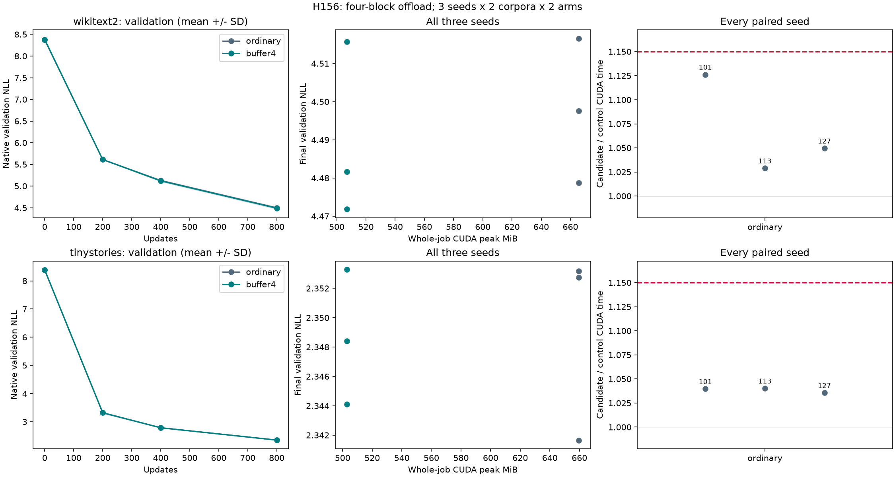

# H156: maintained memory helper under fresh batch16 long training

**PASS fresh batch16 long-training gate.** Independent initialization, native-gradient and checkpoint audit:
**True**. Completed all 12 continuous 800-update runs. Each seed must pass;
aggregate means cannot rescue a failure. The full VRAM/quality research goal remains
open, and no new activation, parameter reduction or SOTA claim is made.

| Corpus | Seed | GPU allocation saved | Complete CUDA ratio | Wall ratio | Final NLL ratio | Failed gates |
|---|---:|---:|---:|---:|---:|---|
| wikitext2 | 101 | 23.86% | 1.1262 | 1.1261 | 1.000655 | none |
| wikitext2 | 113 | 23.86% | 1.0288 | 1.0288 | 0.999814 | none |
| wikitext2 | 127 | 23.86% | 1.0495 | 1.0494 | 0.994267 | none |
| tinystories | 101 | 23.76% | 1.0397 | 1.0397 | 1.000232 | none |
| tinystories | 113 | 23.76% | 1.0402 | 1.0402 | 0.996144 | none |
| tinystories | 127 | 23.76% | 1.0356 | 1.0356 | 1.002890 | none |

## What this resolves

H142 found roughly 24% less allocated VRAM with roughly 5% update-time overhead
in short batch16 continuations. That did not establish fresh long training.
H156 starts both arms from the original empty-Adam step-zero states and runs
800 updates continuously at batch16. H138's earlier batch8 failure is unchanged.
These are the same two small text corpora, not a new domain or independent
benchmark selection. The candidate was fixed before these trajectories.

The ordinary arm uses native loss and keeps checkpoint inputs on GPU. The
candidate calls maintained buffer_model_loss and offload_checkpoint_inputs with
last_n_blocks=4, wrapping blocks 4-7. Both use the same 9,099,648-parameter
Transformer: d384, eight checkpointed blocks, context512 and tied classifier.
FP32, disabled TF32, ordinary attention, default 8.125 MiB cuBLAS workspace,
four CPU threads, AdamW LR0.0006/betas(0.9,0.95), unchanged decay groups and
clipping at 1. Parameters and maintained source code are unchanged.

Both training and validation batches are 16. H142 validated with batch8, so its
scores and timings are not direct paired baselines for this study. All present
quality comparisons use identical validation batches and splits. Each fixture's
arm order alternates, giving three ordinary-first and three candidate-first pairs.
No completed run was reordered, discarded, selected or repeated for a better score.

## Per-run resources and quality

| Corpus | Seed | Arm | GPU peak MiB | Pinned host peak MiB | CUDA update ms | Final NLL | Timing stability ratio | Whole-case seconds |
|---|---:|---|---:|---:|---:|---:|---:|---:|
| wikitext2 | 101 | ordinary | 665.76 | 0.00 | 134.74 | 4.47873 | 1.0830 | 116.3 |
| wikitext2 | 101 | buffer4 | 506.88 | 64.00 | 151.74 | 4.48167 | 1.0487 | 129.3 |
| wikitext2 | 113 | buffer4 | 506.88 | 64.00 | 156.51 | 4.51572 | 1.0468 | 132.4 |
| wikitext2 | 113 | ordinary | 665.76 | 0.00 | 152.13 | 4.51657 | 1.0427 | 129.2 |
| wikitext2 | 127 | ordinary | 665.76 | 0.00 | 152.96 | 4.49761 | 1.0341 | 130.2 |
| wikitext2 | 127 | buffer4 | 506.88 | 64.00 | 160.53 | 4.47183 | 1.0309 | 135.7 |
| tinystories | 101 | buffer4 | 502.86 | 64.00 | 160.67 | 2.35328 | 1.0253 | 134.9 |
| tinystories | 101 | ordinary | 659.58 | 0.00 | 154.54 | 2.35274 | 1.0368 | 130.0 |
| tinystories | 113 | ordinary | 659.58 | 0.00 | 154.76 | 2.35319 | 1.0302 | 130.2 |
| tinystories | 113 | buffer4 | 502.86 | 64.00 | 160.98 | 2.34411 | 1.0294 | 135.2 |
| tinystories | 127 | buffer4 | 502.86 | 64.00 | 160.85 | 2.34842 | 1.0304 | 135.1 |
| tinystories | 127 | ordinary | 659.58 | 0.00 | 155.31 | 2.34165 | 1.0296 | 130.7 |

Whole-case time includes setup, validation, saving and diagnostics, but excludes
process startup and the following cleanup boundary. Primary update timers include
forward/backward, clipping, Adam, transfers and recomputation. They exclude sampling,
gradient clearing, serialization, scoring and logging. All such phases remain in
whole-job CUDA peak accounting. Allocated/reserved peaks exclude driver/context
and other processes. Pinned-host allocation is reported separately, not total RSS.
These are training resource measurements, not isolated inference-memory results.

## All-seed statistics and frozen gates

| Corpus | Arm | Mean final NLL | Median final NLL | Sample variance | Mean GPU peak MiB | Mean CUDA update ms |
|---|---|---:|---:|---:|---:|---:|
| wikitext2 | ordinary | 4.497636 | 4.497611 | 3.578e-04 | 665.76 | 146.61 |
| wikitext2 | buffer4 | 4.489739 | 4.481665 | 5.306e-04 | 506.88 | 156.26 |
| tinystories | ordinary | 2.349193 | 2.352737 | 4.269e-05 | 659.58 | 154.87 |
| tinystories | buffer4 | 2.348606 | 2.348420 | 2.105e-05 | 502.86 | 160.83 |

Every pair must pass allocated memory ratio <=0.90, complete CUDA and wall update
median ratios <=1.15, final NLL ratio <=1.01 and candidate pinned-host peak <=128 MiB.
Each run must also pass max/min <=1.15 across its three 260-update wall-mean blocks
after 20 warmups. Telemetry coverage and full numerical audits are mandatory.
All gates match the prior protocol; clocks and times are not normalized. Passive
200ms telemetry is retained, missing sensors remain missing, and no power or
clock settings were changed. Timing is a measured property of this hardware/run,
not an architecture-independent guarantee. Raw phase timings include forward,
backward and optimizer components.

## Independent verification

9,600 updates and 78,643,200 targets; 12 initial gradient probes and 12 native
replays give 9,624 backwards. There are 48 study validation scores and 42 independent
native scores, covering initial states and all 200/400/800 checkpoints. All 48
tensor artifacts, 19,332 memory intervals and 43 zero allocator boundaries verify.
The independent audit regenerates all six original initial states exactly,
checks every training batch and sampler state, validates model/Adam hashes and
finite moments/counters, and scores every saved checkpoint without the custom loss
or offload path. It does not rerun all optimizer updates independently.

Initial numerical caps remain global gradient relative L2 <=1e-5, per-tensor
relative L2 <=1e-4, and relative loss/score error <=1e-6. Ordinary attention is
nondeterministic, so passing is bounded numerical agreement, not bitwise trajectory
identity. All training losses, gradient summaries and layer diagnostics remain in
the artifacts. Source, input, library, checkpoint and maintained-code hashes verify.
UV-managed Python and the installed CUDA PyTorch environment are recorded per run.

## Decision

The maintained opt-in helper now has fresh 800-update evidence at batch16 across both corpora and all three seeds. Keep the scope explicit; test a larger model or another precision/workload before generalizing. This is a memory optimization and does not meet the separate architectural parameter-reduction target.

A separate [checkpoint-compression design note](checkpoint_compression_note.md)
records a possible follow-up; it was not implemented or tested in this experiment.

This is one model scale and 800 updates on two text corpora, not final convergence
or cross-domain generality. The reusable API and its restrictions are documented
in [training_memory_usage.md](training_memory_usage.md). All historical failures
remain intact, and default model/trainer behavior is unchanged.

[Prospective plan](batch_scale_long_plan.md),
[machine-readable summary](../results/batch_scale_long_v1/summary.json),
[receipt](../results/batch_scale_long_v1/receipt.json).
