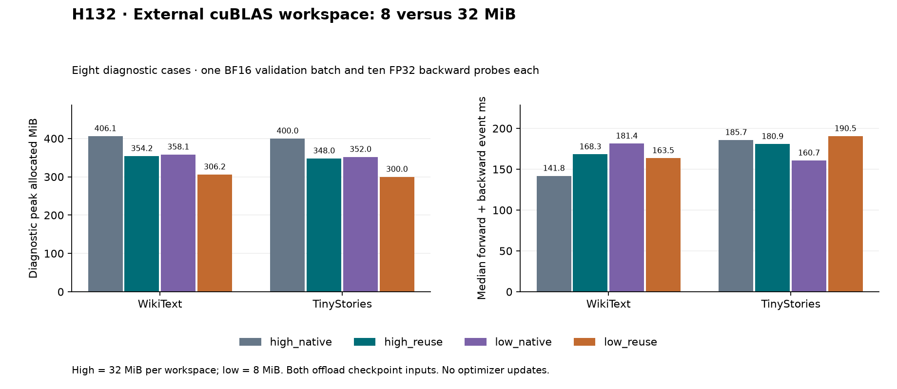

# H132: 8-MiB explicit workspace versus 32 MiB

**FAIL combined diagnostic gate.** Native replay: **True**; release accounting:
**True**. The deterministic environment remains fixed while
only the external cuBLAS workspace capacity changes. No optimizer updates.
Memory falls by 48 MiB. Three of four resource comparisons pass, but TinyStories
against its 8-MiB native classifier control is 18.57% slower by CUDA events
and 17.74% slower by wall time, exceeding the fixed 15% limit.

| Corpus | Workspace | Classifier | Diagnostic peak MiB | Median event ms | Median wall ms |
|---|---|---|---:|---:|---:|
| wikitext2 | high | native | 406.148 | 141.838 | 153.523 |
| wikitext2 | high | reuse | 354.180 | 168.259 | 178.980 |
| tinystories | high | reuse | 348.001 | 180.856 | 191.674 |
| tinystories | high | native | 399.969 | 185.749 | 195.612 |
| wikitext2 | low | native | 358.148 | 181.415 | 190.826 |
| wikitext2 | low | reuse | 306.180 | 163.519 | 175.747 |
| tinystories | low | reuse | 300.001 | 190.503 | 201.157 |
| tinystories | low | native | 351.969 | 160.667 | 170.845 |

Low-workspace buffer classifier versus each predeclared control:

| Corpus | Control | Peak allocation saved | Event ratio | Wall ratio | Failed gates |
|---|---|---:|---:|---:|---|
| wikitext2 | low_native | 14.51% | 0.9014x | 0.9210x | none |
| wikitext2 | high_reuse | 13.55% | 0.9718x | 0.9819x | none |
| tinystories | low_native | 14.77% | 1.1857x | 1.1774x | event, wall |
| tinystories | high_reuse | 13.79% | 1.0533x | 1.0495x | none |

High/low mean explicitly set 32/8 MiB via
`torch.backends.cuda.cublas_workspace_size`; both processes retain
`CUBLAS_WORKSPACE_CONFIG=:4096:8`. The getter verifies the setting before
model work. Strict deterministic algorithms, default SDPA, cuDNN deterministic
execution, disabled TF32, FP32 training and four CPU threads remain fixed.
Both native and buffer classifiers use checkpoint-input CPU offload, ordinary
RMSNorm and resident gradients. Parameters remain 9,099,648.

## What the evidence proves

After case objects are released, clearing cuBLAS workspaces releases 64 MiB
for the 32-MiB policy and 16 MiB for the 8-MiB policy. Live allocation then
reaches zero. The measured 48-MiB difference equals 2 x (32-8), and all four
matched diagnostic-peak differences are 48 MiB. The factor two follows from
measured bytes, not direct handle enumeration. The external capacity setter
therefore controls a concrete allocator cost while leaving the deterministic
environment unchanged. No internal GEMM algorithm or kernel cause is inferred.

The fresh native replay includes the same one-batch BF16 evaluation warmup
and verifies every saved gradient, loss and evaluation result bitwise at its
own workspace size. Cross-workspace bitwise equality is not required. Model,
optimizer and sampler states remain unchanged. The H128 operator and H131
worker/replay implementations are reused rather than reimplemented.

This existing [PyTorch workspace API](https://docs.pytorch.org/docs/stable/backends)
takes precedence over the environment for external workspace allocation.
[NVIDIA's reproducibility discussion](https://docs.nvidia.com/cuda/cublas/index.html)
provides context; this experiment is not a novel activation or FFN.

## Limits and reproducibility

**88 backwards, zero training updates**: 80 resource probes and eight native
replays, 327,680 and 32,768 diagnostic targets respectively. Sixteen one-batch
BF16 evaluations cover 65,536 targets, not full validation sweeps. Eight gradient
artifacts, 344 memory intervals and 20 zero allocator boundaries are
recorded. All 61 maintained file hashes and frozen source/input hashes verify.
The CPU analysis recomputes timing summaries, peak maxima, artifact hashes and
workspace accounting. No completed scientific case was retried.

Timing uses seven measured probes after three warmup probes; all raw steps,
mean, median and variance are retained. Workspaces run in separate sequential
processes and arm order reverses across corpora. The fresh 32-MiB controls are
substantially slower than H131's 32-MiB controls despite the same shapes. That
observed variation makes cross-study timing attribution unsafe. No GPU clock
or power history was recorded here, so its cause is unknown. Within-study
predeclared thresholds still decide acceptance; this limitation does not
convert a failure into a pass or prove a specific workspace-induced slowdown.

The diagnostic peak includes evaluation workspace warmup, all probes and
serialization/state checks; it does not represent a complete training job.
CUDA allocation excludes driver/context and other processes. Pinned-host RAM
is separate. No long-run quality, parameter-efficiency or broad success claim.
The read-only inspection command had a PowerShell formatting error that was
corrected. One CPU-analysis launch request timed out in automatic permission
review before process creation; its single permitted retry succeeded. No
scientific process was restarted.

## Next decision

Do not expand to longer training. Use a separately frozen timing experiment with alternating candidate/control probes and GPU clock/power telemetry to distinguish a persistent runtime penalty from execution-order drift. No threshold or old-result changes; the present gate remains failed.
H131/H130 failures stay recorded, maintained defaults stay unchanged, and the
full VRAM/quality and parameter-efficient FFN goal remains open.

[Plan](blas_workspace_mid_plan.md), [summary](../results/blas_workspace_mid_v1/summary.json),
[receipt](../results/blas_workspace_mid_v1/receipt.json).
