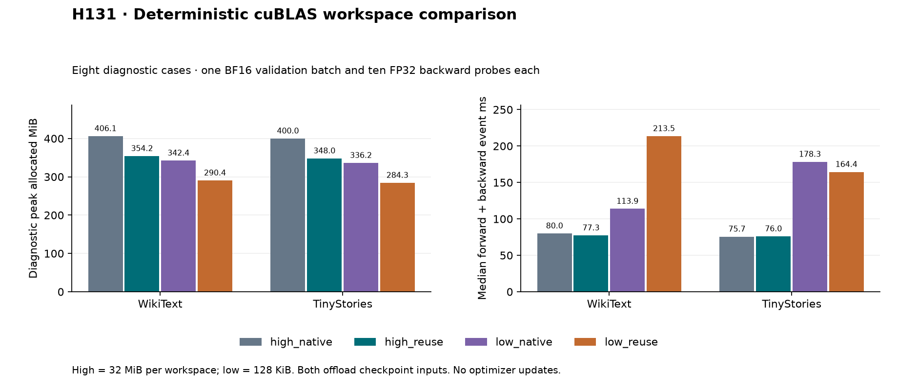

# H131: workspace memory is measurable, but the smallest setting is costly

**FAIL combined diagnostic gate.** Exact native replay audit: **True**.
Workspace-release prediction: **True**. This is an isolated
storage diagnostic; no optimizer updates or long-run quality claims.
The smaller setting removes 63.75 MiB, but the buffer classifier takes
2.76x/2.16x the high-workspace event time on WikiText/TinyStories. It fails
the 1.15x runtime limit despite exact native replay and lower memory.

| Corpus | Workspace | Classifier | Diagnostic peak MiB | Median event ms | Median wall ms | Live workspace released MiB |
|---|---|---|---:|---:|---:|---:|
| wikitext2 | high | native | 406.148 | 80.015 | 86.382 | 64.000 |
| wikitext2 | high | reuse | 354.180 | 77.319 | 83.088 | 64.000 |
| tinystories | high | reuse | 348.001 | 76.038 | 81.710 | 64.000 |
| tinystories | high | native | 399.969 | 75.667 | 81.190 | 64.000 |
| wikitext2 | low | native | 342.398 | 113.862 | 123.691 | 0.250 |
| wikitext2 | low | reuse | 290.430 | 213.539 | 224.322 | 0.250 |
| tinystories | low | reuse | 284.251 | 164.386 | 173.621 | 0.250 |
| tinystories | low | native | 336.219 | 178.334 | 188.642 | 0.250 |

Low-workspace buffer classifier compared with the preregistered controls:

| Corpus | Control | Peak allocation saved | Event ratio | Wall ratio | Failed gates |
|---|---|---:|---:|---:|---|
| wikitext2 | low_native | 15.18% | 1.8754x | 1.8136x | event, wall |
| wikitext2 | high_reuse | 18.00% | 2.7618x | 2.6998x | event, wall |
| tinystories | low_native | 15.46% | 0.9218x | 0.9204x | none |
| tinystories | high_reuse | 18.32% | 2.1619x | 2.1248x | event, wall |

Both policies retain strict deterministic algorithms, default attention,
cuDNN deterministic execution, FP32 training, disabled TF32 and four CPU
threads. Both classifier arms offload checkpoint inputs and retain ordinary
RMSNorm and resident gradients. The only policy change is
`CUBLAS_WORKSPACE_CONFIG`: high `:4096:8`, low `:16:8`.
The installed getter reports 32 MiB and 128 KiB respectively; no size setter
or backend override is used. Lower workspace may change GEMM algorithms.
Cross-workspace bitwise equality is not required or claimed.

## Direct workspace accounting

After each case releases its model/data objects and Python garbage collection
runs, clear only cuBLAS workspaces and measure the live CUDA allocation drop.
All remaining live allocation falls to zero. The high setting releases 64 MiB;
the low setting releases 0.25 MiB. The difference matches twice the queried
per-workspace size difference: 2 x (32 - 0.125) = 63.75 MiB.

| Corpus | Classifier | Measured release difference MiB | Predicted difference MiB | Diagnostic peak difference MiB |
|---|---|---:|---:|---:|
| wikitext2 | native | 63.750 | 63.750 | 63.750 |
| wikitext2 | reuse | 63.750 | 63.750 | 63.750 |
| tinystories | native | 63.750 | 63.750 | 63.750 |
| tinystories | reuse | 63.750 | 63.750 | 63.750 |

This establishes the workspace allocation effect in these probes. The factor
of two is inferred from released bytes; it is not an enumeration of internal
library handles. The earlier H130 excess of 47.75 MiB is consistent with two
pools changing from the Ada default 8.125 MiB to 32 MiB. That default follows
[PyTorch's allocation source](https://github.com/pytorch/pytorch/blob/main/aten/src/ATen/cuda/CublasHandlePool.cpp);
the current isolated release measurement is stronger evidence than attributing
H130's entire policy bundle by subtraction alone. It does not establish which
GEMM selection or kernel explains the runtime change.

[NVIDIA](https://docs.nvidia.com/cuda/cublas/index.html) documents both deterministic
settings and warns the smaller one may limit performance.
[PyTorch](https://docs.pytorch.org/docs/main/cuda_environment_variables.html)
documents the size/count syntax. These are existing controls, not a new
activation, FFN or algorithmic novelty. Parameters remain 9,099,648.

## Verification and limits

Eighty fixed-state probe backwards plus eight fresh native replays =
**88 backwards, zero optimizer updates**. Probe targets: 327,680; replay targets:
32,768, all diagnostic. Each probe case and each replay evaluates one 4,096-target
BF16 validation batch (65,536 evaluation targets total), creating the evaluation
workspaces present in training. This is not a full validation sweep.
Eight saved gradient artifacts, all 344 probe memory intervals and 20 zero
GPU allocator boundaries are retained. All 61 maintained file hashes and frozen
source/input hashes verify. No completed case was retried.

Every native replay uses its corresponding workspace setting, repeats evaluation,
and checks loss, all parameter gradients and evaluation metadata bitwise against
the saved case. Model/optimizer/sampler states remain unchanged. H123's existing
checks against the older reference retain their original numerical tolerances.
The resource loop is reused unchanged, with evaluation inside its construction
interval and no intervening peak reset. Thus that evaluation's transient and
persistent allocations count toward the diagnostic peak.

Timing uses seven measured probes after three warmup probes, with every raw
value, mean, median and variance retained. Workspace sizes run in sequential
processes; classifier arm order reverses across corpora. Scheduling/thermal
variation remains possible, and these short timings are not long-run throughput
estimates. Pinned host allocation is separate additional RAM. CUDA allocation
excludes driver/context allocations and other processes. Whole training-job
VRAM, Adam updates and long-run quality remain untested at the smaller workspace.

## Next decision

Do not extend this 128-KiB workspace to longer training. Test an intermediate explicit workspace size through the installed PyTorch workspace API, keeping the deterministic environment and algorithm policy fixed. That isolates external workspace capacity without accepting this speed penalty. Require fresh exactness/resource comparisons; no threshold or old gate changes.
H130's runtime failure and all other earlier gates remain unchanged. No maintained
default changes. The full VRAM/quality and parameter-efficient FFN goal is open.

[Plan](blas_workspace_plan.md), [summary](../results/blas_workspace_v1/summary.json),
[receipt](../results/blas_workspace_v1/receipt.json).
