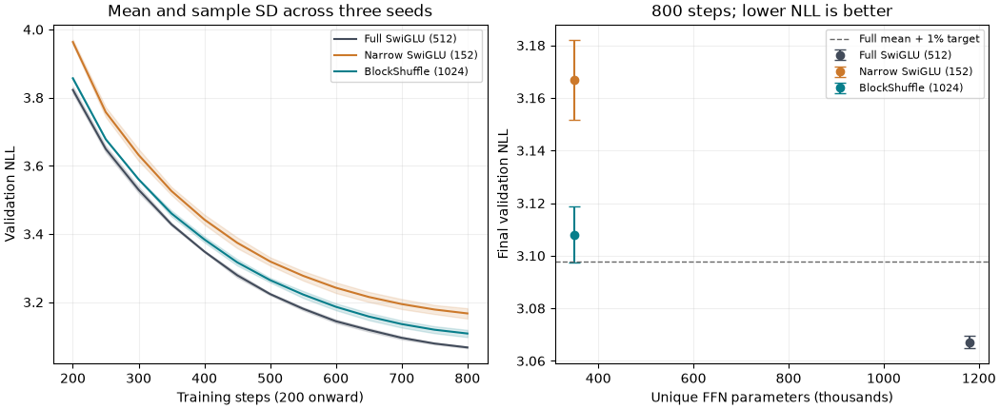

# BlockShuffle: locked three-seed results

BlockShuffle improves quality over the narrow parameter-matched SwiGLU control in all three seeds. The full research target remains unmet.

The candidate uses 350,208 FFN weights: **70.3125% fewer** than full SwiGLU. Its factorized FFN matrix FLOPs fall by the same fraction. Total model parameters fall from 2,557,632 to 1,728,192 (32.43%). Wider hidden activations and six grouped matrix operations per FFN still cost time and memory.

## Controlled comparison

All nine runs use the same cached TinyStories data, tokenizer, decoder dimensions, BF16 precision, seed-specific data order, and 1,638,400 training tokens (800 steps). Validation uses 32,768 fixed targets. Seeds are 17, 29 and 43. Seed 17 informed candidate selection; the other two replicate the locked recipe.

The structured candidate uses orthogonal factor initialization, per-factor fan-in learning rates and native gate recomputation. Dense controls retain the original initialization and uniform rate. This compares complete training recipes; it does not isolate architecture or equalize hyperparameter-search effort. The [frozen width plan](blockshuffle_width_plan.md) and [memory plan](gate_recompute_plan.md) disclose selection.

| Method | Unique FFN weights | Total weights | Mean NLL +/- sample SD | Peak training MiB (max) | Training tokens/s (mean) |
|---|---:|---:|---:|---:|---:|
| Full SwiGLU (512) | 1,179,648 | 2,557,632 | 3.067138 +/- 0.002325 | 256.57 | 25,919 |
| Narrow SwiGLU (152) | 350,208 | 1,728,192 | 3.166971 +/- 0.015172 | 222.50 | 25,734 |
| BlockShuffle (1024) | 350,208 | 1,728,192 | 3.108014 +/- 0.010612 | 272.37 | 17,652 |

Training timing excludes evaluation, checkpointing and the first ten steps. Separate-run throughput varies with laptop GPU clocks; use the [serving audit](../results/serving_blockshuffle_final.json) for rotating-order forward comparisons. These are full-sequence forwards, not autoregressive generation.

### Every seed

| Seed | Full SwiGLU | Narrow SwiGLU | BlockShuffle |
|---|---:|---:|---:|
| 17 | 3.065045 | 3.149475 | 3.098956 |
| 29 | 3.066728 | 3.174935 | 3.119690 |
| 43 | 3.069640 | 3.176504 | 3.105398 |

### Paired differences

Negative differences favor BlockShuffle. Intervals are exploratory Student-t 95% intervals across three paired seeds, assuming normal differences; they do not account for model selection or data uncertainty.

- Versus Full SwiGLU (512): mean NLL difference +0.040877; interval [+0.014775, +0.066978]; mean paired relative difference +1.333%; better in 0/3 seeds.
- Versus Narrow SwiGLU (152): mean NLL difference -0.058957; interval [-0.085746, -0.032168]; mean paired relative difference -1.861%; better in 3/3 seeds.

## Limits and decision

This is a promising compressed reference built from prior work, with a useful implementation and optimizer study. It is not a verified new architecture or a breakthrough. The mean quality gap against full SwiGLU remains above 1%; the complete gold target cannot pass. Full GELU currently has only one 800-step seed. Trained scaling, a broader corpus, equal tuning, convergence and robust deployment timing remain open.

The [progress and ablation report](blockshuffle_progress.md) includes failed branches, memory tradeoffs and inference packing. Raw [summary JSON](../results/blockshuffle_summary.json) identifies every input metric by hash; original histories, configurations, checkpoints and source archives remain in results/runs.

A later [calibrated narrow reference](width_calibration_results.md) improves the conventional control. The comparison above remains the original locked experiment; use both reports when assessing architecture gains.

Regenerate with `uv run python -m src.core.blockshuffle_report`.
