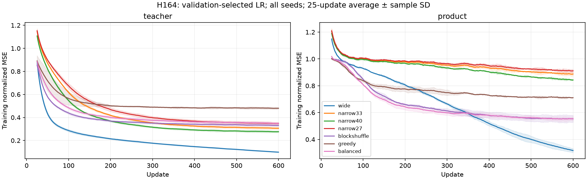

# H164 decision and learning curves

Balanced BTT reduced mean report MSE versus greedy BTT by27.1% on the Gaussian
teacher task and22.6% on cyclic products. All three seeds satisfied the declared
shape-comparison conditions. Both tasks' wide controls passed qualification.

This comparison changes the factor shapes, parameter counts, initialization
scales and prescribed per-core learning rates together. It supports the tested
balanced recipe; it does not isolate rank as the sole causal explanation.

Promotion is rejected. Balanced BTT has77.73% fewer parameters than wide dense,
but local training GPU peak is47.06MiB versus39.98MiB (17.72% higher), and complete
updates are slower. Teacher MSE is about3.1 times wide and about14% worse than
matched narrow33. Product MSE improves on narrow33 but remains worse than wide.
A kernel improvement would not by itself repair these measured quality gaps.

Retain BTT as a known structured baseline and the balanced shape rule as a useful
implementation choice. Do not repeat this rank1 recipe at language-model scale
based on parameter count alone. Future architecture screens should establish
quality against the matched narrow control before expensive kernel integration.
The existing exact memory helper remains the practical qualified result.

Curves use the validation-selected LR per task/seed/arm, all600 updates, a25-step
moving average and sample SD across three seeds. They are not confidence bands
or evidence of terminal convergence. No additional training produced this figure.

[Full report](btt_balance_results.md),
[figure provenance](../results/btt_balance_v1/learning_figure.json).
