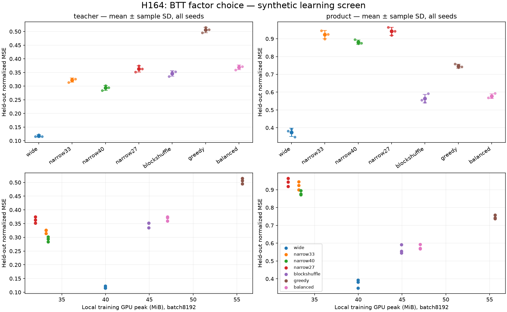

# H164: balanced versus greedy BTT factors

**NO PROMOTION.**84 fits/50,400 learning updates,42 separate resource profiles/840
updates. All168 independently recomputed CPU FP64 scores and six regenerated
datasets verified. Task qualification:{'teacher': True, 'product': True}. Balanced-factor
shape hypothesis passes all planned task conditions:True.

## Hypothesis and implementation

A64->152 up projection has an intermediate32 in rank1 greedy BTT, imposing a
rank<=32 linear bottleneck before GELU. Closest-factor BTT has intermediate64,
which removes this particular bottleneck; its down intermediate is152 instead
of304. Full attainable matrix rank does not guarantee arbitrary dense weights
or good nonlinear learning. BTT is established prior work; this is a shape-choice
ablation prompted by the retained official-code comparison, not a new activation.
[Qiu et al., ICML2024](https://arxiv.org/abs/2406.06248).

Two normalized cores per projection use the official Gaussian muP scale and
per-core LR multipliers; two learned gains and biases are counted. The forward
uses native batched GEMMs without constructing dense weights. Dense uses fan-in
Gaussian initialization; BlockShuffle keeps the repository's orthogonal init
and analogous per-core LR multipliers. This is not a reproduction of upstream
optimized kernels or its entire training recipe. Float64 gradcheck and explicit
dense-weight comparisons pass for the normalized BTT primitive.

Balanced has4,380 parameters versus wide19,672 (77.73% fewer). Greedy has5,340;
BlockShuffle3,672. The corresponding narrow widths33/40/27 have4,321/5,224/3,547.
Slightly lower matched-control budgets are explicit; these are no-bias-in-core
models with a bias after each projection and GELU between projections.

## Learning and resources

Two synthetic tasks: Gaussian dense GELU teacher and cyclic coordinate products.
Three independently generated teacher/data/optimization seeds431/443/457,
4,096training/1,024validation/1,024report examples. Output normalization uses only
training mean and scalar RMS. Each arm receives the same two base rates(.001,.003),
600AdamW updates per rate, batch256, clip1, no weight decay. Selection uses only
validation at200/400/600, including LR selection. FP32/TF32off, four CPU threads,
one RTX4070 Laptop GPU. Equal search steps do not mean equal FLOPs.

| Task | Arm | Parameters | Mean MSE | Median MSE | Sample variance | Mean local peak MiB | Mean median update ms |
|---|---|---:|---:|---:|---:|---:|---:|
| teacher | wide | 19672 | 0.11789 | 0.11578 | 1.7e-05 | 39.98 | 3.375 |
| teacher | narrow33 | 4321 | 0.32207 | 0.32578 | 5.27e-05 | 33.21 | 3.453 |
| teacher | narrow40 | 5224 | 0.29323 | 0.29432 | 8.1e-05 | 33.44 | 3.513 |
| teacher | narrow27 | 3547 | 0.36311 | 0.36333 | 0.000128 | 31.98 | 3.670 |
| teacher | blockshuffle | 3672 | 0.34635 | 0.35153 | 9.34e-05 | 44.92 | 13.653 |
| teacher | greedy | 5340 | 0.50555 | 0.50651 | 0.000101 | 55.62 | 11.238 |
| teacher | balanced | 4380 | 0.36855 | 0.37197 | 6.98e-05 | 47.06 | 13.128 |
| product | wide | 19672 | 0.37430 | 0.38208 | 0.000538 | 39.98 | 3.607 |
| product | narrow33 | 4321 | 0.92311 | 0.92459 | 0.000534 | 33.21 | 3.190 |
| product | narrow40 | 5224 | 0.88121 | 0.87591 | 0.000151 | 33.44 | 3.517 |
| product | narrow27 | 3547 | 0.94214 | 0.94291 | 0.000513 | 31.98 | 3.490 |
| product | blockshuffle | 3672 | 0.56361 | 0.55513 | 0.000603 | 44.92 | 17.983 |
| product | greedy | 5340 | 0.74627 | 0.74205 | 0.000113 | 55.62 | 14.760 |
| product | balanced | 4380 | 0.57775 | 0.57145 | 0.000176 | 47.06 | 13.655 |

Wide controls must reach normalized reportMSE<=.25 on teacher and<=.50 on product
for each seed, otherwise that task is inconclusive for promotion. Balanced must
then stay<=1.05wide MSE and<=.95narrow33 MSE, save>=25%parameters, save>=10%local
allocated GPU peak, and have median CUDA and wall updates<=1.15wide on every seed.
The separate shape hypothesis requires balanced/greedy meanMSE<=.95 on both
qualified tasks and no seed ratio>1.05. Neither aggregate nor a favorable task
rescues a failing promotion gate.

| Task | Seed | MSE / wide | MSE / narrow33 | MSE / greedy | GPU / wide | CUDA / wide | Failed gates |
|---|---:|---:|---:|---:|---:|---:|---|
| teacher | 431 | 3.115 | 1.144 | 0.725 | 1.177 | 5.874 | wide_quality, narrow_quality, memory, cuda, wall |
| teacher | 443 | 3.055 | 1.147 | 0.727 | 1.177 | 2.803 | wide_quality, narrow_quality, memory, cuda, wall |
| teacher | 457 | 3.213 | 1.142 | 0.734 | 1.177 | 3.195 | wide_quality, narrow_quality, memory, cuda, wall |
| product | 431 | 1.489 | 0.602 | 0.750 | 1.177 | 2.971 | wide_quality, memory, cuda, wall |
| product | 443 | 1.456 | 0.635 | 0.774 | 1.177 | 4.528 | wide_quality, memory, cuda, wall |
| product | 457 | 1.703 | 0.641 | 0.799 | 1.177 | 3.831 | wide_quality, memory, cuda, wall |

Resource profiles restore each selected model, then execute20 completeAdamW
updates on the same fixed8,192-example random input/target batch, discarding5
warmups only for timing. Peak allocation includes resident inputs/targets,
weights, gradients, optimizer moments and eager temporaries. These are local FNN
training profiles; they do not establish Transformer whole-job savings or
inference latency. Profiling never alters selected checkpoints. The figure's
error bars are sample SD, not confidence intervals; all three seeds are visible.

## Audit, failures and decision

The independent CPU FP64 audit constructs explicit BTT dense matrices and uses
native GELU, instead of its training contraction, to verify all84 selected-rate
states' validation/report scores within1e-5 relative tolerance. BlockShuffle dense
maps are obtained from basis images. All selected and final state hashes are
checked, data are regenerated exactly, and validation-only selection is verified.
The audit performs no optimizer updates. It does not independently replay every
learning step or establish terminal convergence.

The first CPU preflight command exited1 without a captured Python diagnostic;
one unchanged-code retry with a fresh cache prefix passed before protocol freeze.
Its cause is unknown. The note and retry log are retained. GPU training and
profiling completed once under the fixed protocol; no failed seed was replaced.

Do not insert balanced BTT into a language model or spend on kernel optimization based on this pilot. Preserve the failed gates and the control qualification status. A favorable factor-shape comparison alone does not establish replacing dense width.
The broad VRAM/quality and richer-neuron objective remains open.

[Prospective plan](btt_balance_plan.md), [raw summary](../results/btt_balance_v1/summary.json),
[CPU audit](../results/btt_balance_v1/audit.json), [official comparison](btt_official_comparison.md).
