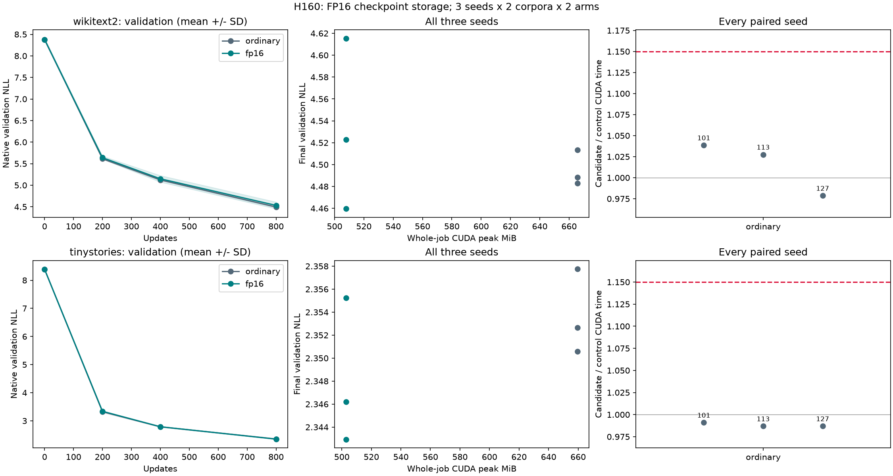

# H160: FP16 checkpoint storage from initialization

**FAIL fresh FP16 long-training gate.** Twelve continuous fresh runs, 9,600 optimizer updates and
78,643,200 training targets. Independent initialization, checkpoint, native-score
and separately qualified gradient audit: **True**. The broader goal
remains open; this is one model scale and an 800-update validation result.

| Corpus | Seed | GPU allocation saved | Complete CUDA ratio | Wall ratio | Final NLL ratio | Failed gates |
|---|---:|---:|---:|---:|---:|---|
| wikitext2 | 101 | 23.72% | 1.0386 | 1.0386 | 1.007649 | stability |
| wikitext2 | 113 | 23.72% | 1.0275 | 1.0274 | 1.022577 | quality |
| wikitext2 | 127 | 23.72% | 0.9787 | 0.9786 | 0.994814 | none |
| tinystories | 101 | 23.76% | 0.9910 | 0.9910 | 0.995871 | none |
| tinystories | 113 | 23.76% | 0.9869 | 0.9868 | 0.998122 | none |
| tinystories | 127 | 23.76% | 0.9869 | 0.9869 | 0.998930 | none |

## What was tested

H159's short continuations passed timing and resource gates from mature models.
Here both arms start from the same original H117 step-zero weights and empty
Adam state, with fresh native controls. The candidate remains buffered classifier
loss plus eight FP16 GPU checkpoint inputs, restored to FP32 for recomputation.
The original forward is FP32 and the backward is approximate. The H157 codec and
long-training loop are imported unchanged. No parameters or activation families
are added, and maintained model/trainer defaults remain unchanged.

Two small text corpora, seeds 101/113/127, 9,099,648 parameters, width 384, eight
blocks, context 512, training and validation batch 16. FP32, TF32 off, ordinary
attention, four CPU threads, default 8.125MiB cuBLAS workspace, AdamW LR0.0006,
betas0.9/0.95, original weight decay and clipping1. Each run gets an isolated
process; the first arm alternates by fixture. No completed run is repeated.

## Absolute resources and outcomes

| Corpus | Seed | Arm | GPU peak MiB | Pinned host peak bytes | CUDA update ms | Final NLL | Timing stability |
|---|---:|---|---:|---:|---:|---:|---:|
| wikitext2 | 101 | ordinary | 665.758 | 13 | 139.031 | 4.488424 | 1.0975 |
| wikitext2 | 101 | fp16 | 507.821 | 13 | 144.399 | 4.522757 | 707.2616 |
| wikitext2 | 113 | fp16 | 507.821 | 13 | 142.833 | 4.615374 | 1.1288 |
| wikitext2 | 113 | ordinary | 665.758 | 13 | 139.008 | 4.513474 | 1.0537 |
| wikitext2 | 127 | ordinary | 665.758 | 13 | 146.960 | 4.482880 | 1.0652 |
| wikitext2 | 127 | fp16 | 507.821 | 13 | 143.823 | 4.459633 | 1.0523 |
| tinystories | 101 | fp16 | 502.860 | 13 | 144.772 | 2.342937 | 1.0247 |
| tinystories | 101 | ordinary | 659.579 | 13 | 146.088 | 2.352650 | 1.0450 |
| tinystories | 113 | ordinary | 659.579 | 13 | 151.368 | 2.350599 | 1.0340 |
| tinystories | 113 | fp16 | 502.860 | 13 | 149.378 | 2.346185 | 1.0613 |
| tinystories | 127 | fp16 | 502.860 | 13 | 162.284 | 2.355238 | 1.0582 |
| tinystories | 127 | ordinary | 659.579 | 13 | 164.432 | 2.357760 | 1.0120 |

Whole-job allocation includes model/moments/data, construction, evaluation,
training, gradient copies, checkpoint saving and diagnostics. Driver/context,
unrelated processes and total CPU RSS are excluded. Complete-update timers
include forward, backward, FP16 casts/restoration, recomputation, clipping and
Adam; sampling, gradient clearing, logging, evaluation and saving are outside
those timers. This does not measure isolated inference memory.

## All-seed statistics and prospective gates

| Corpus | Arm | Mean final NLL | Median | Sample variance | Mean CUDA update ms |
|---|---|---:|---:|---:|---:|
| wikitext2 | ordinary | 4.494926 | 4.488424 | 2.657e-04 | 141.666 |
| wikitext2 | fp16 | 4.532588 | 4.522757 | 6.136e-03 | 143.685 |
| tinystories | ordinary | 2.353670 | 2.352650 | 1.360e-05 | 153.963 |
| tinystories | fp16 | 2.348120 | 2.346185 | 4.064e-05 | 152.145 |

Every seed must satisfy allocation ratio<=0.90, median complete CUDA and wall
ratios<=1.15, final validation NLL ratio<=1.01 and pinned-host peak<=128MiB.
After 20 warmups, each run's three 260-update wall-time means must have max/min
<=1.15. Passive 200ms telemetry must cover timed training. No clock adjustment,
normalization, discarded seed or aggregate rescue. The plot shows all seeds;
its mean+/-SD bands are not confidence intervals. Intermediate checkpoints show
development of differences; only the frozen final-NLL gate decides qualification.

## Independent evidence and gradient semantics

Before long training, all six native/FP16 initial-gradient pairs passed NumPy
FP64 checks: global relative L2<=.002, maximum tensor<=.02, cosine>=.99999 and
loss relative error<=1e-6. Their 12 saved gradients, batch hashes and losses match
the subsequent initial probes. This checks initialization scale, not every later
gradient approximation. Each candidate saves/unpacks 6,408 inputs: 801 backwards
including the initial probe, eight blocks each, with no full input snapshots.

The independent audit regenerates all six initial states bitwise, verifies
all 9,600 sampled batches and every model/Adam/sampler hash at 200/400/800, finite
states and counters, and scores all saved endpoints through native code. There
are 48 study and 42 independent native validation scores, 60 tensor artifacts,
19,332 training memory phases and 56 zero-allocation/reservation GPU boundaries
including preflight. The 9,600 training backwards plus 12 training initial probes,
12 preflight backwards and 12 native audit replays total 9,636; the audit performs
no optimizer updates. It does not independently repeat all 9,600 optimizer steps.

Native controls retain exact replay limits 1e-5 global/1e-4 tensor/1e-6 loss.
For FP16, the old exact replay result remains visible (6
of six fail that exact-gradient diagnostic). A separate NumPy comparison uses
native as the error denominator and applies the declared approximate caps and
cosine. A qualified approximate replay never converts that exact diagnostic into
a pass. Scoring/state audit code remains unchanged. The implementation is not
claimed to compute exact gradients or universally avoid overflow or vanishing
and exploding gradients. All studied losses, norms and states were checked finite.

## User pause, restart and accounting

The user stopped case03 after207 recorded updates. Its full partial history,
initial probe and step200 checkpoint remain untouched. Only that incomplete run
was restarted from initialization into restart/case03; the three completed runs
were retained and cases04-11 then ran once. Accepted comparisons use12 complete
800-update runs. Including discarded work, at least9,807 optimizer updates and
9,844 backwards were performed; one unrecorded in-flight update cannot be excluded.
The figures and tables describe accepted runs only, not total compute spent.

WikiText2 seed113's FP16 and native runs span the pause. Their timing ratio is
cross-session and does not establish temporally adjacent throughput equivalence,
even if the original gates pass. It is not clock-normalized. Quality comparisons
retain matched initialization, data and training recipes. The restart plan was
fixed before new outcomes and did not alter acceptance limits.
[Resume protocol](checkpoint_fp16_long_resume_plan.md).

## Decision and limits

Do not promote the recipe as quality-preserving long training. Retain every failing gate and seed, then distinguish numerical failure, learning degradation and timing instability before redesigning.

The same two language corpora have informed development, so this is not an
untouched final-test or unrelated-domain result. Eight hundred updates do not
prove terminal convergence. There is no parameter reduction, new scalar activation,
novelty or SOTA claim. Activation compression has prior art documented in H157;
the broad architecture/complex-pattern objective remains unresolved. H156's exact
offload result and H157's failed absolute-zero host gate remain unchanged.

[Prospective plan](checkpoint_fp16_long_plan.md),
[machine-readable summary](../results/checkpoint_fp16_long_v1/summary.json),
[independent audit](../results/checkpoint_fp16_long_v1/audit.json).
