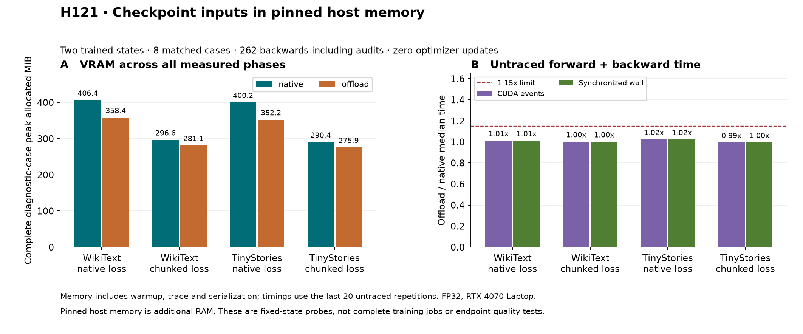

# H121 — checkpoint inputs in pinned host memory

## Decision

**Eliminated for the fixed all-four-fixture gate.** Native-classifier probes
save exactly 48 MiB (11.81–11.99%) with 1.21–2.34% event-time overhead. The
chunked-classifier probes save only 14.47–15.40 MiB (4.98–5.19%), below the
prospective 10% requirement. All gradient, trace, host-memory and timing gates
pass. No training extension was earned, and no maintained default changed.

This is a useful, narrowly scoped storage result, not a new activation,
parameter reduction, quality improvement or breakthrough. The model remains
9,099,648 trainable parameters. The broader research goal remains open.

## Matched results

| Corpus / FP32 classifier | Native peak MiB | Offload peak MiB | Saved | Event time ratio | Wall time ratio | Joint gate |
|---|---:|---:|---:|---:|---:|---|
| wikitext2 / native | 406.398 | 358.398 | 11.81% | 1.0121× | 1.0115× | PASS |
| wikitext2 / chunks | 296.553 | 281.150 | 5.19% | 1.0023× | 1.0017× | FAIL: memory |
| tinystories / native | 400.219 | 352.219 | 11.99% | 1.0234× | 1.0222× | PASS |
| tinystories / chunks | 290.374 | 275.901 | 4.98% | 0.9948× | 0.9956× | FAIL: memory |

These are **complete diagnostic-case allocated peaks**, including construction,
warmup, all forward/backwards, gradient serialization, the separate trace and
release/state checks. Normal untraced probe peaks happen to equal those maxima.
CUDA reserved peaks are separate in `metrics.csv.gz`; allocator figures exclude
driver/context and other processes. This is not complete training-job VRAM:
Adam states are resident, but no optimizer step or validation pass is executed.

Timing compares the last 20 of 30 repetitions of the same first continuation
batch. CUDA-event forward and backward times are summed; synchronized wall
time includes intervening ledger work. Hashing/copy tracing runs separately
and is excluded from these time ratios. Mean, median, sample variance, minima,
maxima and individual repetitions are preserved. Maximum split-half median
ratio is 1.012905, within 1.15. Tiny apparent chunked speed differences
are short-run observations, not production throughput claims.

## What was actually moved

Every one of the eight traces packs exactly eight [8,512,384] FP32 checkpoint
inputs. Payload is eight × 6 MiB = 48 MiB. Offloaded tensors are CPU-pinned;
native trace tensors remain on CUDA. Each input is unpacked once, its value
hash matches the source exactly, and all packed tensor objects release after
backward/graph cleanup. Logical peak payload is 48 MiB and final logical live
payload is zero. This observes Python packed-object lifetimes; it does not
assert instantaneous physical allocator reclamation.

The host allocator reaches 64.000003815 MiB including a 4-byte background
allocation. Each 6 MiB payload rounds to an 8 MiB host block, giving 64 MiB for
eight saved inputs. Cached pinned blocks persist into later native cases;
those cases have near-zero active host payload but retained allocated cache.
Boundary and per-phase host active/allocated statistics preserve that distinction.
Reported host peaks are PyTorch's rounded per-bucket estimates.

The trace delegates PyTorch's existing CPU pack/unpack callbacks. Each
offloaded trace moves 48 MiB device→host and 48 MiB host→device for storage,
plus 96 MiB of **extra diagnostic** device→host hashing. Native traces also
perform 96 MiB of extra hashing. The following transfer timings include trace
synchronization effects and are diagnostic only.

| Corpus / classifier / storage | Forward peak MiB | Backward peak MiB | Live after traced forward MiB | Trace pack / unpack event ms |
|---|---:|---:|---:|---:|
| wikitext2 / native / native | 342.430 | 406.398 | 278.430 | 0.345 / 0.034 |
| wikitext2 / native / offload | 294.430 | 358.398 | 230.430 | 4.442 / 4.332 |
| wikitext2 / chunks / offload | 197.257 | 281.150 | 166.430 | 4.412 / 4.452 |
| wikitext2 / chunks / native | 238.477 | 296.553 | 214.430 | 0.348 / 0.051 |
| tinystories / native / native | 336.250 | 400.219 | 272.250 | 0.363 / 0.011 |
| tinystories / native / offload | 288.250 | 352.219 | 224.250 | 4.632 / 4.337 |
| tinystories / chunks / offload | 191.078 | 275.901 | 160.250 | 4.421 / 4.317 |
| tinystories / chunks / native | 232.297 | 290.374 | 208.250 | 0.337 / 0.040 |

Removing 48 MiB of saved payload does not guarantee 48 MiB of peak savings.
Native and chunked classifiers change the lifetimes and competing transient
allocations. The chunked case's smaller saving is observed; these phase
boundaries do not uniquely identify the within-backward allocation responsible.
An allocation timeline would be needed for that attribution.

## Correctness and provenance

- GPU FP64: six backwards across two tanh-chain shapes and three execution
  paths; six joint finite-difference directions add twelve loss forwards.
  Maximum directional absolute error 1.517e-13; all fixed tolerances pass.
- Eight replay backwards in a fresh process, using the original source states,
  sampler positions and unchanged loss/checkpoint implementation. NumPy
  compares 24 trace/replay/native pairs. Maximum symmetric gradient relative L2
  9.344e-08, maximum tensor relative L2
  2.017e-07, maximum relative loss difference
  0.000e+00. All saved gradients and observed losses are finite.
- Exact input copy hashes; model, moments, optimizer counters at 800, registered
  state keys and parameter identities unchanged. Every repeated batch uses
  the same tokens/targets; replay independently reconstructs the first batch.
- GPU allocator is zero before/between/after cases in qualification, profiling
  and replay. Host caches are recorded rather than incorrectly required zero.
- 162 frozen scientific/source hashes, 61 maintained source/config/test/lock
  hashes, two original source checkpoints and dataset manifests remain intact.
  Original H117 quality failure and H119 active-clipping audit failure remain.

The first audit process crashed during SymPy import, before PyTorch imported
or replay began. Its log and exit are retained. The prospective recovery
manifest permits only the eight outstanding replay backwards through the
unchanged audit function. No completed scientific case was repeated. The
recurrent native import issue has not been diagnosed or claimed fixed.

## Budget and reproduction

Total 262 backwards = 6 qualification + 240 repeated probes + 8 traces + 8 replays.
Zero optimizer/training updates, zero validation scores. Full-model diagnostic
targets 1,048,576 are repeated fixed-state evaluations, not training exposure.
There are 24 new gradient tensor artifacts. Profile wall time is
33.187 seconds excluding process startup and independent replay.
RTX 4070 Laptop 8 GiB; UV-managed Python 3.12.9, installed PyTorch 2.14, four CPU
threads, FP32 weights/gradients/moments, TF32 off, default SDPA, whole-block
checkpointing. H120 model/Adam/data recipe is retained unchanged.

The [prospective plan](checkpoint_input_offload_plan.md),
[audit recovery](checkpoint_input_offload_audit_recovery.md), and
[source guide](../results/checkpoint_input_offload_v1/source/README.md) identify
the exact stage order. Sealed result directories intentionally reject overwrite;
use a new study root for a newly authorized reproduction. Raw tensors remain
local; compressed JSON/CSV/logs, manifests and verification receipt summarize
the inspectable evidence.

## Next decision

Do not expand this result into a quality or parameter-efficiency claim. Keep
the native-classifier storage benefit as a bounded observation. A subsequent
prospective diagnostic could locate the chunked backward peak's live tensors
before designing another architecture or storage change. Any changed hypothesis
needs new gates; it cannot retroactively make H121's four-fixture gate pass.

This uses existing [PyTorch save_on_cpu](https://docs.pytorch.org/docs/2.14/autograd.html#torch.autograd.graph.save_on_cpu)
around [non-reentrant checkpointing](https://docs.pytorch.org/docs/2.14/checkpoint.html).
The installed source is hashed. No algorithmic novelty is claimed.
