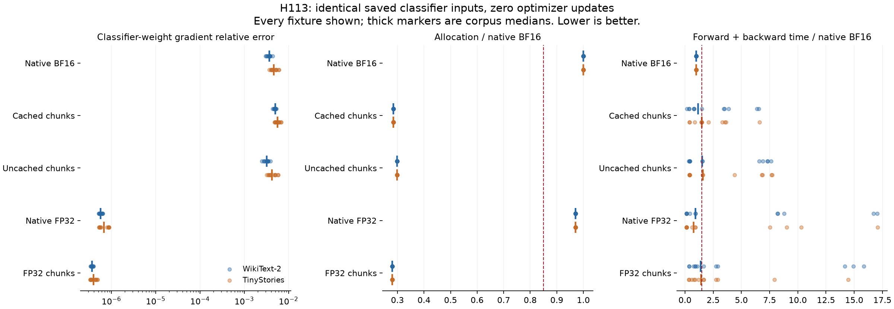
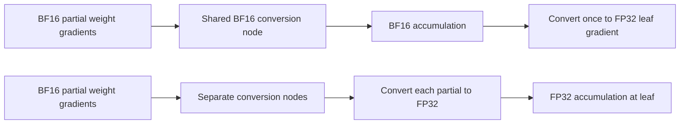

# H113: a shared BF16 cast adds measurable classifier-gradient error

The proposed cache mechanism is supported on **all 24 saved states**. Cached
chunks have one classifier-weight conversion node; uncached chunks have eight.
Disabling that cache leaves loss and the hidden-state gradient bitwise unchanged
in every fixture, while changing the classifier-weight gradient in every fixture.
The gradient arriving at each conversion is BF16. Independent native recapture,
closed-form derivatives and all 144 gradient reruns pass.

Removing the cache reduces median paired weight-gradient error by **35.24% on
WikiText-2 and 22.89% on TinyStories**. That fixed candidate still fails the
prospective local gates: insufficient TinyStories error reduction and excessive
runtime in both corpora. Retain the diagnosis; do not promote uncaching alone.

**FP32 classifier chunks qualify for a whole-model resource/correctness screen.**
They reduce local allocation by **72.02% versus native BF16 classification**,
from 227.03 to 63.53 MiB, and reduce median weight-gradient relative error to
approximately 3.7-3.9e-7. Median paired local time ratios are 1.378 / 1.415.
These are detached-classifier measurements, not whole-job savings or measured
language improvement. The recipe uses an existing helper and no new parameters.

## Experiment and controls

The [frozen plan](classifier_precision_plan.md) uses all twelve H112 training
trials at updates 100 and 800: two corpora, three training seeds and both old
training policies. These are 24 correlated states from twelve trained models,
not 24 independent training replications. Each state supplies one actual
normalized decoder output for B8/T512, using a training-data probe with sampler
seed equal to the training seed plus 30,000. Tokens match across state/policy
within each corpus/seed. They are fresh probes of previously used training
corpora, not a new held-out test.

The captured hidden matrix has 4,096 rows and 384 features; the classifier is
4,096 by 384. Both inputs are saved in their actual FP32 storage after native
BF16 decoder execution. Every method receives precisely the same detached
hidden rows, weights and targets. No optimizer is constructed or updated.

Five methods are compared: native BF16; maintained checkpointed BF16 chunks
with caching; the identical helper with autocast caching disabled; native FP32;
and maintained FP32 chunks. Chunk size stays 512. A native FP64 loss/gradient,
using exact promotion of the saved FP32 inputs, provides a local numerical
reference. It is not a FP64 decoder or a claim of exact real arithmetic.

Before measurement, ten CPU-double shape/policy checks pass with partial masks
and uneven chunks. Three chunk policies also pass numerical gradcheck. Eight
small CPU/CUDA linear examples inspect actual conversion nodes and gradient
dtypes. Measurements then complete **120 method comparisons and 504 backward
passes**, consisting of one reference and twenty warmup/measured passes per
fixture. There are **zero optimizer updates**. Total study time is 170.33 seconds.

## The scoped arithmetic result

For valid-target count N, hidden rows H, weights W and probabilities
P = softmax(H W^T), define G = (P - one_hot(y)) / N, with ignored rows zero.
Then

$$
\nabla_H L = GW,\qquad
\nabla_W L = G^T H = \sum_j G_j^T H_j.
$$

This partition identity is exact in real arithmetic. Let g_j denote a partial
gradient already rounded by a BF16 linear backward. Reusing one conversion
node can accumulate these partials in BF16 before converting to FP32. Separate
nodes convert each partial first, allowing accumulation at the FP32 leaf.
The cast's autograd rule rounds the transmitted gradient; it is not the
ordinary derivative of a discontinuous quantization function.

BF16 spacing at 256 is 2. With round-to-nearest-even, repeatedly adding 1 to
256 can keep producing 256. The exact sum 256 + 1 + 1 + 1 + 1 is 260, which
is representable. In the actual recorded five-term graph, the cached gradient
is **256** and the uncached gradient is **260**, on both CPU and CUDA.
Reversing the construction order gives 260 for both. Thus the discrepancy
depends on accumulation order; it is not an unavoidable error for every sum.

For ordinary sequential floating-point addition, assuming no overflow or
underflow and the standard relative-roundoff model, the componentwise
bound is |fl(sum g_j) - sum g_j| <= gamma_(k-1) sum |g_j|, where
gamma_m = m*u/(1-m*u) and m*u < 1. For eight terms, BF16 u = 2^-8 gives
gamma_7 = 7/249, while FP32 u = 2^-24 gives about 4.17e-7. This bounds the
additional accumulation error of already formed partials only. It excludes
input, matrix-product and softmax rounding, and gives no universal relative
bound under cancellation or guarantee about optimization and NLL. See
[Higham (1993), section 2](https://nhigham.com/wp-content/uploads/2023/10/high93s.pdf)
for the standard summation bound and its conditioning limits.

The matrix identities, rounding example and standard accumulation bound are
elementary numerical analysis, not a new theorem. PyTorch's
[cache implementation](https://github.com/pytorch/pytorch/blob/v2.14.0/aten/src/ATen/autocast_mode.cpp)
and [AMP documentation](https://docs.pytorch.org/docs/2.14/amp.html) explain when
leaf-weight casts may be reused. Its
[numerical-accuracy notes](https://docs.pytorch.org/docs/2.14/notes/numerical_accuracy.html)
warn that mathematically equivalent computation orders need not agree bitwise.

## Complete comparative results

Errors are relative L2 errors against the same FP64 reference, summarized as
medians over twelve fixtures per corpus. Time is the median of paired fixture
ratios, not the ratio of aggregate medians. Allocation is identical across
fixtures for each policy.

| Method | WikiText dW error | TinyStories dW error | Local peak, MiB | WikiText paired time | TinyStories paired time |
|---|---:|---:|---:|---:|---:|
| Native BF16 | 0.003666 | 0.004589 | 227.03 | 1.000x | 1.000x |
| Cached BF16 chunks | 0.004947 | 0.005559 | 64.66 | 1.147x | 1.488x |
| Uncached BF16 chunks | 0.003205 | 0.004214 | 67.66 | 1.538x | 1.578x |
| Native FP32 | 5.64e-7 | 6.81e-7 | 220.28 | 0.927x | 0.778x |
| FP32 chunks | 3.66e-7 | 3.93e-7 | 63.53 | 1.378x | 1.415x |

Cached and uncached dH are bitwise identical, with median relative errors
0.003568 / 0.005132. FP32 chunks reduce those errors to 3.53e-7 / 5.72e-7.
Uncaching therefore removes one weight-accumulation error source but leaves
other mixed-precision errors. It does not alone reproduce the FP64 gradient.

Both altered policies pass the all-fixture memory and hidden-gradient gates.
Uncached BF16 fails the <=1.5 median time ratio in both corpora and the required
25% median dW-error improvement in TinyStories. FP32 chunks pass all prospective
gates in both corpora. Native FP32 is an accuracy control; its almost-full logit
allocation does not qualify as the low-memory candidate.

Every result, mean, median, sample variance and range is available by corpus,
checkpoint and policy in the [summary](../results/classifier_precision_v1/summary.json)
and [120-row table](../results/classifier_precision_v1/metrics.csv.gz). Timings vary
substantially across fixtures: FP32-chunk time ratios span **0.335-15.862x**
across both corpora. The frozen median rule permits the next resource screen,
but this spread makes current runtime evidence weak. No robust kernel-speed
ranking follows. The all-point figure shows every ratio; a complete-model
screen must remeasure wall time with sustained warmup and separate GPU-event
timing before claiming practical cost.

## Memory scope and recorded limitation

Local peaks include hidden/weight/target inputs, their gradients, classifier/CE
intermediates and normal cuBLAS workspaces. They exclude the decoder, optimizer,
corpus cache and GPU driver/context. The saved CPU inputs and gradient references
are outside those CUDA peaks. Before each policy fixture, unused tensors and
workspaces are cleared and zero allocated/reserved storage is checked. Workspace
sizes are unchanged and no bytes are subtracted during measurement.

Capture peaks at **88.29 MiB**. The largest logged phase peak is **416.16 MiB**,
from the FP64 reference. A planned overall diagnostic-process maximum was not
fully recorded: counters reset per repetition, and warmup peaks were not
serialized. These values are therefore phase measurements, not an authoritative
whole-process maximum. This instrumentation limitation is explicit in the
summary and does not change the recorded per-policy gates. No complete-job
memory or inference-serving claim is made from these values.

## Independent verification and decision

The audit recaptures all 24 hidden matrices through the maintained native model
forward with a norm hook, independently of the capture driver's manual block
traversal. Tokens, targets, hidden rows and weights all match exactly. It then
checks the FP64 reference using the explicit softmax/matrix derivative formulas
above, within 1e-10 relative and 1e-12 absolute gradient tolerance.

All **144 losses and both-gradient reruns match exactly**, including the 24
references. All 240 stored gradient-error records recompute exactly. Original
checkpoint hashes, 48 capture/gradient artifacts, frozen sources and qualification
records are retained. No scientific retry or native failure occurred in this
study or its audit. The same absolute UV-managed Python 3.12.9, PyTorch
2.14.0+cu132, RTX4070 Laptop GPU, four threads and TF32-off setting are used.
Prior intermittent native failures remain unresolved, despite these successful
runs. The [final receipt](../results/verification/classifier_precision_final_v1.json)
separates this audit from the unchanged previous 116-test maintained suite.

Retain the shared-cast diagnosis as a **PROMISING COMPONENT**. Eliminate
uncaching alone under the tested local gates. Advance FP32 classifier chunks
only to full-model gradient, memory and update-cost qualification, with the
original BF16 and native FP32 controls. No language training is earned directly
by this diagnostic. It neither proves why H112's final NLL differed nor that
higher numerical precision will improve learning.

The [source guide](../results/classifier_precision_v1/source/README.md) distinguishes
frozen scientific code from later audit and reporting. Existing loss chunking is
prior work, including [Cut Your Losses](https://arxiv.org/abs/2411.09009); this
uses ordinary PyTorch rather than its specialized kernels. No new activation,
SOTA FFN, parameter reduction or breakthrough is established. The primary VRAM/
quality objective and separate compressed-architecture target remain open.
