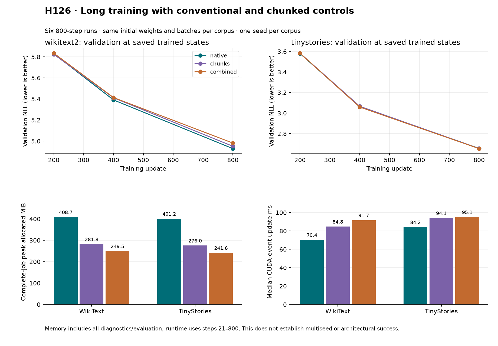

# H126: long training with native and chunked controls

**FAIL: the candidate does not pass every fixed long-run gate.** These are fresh-from-initialization runs of one deliberately
selected seed per corpus, including the historical difficult WikiText seed.
All independent initialization, gradient, data and scoring audits pass.

| Corpus | Arm | Final validation NLL | Complete-job peak MiB | Median event ms | Median wall ms |
|---|---|---:|---:|---:|---:|
| wikitext2 | native | 4.928883 | 408.686 | 70.385 | 70.439 |
| wikitext2 | chunks | 4.951098 | 281.838 | 84.805 | 84.855 |
| wikitext2 | combined | 4.981678 | 249.538 | 91.651 | 91.699 |
| tinystories | combined | 2.654535 | 241.634 | 95.118 | 95.164 |
| tinystories | chunks | 2.655545 | 275.964 | 94.050 | 94.099 |
| tinystories | native | 2.656350 | 401.157 | 84.178 | 84.240 |

Candidate comparisons (positive NLL change means worse):

| Corpus | Control | NLL change | VRAM saved | Event ratio | Wall ratio | Failed gates |
|---|---|---:|---:|---:|---:|---|
| wikitext2 | native | +1.071% | 38.94% | 1.3021x | 1.3018x | quality, event, wall, stability |
| wikitext2 | chunks | +0.618% | 11.46% | 1.0807x | 1.0807x | stability |
| tinystories | native | -0.068% | 39.77% | 1.1300x | 1.1297x | none |
| tinystories | chunks | -0.038% | 12.44% | 1.0114x | 1.0113x | none |

The combined arm saves 38.94%/39.77% CUDA allocation against native on
WikiText/TinyStories, and 11.46%/12.44% against chunks. TinyStories passes both
comparisons. WikiText exceeds the native quality limit: +1.071% NLL against
a predeclared +1% maximum. Its observed native-relative event overhead is
30.21%, above 15%, and the native arm's timing stability is 1.170, above 1.15.
That instability limits runtime interpretation and fails both WikiText
comparisons under the corpus-wide stability rule; it does not erase the
separate quality failure. This single seed cannot establish a systematic
quality penalty or isolate which numerical change caused it.

The native arm uses ordinary RMSNorm, native FP32 classifier loss and standard
whole-block checkpointing. The chunks arm uses chunked FP32 loss and CPU
checkpoint-input storage. The combined arm additionally uses compact RMSNorm
and gradient staging/restoration. Every gradient returns to CUDA before the
unchanged global clipping/default AdamW update. BF16 evaluation uses ordinary
RMSNorm. There are no parameter reductions: all models have 9,099,648 parameters.

## Evidence and limits

Six 800-update runs use the original two step-zero states, identical optimizer
settings and identical batch order per corpus. Arm order reverses across
corpora. Total **4,800 updates, 19,660,800 training targets and 4,812 backwards**:
4,800 training, six initial probes, six independent replays. Initial-probe and
replay targets are diagnostics, not extra training exposure. No run was repeated.

The audit regenerates both original initializations exactly, reconstructs all
4,800 training batches, verifies all 18 model/optimizer states at steps 200/400/800,
and checks 20 native validation scores. Maximum gradient replay relative L2 is
1.548e-07; maximum trained-checkpoint score discrepancy is 1.494e-08. All states
and gradients are finite. The 24 tensor artifacts are six initial gradients and
18 trained states. Sources, datasets and all 61 maintained file hashes verify.

Complete-job peaks include warmup, initial probes, all transfers/updates,
evaluation, diagnostics and serialization. All 9666 memory intervals and
16 zero GPU allocator boundaries are recorded. Host pinned active/allocated
statistics are separate from CUDA allocation; pinned memory is additional RAM.
Pinned allocated peak reaches 112.03 MiB. The host allocator cache persists
across cases, so later control peaks can include buffers cached by earlier
arms; these are process peaks, not isolated per-arm host ownership.
CUDA allocator figures exclude driver/context memory and other processes.
Runtime uses steps 21–800, with mean, median, variance and block stability saved.
The figure shows all three trained validation checkpoints; initial scores are
also retained in machine-readable results.

The old H117 training and audit functions and H125 adapter are reused without
editing their implementation. H125's short continuation pass is preserved;
it cannot substitute for these longer-run gates. H117/H119 failures are not
retroactively resolved. No maintained defaults change and no algorithmic
novelty or architectural breakthrough is claimed.

## Next decision

Expansion to more seeds is not earned under this protocol. Investigate the failed dimensions before allocating another training matrix. Memory savings remain scoped observations, not a rescued quality/runtime gate.
The broader VRAM/quality and parameter-efficient FFN research goal remains open.

[Prospective plan](compact_long_training_plan.md),
[summary](../results/compact_long_training_v1/summary.json),
[evidence receipt](../results/compact_long_training_v1/receipt.json).
