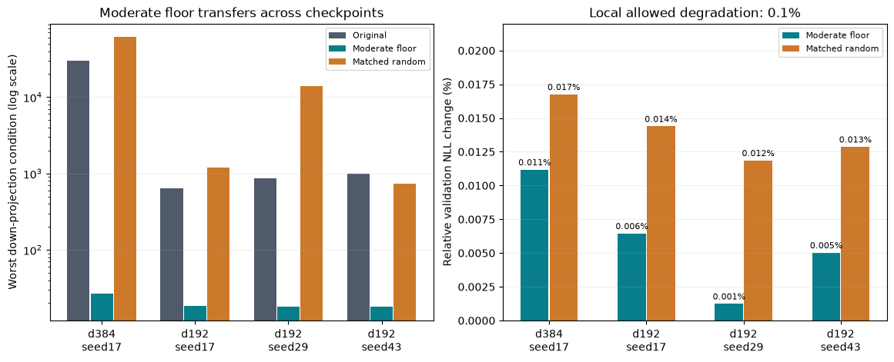

# Trained projection conditioning: intervention and transfer

A moderate post-training singular-value floor substantially improves the down-projection condition numbers with small validation-loss changes. The effect transfers to all three existing smaller-model seeds. This is a measured projection-level benefit with unchanged parameter count and matrix-operation shapes; it does not establish improved training, runtime, full-network gradient stability or architectural novelty.

Read the [initial frozen protocol and scoped proof](conditioning_plan.md) and the [locked transfer plan](conditioning_replication_plan.md). Original checkpoints remain unchanged. Transformed square-factor tensors, source archives, fixed data hashes, exact recipes, full spectra and directional gradient records are retained in each results/conditioning_* directory.

## Width384/layer8, seed17, 800-step checkpoint

| Intervention | NLL | Relative NLL change | Worst down condition | Condition improvement | Local gates |
|---|---:|---:|---:|---:|---|
| unchanged | 2.772706 | +0.00000% | 30134.36 | 1.0x | Control |
| svd_reconstruction | 2.772706 | +0.00000% | 30134.36 | 1.0x | Control |
| floor_0.01 | 2.772755 | +0.00179% | 216.71 | 139.1x | PASS |
| floor_0.1 | 2.773015 | +0.01118% | 26.53 | 1136.0x | PASS |
| floor_1 | 2.878294 | +3.80812% | 3.97 | 7590.6x | FAIL |
| random_0.01 | 2.772741 | +0.00129% | 23305.37 | 1.3x | FAIL |
| random_0.1 | 2.773170 | +0.01676% | 61221.96 | 0.5x | FAIL |
| random_1 | 2.831766 | +2.13008% | 3322.73 | 9.1x | FAIL |

Floor strengths .01 and .1 pass the prespecified >=10x condition-improvement and <=.1% relative NLL-degradation gates. The .1 floor improves worst down conditioning by 1136x, to 26.53, at a .01118% NLL cost. Full orthogonalization (strength1) improves conditioning further but costs 3.81% NLL and fails. Random perturbations match per-block edit norm; at strength.1 they worsen conditioning despite a similarly small NLL change. This supports a directional effect in this checkpoint, not a replicated distributional claim over noise samples.

All eight cases have finite loss/recorded gradients. Unchanged and SVD-reconstructed validation reproduce the archived baseline exactly. The new materialized product is computed in FP64 from FP32 factors; its original worst condition 30134.36 differs slightly from the earlier FP32-product audit's 30134.46. This precision distinction does not explain the intervention's large effect.

## Locked .1 floor on width192/layer4, three seeds

The moderate strength was selected using the larger-model result, then fixed before evaluating the smaller native-gate h1024 checkpoints. Each seed includes unchanged and reconstruction controls plus a fixed-direction matched random perturbation. This is transfer across size and seeds, not three-seed confirmation of the larger model's quality result.

| Seed | Original NLL | Floored NLL | Relative NLL change | Original down condition | Floored down condition | Random-control down condition | Gates |
|---|---:|---:|---:|---:|---:|---:|---|
| 17 | 3.098956 | 3.099156 | +0.00645% | 646.30 | 18.49 | 1206.43 | PASS |
| 29 | 3.119690 | 3.119729 | +0.00124% | 864.24 | 17.79 | 13805.04 | PASS |
| 43 | 3.105398 | 3.105554 | +0.00503% | 1002.46 | 17.92 | 732.10 | PASS |

Original mean NLL is 3.108014; floored mean is 3.108146 (sample SD 0.010529). The all-three transfer decision is PASS. The original small-model quality gap against full SwiGLU remains; this intervention addresses projection conditioning, not that accuracy deficit.

## Proof scope and next decision

The floor is applied across all singular values in each layer's square block-diagonal factor, followed by a common rescale preserving its Frobenius norm. For nonzero factors in exact arithmetic, its condition is at most 1/alpha; at alpha1 it is scaled orthogonal and preserves the rectangular factor's condition in the composed projection. All recorded finite-precision factor bounds, Frobenius preservation and product-condition inequalities pass numerical checks.

The intervention changes learned weights and therefore changes the represented function. It adds no weights, buffers or inference operations after edited factors replace the originals. The offline SVD cost is separate; this diagnostic makes no serving-speed claim. The rectangular down projections necessarily have an input nullspace: the condition numbers compare only their nonzero singular values. The reported condition is not that of the gated FFN or residual-network Jacobian. Finite one-batch loss-direction gradients provide no global lower bound.

A hard orthogonal constraint is not justified by the quality failure at strength1. The evidence instead supports retaining the mild floor as a post-training conditioning option and testing any training-time variant separately against matched controls. Separate [fused execution](fused_execution_results.md) and [larger three-seed quality](scale_replication_results.md) reports now supply those local checks for original weights. The [joint three-checkpoint audit](joint_conditioning_results.md) now supplies the floor-plus-fused numerical and quality checks. Convergence, broader data and combined serving speed remain unmeasured. Existing structured orthogonal work is cited in the proof plan; no new primitive is established.

Reproduce with `uv run python -m src.core.conditioning_report`.
