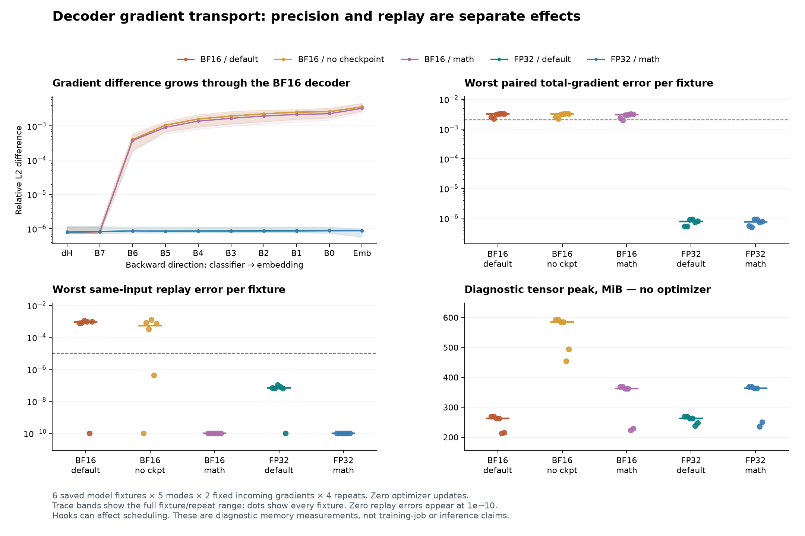

# H115: precision separates gradient transport error from replay variability

**Two FP32 decoder configurations pass this fixed numerical diagnosis and earn
an uninstrumented resource screen.** BF16 configurations fail; disabling
checkpointing does not rescue them. No new layer, parameter saving, language
quality gain or whole-job memory improvement is established by this study.
The primary goal remains lower actual VRAM with preserved quality and practical
runtime. The broader architectural goal remains open.

This follows [H114's failed full-model precision screen](fp32_classifier_profile_results.md).
Its original failures remain unchanged. The [prospective plan](decoder_gradient_transport_plan.md)
fixed the interventions, repetitions and thresholds before execution.

## What was controlled

Six existing starting checkpoints were used: WikiText-2 and TinyStories seed 61,
each with the old block and loss-chunk policies at step 800, plus full GELU and
SwiGLU seed 17 controls at step 3,200. These are heterogeneous fixtures with
correlated pairs, **not six independent training seeds**. Every mode receives
the same checkpoint and first H114 probe batch for its fixture.

All models have width 384, eight layers, six heads and vocabulary 4,096. Narrow
GELU uses hidden width 456, batch 8/context 512, 9,099,648 total and 2,801,664 FFN
parameters. Full GELU hidden 1,536 and SwiGLU hidden 1,024 use batch 16/context 128,
15,735,168 total and 9,437,184 FFN parameters. No architecture or weight changes.

The five modes cross BF16/FP32 decoder precision, default/forced-math attention,
and whole-block/no checkpointing as listed below. Classifiers always run FP32:
native cross-entropy versus the existing checkpointed 512-token chunks. For
each condition, both classifiers first receive identical detached normalized
hidden states H and weights W. Their saved incoming gradients dH are then held
fixed for four interleaved decoder backward repeats per classifier policy.
Each repeat starts with a fresh forward and unchanged model weights/tokens.

The main study completes **30 conditions, 60 classifier backwards and 240 decoder
backwards in 189.85 seconds**. Qualification adds 20 small backwards: 16 CPU and
four CUDA. There are **zero optimizer updates and zero new language-training
runs**. One RTX 4070 Laptop GPU was used with UV-managed Python 3.12.9,
PyTorch 2.14.0+cu132, four CPU threads and TF32 disabled. Deterministic algorithms
and cuBLAS workspace configuration were not changed.

## Chain rule and a concrete rounding witness

Write the normalized decoder output as $H=F_\theta(X)$, and the classifier loss
as $L(H,W)$. For fixed incoming $G=\partial L/\partial H$, the decoder contribution is

$$g_{\mathrm{decoder}}=J_{F,\theta}^{T}G.$$

The embedding and classifier share W. Therefore its total gradient must include
both paths:

$$g_W=J_{F,W}^{T}G+\left.\frac{\partial L}{\partial W}\right|_{H\ \mathrm{fixed}}.$$

Other parameter gradients contain only the decoder contribution. Four tiny
CPU-double GELU/SwiGLU × native/chunked cases compare this reconstruction against
complete autograd; all are exact in the recorded runs. This checks the
decomposition, rather than treating the saved classifier gradient as an
independent parameter update.

In exact arithmetic the fixed Jacobian maps incoming gradients linearly.
Floating-point backward execution includes rounding. Consider a scalar linear
layer with input=weight=1 and incoming gradients

$$m=1+2^{-8},\quad g_-=m-2^{-23},\quad g_+=m+2^{-23}.$$

Their difference is 2^-22. Around 1, BF16 spacing is 2^-7. Round-to-nearest maps
g_- to 1 and g_+ to 1+2^-7, making the gradient difference larger by

$$\frac{2^{-7}}{2^{-22}}=2^{15}=32768.$$

All eight CPU/CUDA × BF16/FP32 × two-input backward checks give the predicted
input and weight gradients. FP32 preserves the original two values. This is an
elementary rounding-boundary witness in actual autograd, **not a new theorem,
an ordinary derivative of quantization, or proof of every H114 discrepancy**.

## Numerical results and elimination

Paired error compares chunk-derived and native-derived **total parameter
gradients**, including the tied-weight addition. The table's paired median is
the median of six fixture medians, each using all four paired repetitions.
Replay error compares repeated identical incoming gradients to their first
pass. The 36 comparisons per mode exclude the trivial first-pass self-matches.
These descriptive statistics are not independent-seed confidence intervals.

| Decoder / attention / checkpoint | Paired global relative-L2 median | Worst repeat relative L2 | Bitwise repeat matches | Decision |
|---|---:|---:|---:|---|
| BF16 / default / block | 0.00318076 | 0.00117032 | 13/36 | Fails both gates |
| BF16 / default / none | 0.00318076 | 0.00125392 | 23/36 | Fails both gates |
| BF16 / math / block | 0.00303011 | 0 | 36/36 | Repeat gate passes; transport fails |
| FP32 / default / block | 7.78789e-7 | 1.06773e-7 | 11/36 | Both gates pass |
| FP32 / math / block | 7.58141e-7 | 0 | 36/36 | Both gates pass |

The unchanged transport limits are <=0.002 global and <=0.02 per parameter,
for **every** fixture/repetition. Repeat limits are <=1e-5 global and <=1e-4
per parameter. Same-mode forward boundaries must match exactly; all do.
The largest paired global error among both FP32 modes is 9.35387e-7, and the
largest per-parameter error is 1.20839e-6. FP32/default's bitwise mismatches
remain visible even though its much smaller numerical differences pass.

The FP32 classifiers differ in incoming dH by roughly 7e-7 to 1.2e-6. A concrete
WikiText seed 61/block first repeat illustrates transport through the decoder:

| Boundary, in backward order | BF16/default | FP32/default |
|---|---:|---:|
| Normalized hidden, incoming dH | 7.29349e-7 | 7.30093e-7 |
| Block 6 output | 2.33154e-4 | Approximately 7e-7 |
| Embedding output | 2.75497e-3 | Approximately 5.8e-7 |
| Total parameter gradient | 2.46696e-3 | 5.40552e-7 |

Math attention leaves a similar BF16 growth in this fixture: incoming 7.32583e-7
to embedding 2.50241e-3 and total parameter error 2.33641e-3. Thus observed
repeat variability is insufficient to explain all of the paired transport
error. Relative-error amplification is descriptive; it does not measure a
Jacobian condition number or prove exploding/vanishing training gradients.

Default attention exposes `ScaledDotProductEfficientAttentionBackward0` in all
default conditions, including FP32. Forced math uses a decomposed graph with no
such node. The context remains active during checkpoint recomputation. These
observations do not identify the particular CUDA operator causing variability.

## Forward changes and resource limits

Removing checkpointing preserves hidden states exactly but fails the numerical
gates. Switching precision changes both forward and backward execution. FP32
normalized hidden states differ from BF16/default by **0.249-0.384% relative L2**;
BF16/math differs by 0.184-0.366%. This is not a backward-only repair or an
identical-forward comparison across precision/backend modes.

| Mode | Median diagnostic allocated MiB | Median reserved MiB | Median instrumented decoder pass, ms |
|---|---:|---:|---:|
| BF16/default/block | 262.65 | 370 | 159.17 |
| BF16/default/none | 585.65 | 788 | 127.07 |
| BF16/math/block | 362.01 | 494 | 185.81 |
| FP32/default/block | 262.65 | 384 | 160.92 |
| FP32/math/block | 363.16 | 488 | 183.29 |

These pooled medians cover different model/context fixtures and **are not
whole-job savings or practical speed comparisons**. CPU gradient hooks/copies
and forward hashing alter scheduling. No optimizer is resident. All 13 memory
intervals per condition count model/data, fixed-gradient tensors and normal
workspaces before resets; zero allocated/reserved memory is verified at all 31
condition boundaries. Driver/context memory is outside PyTorch allocation.

## Evidence and next decision

An independently frozen audit recaptures all 30 hidden states using the maintained
Transformer forward and a normalization hook; every value matches exactly.
It checks all 60 saved first-gradient sets, tied-embedding additions, 30 initial
model hashes and first-pair errors with an independent sum-of-squares calculation.
This adds 30 native forwards, **zero backwards and zero optimizer updates**.
It verifies forward capture and stored arithmetic; it is not an independent
repeat of the full gradient experiment. Later repeats retain full tensor hashes
and error records; raw tensors are saved only for the first two policy passes.

The [summary](../results/decoder_gradient_transport_v1/summary.json) includes
means, medians, sample variances and ranges. Compact exports contain 30 condition
rows, 120 pairs, 180 nontrivial replays and 1,200 boundary comparisons. See the
[source guide](../results/decoder_gradient_transport_v1/source/README.md) and
[final integrity receipt](../results/verification/decoder_gradient_transport_final_v1.json).
All 109 prospectively frozen sources, 61 maintained files and previous H114
evidence are preserved. The prior 116-test maintained-suite pass was not rerun.

Retain **FP32/default/block and FP32/math/block only for a separate, prospective
uninstrumented whole-model resource screen** with native/chunked FP32 classifiers,
real Adam state, full evaluation peaks and a BF16 resource reference. Fresh
language training requires that screen to pass. No default changes are earned.
Four repeats on these fixtures cannot prove global determinism, convergence,
broader-dataset quality or a novel activation advantage.

PyTorch documents backend-dependent numerics and FP32 math-attention intermediates
for BF16 inputs in [SDPA](https://docs.pytorch.org/docs/2.14/generated/torch.nn.functional.scaled_dot_product_attention.html),
mixed-precision execution in [AMP](https://docs.pytorch.org/docs/2.14/amp.html),
and scope limits in [numerical accuracy](https://docs.pytorch.org/docs/2.14/notes/numerical_accuracy.html)
and [reproducibility](https://docs.pytorch.org/docs/2.14/notes/randomness.html).
Those general statements support the investigation, not a specific kernel-cause
claim. Memory-efficient classifier losses also have established precedent,
including [Cut Your Losses](https://arxiv.org/abs/2411.09009); this study makes no
novelty claim for chunking or floating-point rounding.
