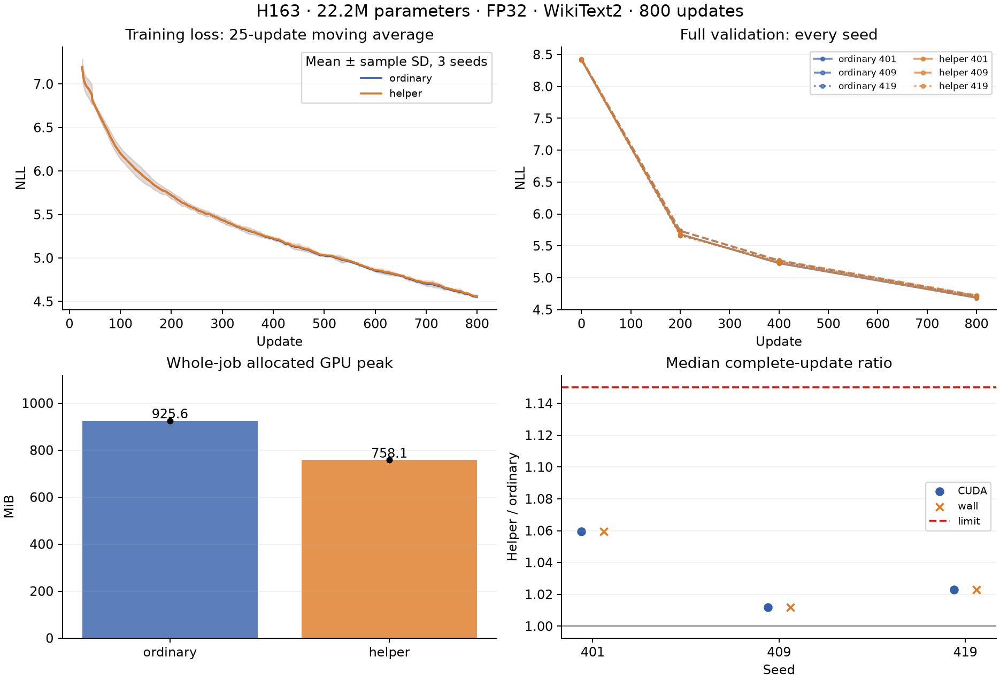

# H163: sustained exact memory-helper qualification at larger scale

**PASS 800-update larger-scale qualification.** Six fresh800-update runs;4,800 optimizer updates/4,806 backwards.
Three WikiText2 seeds,22,163,968 parameters, FP32. The model and trainable parameter
count are identical between arms. This is a scoped memory optimization, not a
new activation, parameter-reduction result or breakthrough.

| Seed | Allocated GPU saved | CUDA update ratio | Wall ratio | Final NLL ratio | Failed gates |
|---|---:|---:|---:|---:|---|
| 401 | 18.10% | 1.0594 | 1.0594 | 1.001168 | none |
| 409 | 18.10% | 1.0119 | 1.0119 | 1.002355 | none |
| 419 | 18.10% | 1.0230 | 1.0230 | 0.999429 | none |

## Fixed recipe and measurements

Width512, hidden608,12 layers/eight heads, batch16/context512, ordinary attention,
TF32off, four CPU threads, whole-block checkpointing. AdamW lr0.0006, beta(.9,.95),
eps1e-8, matrix decay.1/vector decay0, gradient clipping1, no learning-rate schedule.
Native classifier CE is compared with unchanged buffered CE and exact CPU offload
of the last four block inputs. Seeds401/409/419 use arm orderAB/BA/AB. Initialization
and all sampled batches are identical within each pair.

GPU peaks include construction, resident data, initial gradient probe, full FP32
chunked validation initially and at200/400/800, all complete updates and checkpoint
serialization. Windows lifetime peak working set and private commit include imports
and CPU serialization through worker completion; they are distinct from pinned RAM
and from whole-system RAM. See H162 for the validated native counter definitions.

| Seed | Arm | GPU allocated MiB | Host peak WS MiB | Host peak commit MiB | Final NLL | Timing block max/min |
|---|---|---:|---:|---:|---:|---:|
| 401 | ordinary | 925.58 | 1758.23 | 4314.81 | 4.684675 | 1.1136 |
| 401 | helper | 758.08 | 1822.05 | 4202.72 | 4.690148 | 1.0561 |
| 409 | helper | 758.08 | 1823.00 | 4206.95 | 4.724724 | 1.0080 |
| 409 | ordinary | 925.58 | 1758.55 | 4317.23 | 4.713624 | 1.0373 |
| 419 | ordinary | 925.58 | 1756.58 | 4311.94 | 4.713436 | 1.0187 |
| 419 | helper | 758.08 | 1822.69 | 4204.42 | 4.710744 | 1.0096 |

All-seed final validation NLL statistics:

| Arm | Mean | Median | Sample variance |
|---|---:|---:|---:|
| ordinary | 4.70391160 | 4.71343598 | 0.00027754694 |
| helper | 4.70853873 | 4.71074400 | 0.00030251028 |

The figure's training panel uses a25-update moving average, then mean±sampleSD
across all three seeds; the band is not a confidence interval. The validation
panel shows every seed at all four scoring points. No best-seed selection.
Raw per-update forward/backward/optimizer/wall times and their mean, median and
sample variance are retained in the summary. Passive GPU telemetry is retained.

## Prospective gates and audit

Each seed must save at least10% allocated GPU peak; complete CUDA/wall medians
must be<=1.15x native; final validation NLL<=1.01x native. Pinned allocation<=128MiB;
helper minus native host peak working set and private commit each<=256MiB, with
both arms' peaks<=8GiB. Discard20 timing warmups and compare three260-update
wall means: max/min<=1.15; max timed wall/median<=5. No clock normalization,
interruption trimming, aggregate rescue or post-result gate change is permitted.

Independent audit regenerates every initial model and all4,800 sampled batches,
checks sampler states at200/400/800, verifies all saved hashes and compares full
initial gradients in NumPy FP64 (global relativeL2<=1e-5, max tensor<=1e-4,
initial relative loss<=1e-6). Native full-classifier scoring checks all initial and
saved endpoint scores:24 audit scores, relative NLL tolerance1e-6. Each rolling
resume state is checked against final model/sampler hashes, finite optimizer
moments, optimizer settings and800-step counters. Every GPU boundary returns to0.
The audit does not independently repeat all4,800 optimizer steps.

Weights at200/400/800 and initial gradients remain immutable. The complete model,
Adam and sampler checkpoint is rolling: its earlier contents are replaced at the
next endpoint, avoiding redundant optimizer archives. The final resume.pt files
contain step800 state. This study had no execution retry.

## Decision and limits

The exact helper qualifies for800updates on this larger model and corpus across all three seeds. It remains opt-in and scoped to the tested FP32 recipe. Further evidence is needed for other workloads, precisions, domains and convergence endpoints.

Eight hundred updates do not prove terminal convergence. WikiText2 has informed
prior development and is not an untouched final-test corpus. The same architecture
is used in both arms; richer-neuron parameter efficiency and new-architecture
capability remain unresolved. The broad research goal stays open.

[Prospective plan](exact_offload_long_scale_plan.md),
[per-run numerical/resource evidence](../results/exact_offload_long_scale_v1/summary.json),
[host and combined gates](../results/exact_offload_long_scale_v1/qualification.json).
