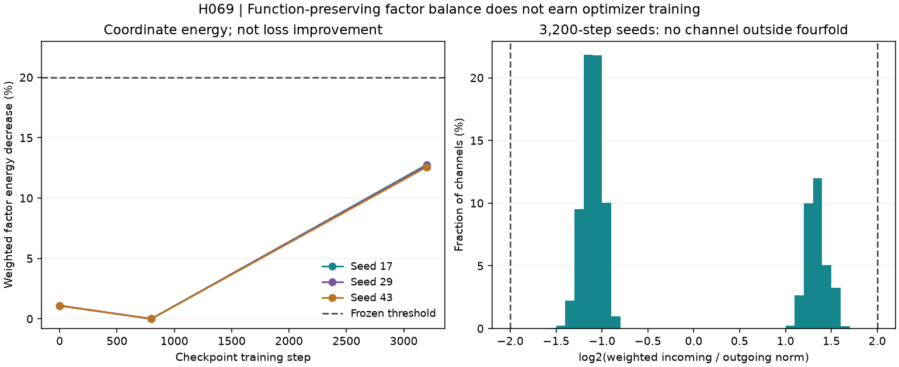

# H069 - Internal factor balance results

**Local equality: PASS. Motivation for a new optimizer experiment: REJECTED.**
The existing 3,200-step checkpoints do not meet the frozen imbalance gates.
The gold quality, efficiency and learning objective remains unmet.

| Seed | Weighted energy reduction, initialization | At 800 steps | At 3,200 steps | 3,200-step channels outside fourfold | Decision |
|---|---:|---:|---:|---:|---|
| 17 | 1.090909% | 0.000032% | 12.7591% | 0 / 9,216 | FAIL |
| 29 | 1.090909% | 0.000998% | 12.6931% | 0 / 9,216 | FAIL |
| 43 | 1.090909% | 0.000000% | 12.5759% | 0 / 9,216 | FAIL |

The rule required **at least 20% energy reduction and at least 10% of channels
outside the fourfold weighted-norm interval in every trained seed**. Measured
energy reduction is 12.5759..12.7591%, and zero channels exceed that interval.
All 82,944 channel records across initialization/800/3,200 states stay within
weighted ratios 0.318396..3.424028.
This does not disprove all conditioning or optimizer improvements; it closes
this specific balancing motivation without another learning allocation.



## What the transformation proves

Each linear projection is W=P_out^-1 B P A. Multiply an incoming factor row by
c and divide its correctly permuted outgoing factor column by c. The represented
matrix is unchanged in real arithmetic. Consequently its singular values and
condition number cannot improve through this transformation. The energy below
describes factor coordinates, not the represented function, loss or curvature.

For row/column norms a,b and existing factor-rate multipliers s_A,s_B:

```text
E(c) = a^2 c^2 / s_A + b^2 / (s_B c^2)
c_star = ((b^2/s_B)/(a^2/s_A))^(1/4)
E(c_star) = 2ab / sqrt(s_A s_B)
c = 2^round(log2(c_star))
E(c) <= min(E(1), 1.25 E(c_star))
```

The continuous minimizer follows from minimizing a positive square. Writing
q=c/c_star, nearest-power-of-two rounding bounds q between 2^-1/2 and 2^1/2,
so E(c)/E(c_star)=(q^2+q^-2)/2 <=1.25. The resulting weighted row/column norm
ratio lies in [1/2,2]. These bounds are qualified numerically for every record.
The actual rate multipliers are (4,4) for up/value and (4,64/3) for down.

This energy is not an Adam objective or proof of an optimization pathology.
Mapping gradients between coordinates is necessary: grad_A'=grad_A/c and
grad_B'=c*grad_B. Adam's moments, epsilon and updates do not automatically
transform into an equivalent training trajectory. No moment transport or
optimizer update is implemented or tested here.

## Numerical evidence and scope

Four mathematical/software checks pass: scalar energy and rounding optimality,
actual shuffled FP64 matrix preservation, independent gradient covariance, and
exact initialization/count agreement with the existing Transformer.

The corrected diagnosis records 216 projections (nine states, eight layers and
three projections). Its 24 paired FFN cases cover initialization seed17 and
trained 3,200-step seeds17/29/43, layers0/3/7, each CPU FP32 and CUDA BF16.
Both copies use the existing native inner SwiGLU recomputation policy. Inputs
are [2,7,384] on CPU and [16,128,384] on GPU; TF32 is disabled.

All **192 tensor comparisons** are bitwise exact and finite: output, input
gradient and six factor gradients after mapping back to original coordinates.
Power-of-two representability alone is not a universal GEMM equality theorem.
These are fixed synthetic probes, not corpus quality or full-network gradient
bounds. Weights remain 350,208 per FFN / 2,801,664 across eight layers, with no
new learned parameter or active model variant.

Independent verification reloads every raw paired tensor, rederives all energy
and ratio arrays, checks both decision gates, and verifies all six source
checkpoints and metric files unchanged. There are **zero optimizer updates and
zero corpus targets** in either attempt.

## Preserved logging failure and correction

The first attempt passed its four checks and one CPU pair, then exited code1
when its tensor hash called NumPy directly on BF16. Its original source, failed
process/log and first CPU tensors are preserved. The first CUDA case did not
finish recording; it is not counted as a completed numerical comparison.

A separately frozen, one-time correction replaces only the artifact hash helper
with canonical raw uint8 bytes and overrides the output root. Four additional
logging tests cover known BF16 bits (including signed zero), legacy hashes,
scalar/empty/noncontiguous tensors and CPU/CUDA parity. They pass before the
corrected diagnosis completes in 11.90 seconds. The repeated first CPU case's
raw tensors reproduce the initial artifact exactly. All old scientific code
and gates remain unchanged, and the correction adds no active test count.

## Prior art and next decision

[Path-SGD](https://papers.neurips.cc/paper_files/paper/2015/file/eaa32c96f620053cf442ad32258076b9-Paper.pdf)
studies scale-invariant optimization. [Du, Hu and Lee](https://arxiv.org/abs/1806.00900)
derive balancing under specified homogeneous dynamics; these are not guarantees
for the present AdamW recipe. [Singh 2026](https://arxiv.org/html/2608.05136v1)
distinguishes orthogonal factor-gauge equivariance from balancing and implicit
bias. Orthogonal and diagonal-scaling invariance are different requirements.
The present gauge and energy calculations are elementary applications, not a
new architecture or optimizer priority claim.

Close this diagnostic branch. Neither an optimizer-state experiment nor new
training is earned. H068's activation rejection, H052's decay rejection and
H057's separate whole-FFN geometry result remain unchanged. The retained
three-folder/six-variant shortlist is preserved. Further work must identify a
distinct mechanism and meet the original quality and resource requirements.

- [Original frozen diagnosis](factor_balance_plan.md).
- [Logging correction plan](factor_balance_logging_plan.md).
- [Raw result](../results/factor_balance_v2/result.json) and [terminal process](../results/factor_balance_v2/diagnosis_process.json).
- [Independent tensor/energy audit](../results/verification/factor_balance_analysis_v1.json).
- [Final preservation audit](../results/verification/factor_balance_final_v1.json).

Result SHA-256: `11f6ee2845b912ba3b151231e2d702ae8496ad335875385fb289ff3a04c721b3`.
Protocol SHA-256: `273d1b145c0c6dec931781a61192e75fc760d22f26decbe27c74af1505126c7d`.
