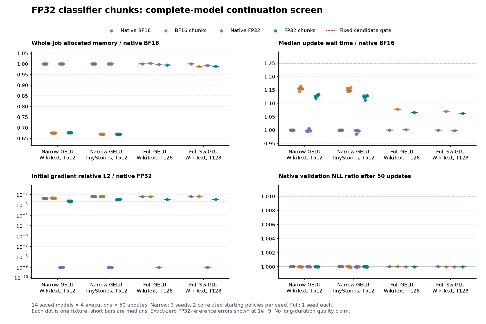

# H114 — memory benefit survives; gradient replay remains unresolved

FP32 classifier chunks reduce measured whole-job allocation by **32.36% on WikiText-2** and
**33.06% on TinyStories** in the narrow, context-512 models. The short continuations
finish with finite states and stable warmed timings. This is a useful scoped
resource observation, **not a qualified training recipe**: the original global
gradient-fidelity gate fails in every scope. Independent gradient replay also
fails both an exact audit and a subsequent numerical audit. Advancement
to fresh language training is held. The full-width, context-128 cases also fail
the required 15% whole-job saving. No parameter reduction or breakthrough follows.

## Controlled experiment

The [prospective plan](fp32_classifier_profile_plan.md) fixes 14 saved models and
four execution policies per model. All twelve H112 step-800 states are included:
two corpora, three training seeds and two previous training policies per seed.
Those two states are correlated fixtures, not six independent seeds. Two H078
step-3200 full controls add GELU/SwiGLU breadth, each with seed 17 only.

Each execution starts from identical source weights and Adam state and performs
50 sequential updates: 20 warmup and 30 measured. Total: **2,800 optimizer updates,
10,649,600 targets and 2,856 profile backwards**, completed once in
**502.12 seconds**. This is checkpoint continuation, not fresh training.
Batch/context stay 8/512 for narrow and 16/128 for full models. All decoders use
BF16 and whole-block checkpointing; only the classifier precision/chunking changes.
The vocabulary is 4096, width 384, eight layers and six attention heads.

Narrow models retain 9,099,648 total / 2,801,664 FFN parameters; full controls
retain 15,735,168 total / 9,437,184 FFN parameters. All weights, gradients and Adam
moments are FP32. The candidate adds **zero trainable parameters**. Dense FFNs,
activation functions and all 61 maintained files remain unchanged.

All cases use LR 0.0006, AdamW (0.9,0.95), epsilon 1e-8, matrix decay 0.1,
zero scalar decay and gradient clipping at 1. H078's saved terminal LR 0.00012
is deliberately replaced identically across its four continuations; optimizer
moments and steps are retained. A new common sampler seed (training seed +40000)
is used, with every batch hash preserved. No source checkpoint is overwritten.

## Whole-job resource and short-quality observations

Allocation includes model/gradients/Adam, CUDA corpus caches, normal workspaces,
probe, warmup, updates, evaluations, diagnostics and checkpoint preparation.
PyTorch's allocated counter excludes GPU driver/context memory. Reserved memory
is reported separately in the machine-readable table. Times are median paired
ratios across fixtures; quality uses independent native BF16 validation forward.
Positive NLL change means worse. This reused development validation is not a
new holdout or the official test set.

| Scope | Native BF16 job MiB | FP32 chunks job MiB | Allocation saving | Median update cost | Final NLL change range |
|---|---:|---:|---:|---:|---:|
| Narrow GELU / WikiText-2, T512 | 407.25 | 275.47 | 32.36% | +12.84% | -0.0033% to +0.0002% |
| Narrow GELU / TinyStories, T512 | 400.22 | 267.92 | 33.06% | +12.64% | -0.0036% to +0.0051% |
| Full GELU / WikiText-2, T128 | 368.62 | 366.68 | 0.53% | +6.59% | -0.0009% to -0.0009% |
| Full SwiGLU / WikiText-2, T128 | 355.25 | 351.43 | 1.08% | +6.11% | -0.0002% to -0.0002% |

All 5,992 memory intervals are recorded before counter resets, fixing H113's
missing overall-peak accounting. First 20 updates count toward memory and learning
even though excluded from timing summaries. Every case passes the fixed warmed
timing-stability bound; the largest max/min ratio of three ten-update block means
is **1.0479**, below 1.25. No timing outlier was removed.

CUDA events enclose forward, backward and optimizer phases; only the end is
synchronized. Wall time includes clipping/Adam and the final synchronization,
while excluding sampling/hashes/evaluation/disk logging. Complete case elapsed
time is also recorded. Event time measures elapsed stream time, including
scheduling/submission gaps, not pure kernel activity. See the
[PyTorch CUDA guidance](https://docs.pytorch.org/docs/2.14/notes/cuda.html) and
[event API](https://docs.pytorch.org/docs/2.14/generated/torch.cuda.Event.html).

## All four policies

Gradient errors below compare original saved initial probes against each
fixture's native FP32 classifier, with the decoder still BF16. They are measured
single-probe comparisons, **not fully independently replay-qualified gradients**.
The [summary](../results/fp32_classifier_profile_v1/summary.json) includes mean,
median, sample variance, range and per-seed aggregates. The
[56-case table](../results/fp32_classifier_profile_v1/metrics.csv.gz) and
[2,800-update table](../results/fp32_classifier_profile_v1/updates.csv.gz) retain all points.

| Model/corpus | Classifier policy | Job MiB | Median wall ms | Median event ms | Median initial gradient relative L2 |
|---|---|---:|---:|---:|---:|
| Narrow GELU (Wiki) | block_bf16 | 407.25 | 81.31 | 81.26 | 0.00416 |
| Narrow GELU (Wiki) | chunks_bf16 | 274.95 | 93.89 | 93.84 | 0.00461 |
| Narrow GELU (Wiki) | block_fp32 | 407.25 | 81.33 | 81.28 | 0 |
| Narrow GELU (Wiki) | chunks_fp32 | 275.47 | 91.75 | 91.71 | 0.00225 |
| Narrow GELU (Tiny) | block_bf16 | 400.22 | 81.74 | 81.69 | 0.00642 |
| Narrow GELU (Tiny) | chunks_bf16 | 267.92 | 94.12 | 94.08 | 0.00638 |
| Narrow GELU (Tiny) | block_fp32 | 400.22 | 81.38 | 81.34 | 0 |
| Narrow GELU (Tiny) | chunks_fp32 | 267.92 | 91.96 | 91.92 | 0.00337 |
| Full GELU (Wiki) | block_bf16 | 368.62 | 83.73 | 83.68 | 0.00626 |
| Full GELU (Wiki) | chunks_bf16 | 369.87 | 90.26 | 90.21 | 0.00633 |
| Full GELU (Wiki) | block_fp32 | 367.99 | 83.78 | 83.74 | 0 |
| Full GELU (Wiki) | chunks_fp32 | 366.68 | 89.24 | 89.20 | 0.00332 |
| Full SwiGLU (Wiki) | block_bf16 | 355.25 | 90.93 | 90.88 | 0.00633 |
| Full SwiGLU (Wiki) | chunks_bf16 | 350.80 | 97.31 | 97.27 | 0.00645 |
| Full SwiGLU (Wiki) | block_fp32 | 352.75 | 90.68 | 90.63 | 0 |
| Full SwiGLU (Wiki) | chunks_fp32 | 351.43 | 96.48 | 96.44 | 0.00322 |

The original full-model global-gradient tolerance is 0.002 relative L2 against
the same model with a native FP32 classifier. Although FP32 chunks improve
the median error relative to BF16 classifier execution, they do not meet this
absolute requirement in every fixture. This is an original prospective gate
failure, independently of the later replay-audit hold. Per-tensor and initial
loss gates pass. H113's local classifier precision result does not extend to
the complete BF16 decoder gradient at the required tolerance.

| Scope | FP32 chunk global-gradient error range | Fixtures exceeding 0.002 |
|---|---:|---:|
| Narrow GELU / WikiText-2, T512 | 0.002020 to 0.002470 | 6/6 |
| Narrow GELU / TinyStories, T512 | 0.003144 to 0.003424 | 6/6 |
| Full GELU / WikiText-2, T128 | 0.003317 to 0.003317 | 1/1 |
| Full SwiGLU / WikiText-2, T128 | 0.003217 to 0.003217 | 1/1 |

## Why the full-width memory result is weak

| Full control | Policy | Training peak MiB | Whole-job peak MiB |
|---|---|---:|---:|
| full_gelu | chunks_fp32 | 350.74 | 366.68 |
| full_gelu | block_bf16 | 358.37 | 368.62 |
| full_swiglu | block_bf16 | 355.25 | 355.25 |
| full_swiglu | chunks_fp32 | 350.05 | 351.43 |

The final layer-diagnostics phase sets both full-GELU peaks and the FP32-chunk
full-SwiGLU peak. Thus a smaller classifier training allocation does not establish
an equivalent whole-job reduction. Persistent parameter/gradient/Adam storage
also grows from about 138.85 MiB in narrow models to 240.10 MiB in full models.
Phase identification is measured; no individual diagnostic operator has been
isolated as a causal explanation. No bytes are subtracted to improve the gate.

## Numerical mechanism and its limit

With N tokens, vocabulary V and chunk C, a materialized FP32 logit tensor uses
4NV bytes, versus 4CV for one chunk, before cross-entropy intermediates. At
N=4096,V=4096,C=512 that is 64 MiB versus 8 MiB. Chunking sums the same loss in
real arithmetic. Its floating-point reduction and backward path need not be
identical. This elementary count explains why increasing classifier precision
can coexist with lower memory; it does not prove a whole-job saving.

[H113](classifier_precision_results.md) independently verified the classifier
cast/accumulation mechanism and FP64 derivative comparisons. H114's 16 small
double-precision complete-model checks also pass. Neither establishes bitwise
reproducibility of the full BF16 decoder backward. No new theorem, activation or
priority claim is made. Classifier-memory techniques already exist, including
[Cut Your Losses](https://arxiv.org/abs/2411.09009); these ordinary PyTorch chunks
are not that fused implementation.

## Failed replay audits are part of the result

The original audit stopped on a gradient hash mismatch after checking exact
weights, tokens, targets and scalar loss. A six-backward diagnostic of the first
native-BF16 case found five exact replays and one discrepancy with maximum
per-tensor relative L2 2.061e-6. It changed optimizer presence and preceding
evaluation together, so it did not establish a cause.

The [explicit recovery](fp32_classifier_profile_audit_recovery.md) introduced a
posthoc replay tolerance of 1e-5 global / 1e-4 per tensor, leaving every
prospective candidate gate unchanged. That recovery passed five probes and then
failed on `wikitext2_s61_loss_chunks__block_fp32`: global relative L2
**0.0005106002**, maximum tensor relative L2 **0.0009818187**, maximum absolute
difference **3.051758e-5**, with identical scalar loss. This larger discrepancy
shows the first diagnosis was not representative. The cause is unresolved;
there is no second tolerance relaxation or best-repeat selection.

The [completion audit](fp32_classifier_profile_completion_audit.md) performs zero
backwards: all **70 native scores, 56 saved gradient hashes, final model/Adam
states and 2,800 training batches** verify. Maximum streamed/native NLL drift is
**2.25e-08**. That audit validates scores,
states and saved-gradient integrity; it does not certify gradient replay.

Both failed audit sources, protocols, logs and errors remain unchanged. The
diagnostic and failed recovery add six backwards each, with zero updates. The
first failed audit's exact backward count was not logged (one to four). Do not
claim an exact combined audit backward total. No scientific training was retried.
These are Python assertion failures, separate from earlier unresolved native
import crashes; H114 training completed without a native failure.

During reporting, an analyzer stalled before producing exports and was stopped;
an unchanged run with a traceback watchdog completed. A premature report/plot
attempt failed because those exports were absent. The original plot error and
exit remain preserved, and plotting succeeded after analysis. These ordering
and postprocessing failures are recorded in
[the postprocessing record](../results/fp32_classifier_profile_v1/postprocessing_record.json);
they caused no scientific rerun. The analyzer stall's cause is unknown.

## Decision

- `narrow_wikitext2`: original measured gates fail; failed gates: initial_global_gradient_fidelity. Gradient replay audit holds advancement.
- `narrow_tinystories`: original measured gates fail; failed gates: initial_global_gradient_fidelity. Gradient replay audit holds advancement.
- `full_gelu`: original measured gates fail; failed gates: initial_global_gradient_fidelity, all_memory_ratios_at_most_0_85. Gradient replay audit holds advancement.
- `full_swiglu`: original measured gates fail; failed gates: initial_global_gradient_fidelity, all_memory_ratios_at_most_0_85. Gradient replay audit holds advancement.

Retain the narrow-model memory observation as a component result. Close the
fixed full-model gradient-fidelity claim in all scopes and the fixed full-width
whole-job saving claim. **Hold fresh LM allocation for all
scopes until backward reproducibility is understood.** A separately frozen
matched-state diagnosis is the next useful discriminator; this round does not
automatically allocate another training grid or change maintained defaults.

Execution used UV-managed Python 3.12.9, PyTorch 2.14.0+cu132, the RTX4070 Laptop,
four CPU threads and TF32 off, with one GPU worker at a time. Fresh models share
one CUDA process; 57 case boundaries verify zero allocated/reserved bytes after
unused workspace cleanup. Workspaces count normally within cases. The
[source guide](../results/fp32_classifier_profile_v1/source/README.md) and
[final receipt](../results/verification/fp32_classifier_profile_final_v1.json)
separate completed science, failed gradient checks and narrower successful audit.
The prior 116-test maintained suite was not rerun because those files are unchanged.
The broader VRAM/quality and parameter-efficient architecture goals remain open.
