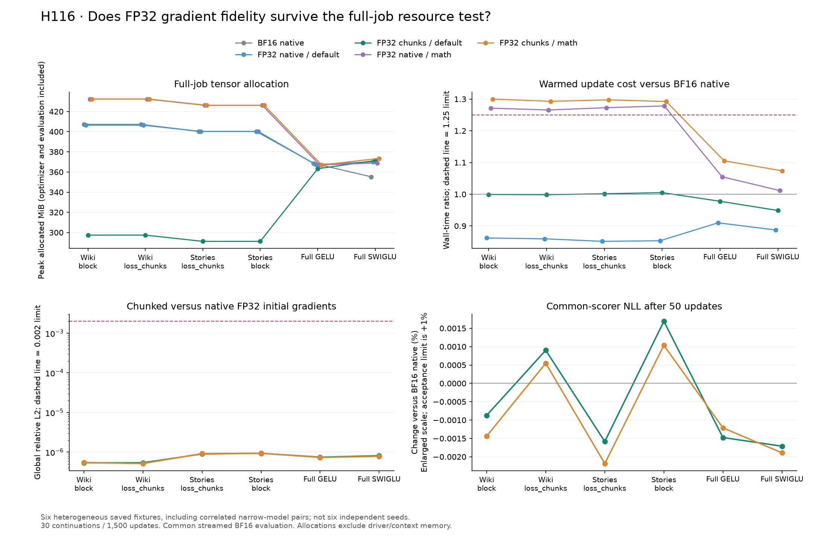

# H116: 27% lower full-job allocation survives the FP32 resource screen

**FP32 decoder execution with default attention and chunked classifiers passes
the frozen resource, numerical and short-continuation gates on both narrow
corpus fixtures.** Measured job allocation falls by 26.97% on WikiText-2 and
27.23% on TinyStories, with approximately unchanged update time versus BF16
native training. Full GELU/SwiGLU controls fail the memory gate. Forced math
attention also fails. This is a promising execution component, not a new FFN,
parameter reduction, long-run quality result or completed breakthrough.

The [prospective plan](fp32_decoder_resource_plan.md) follows
[H115's decoder diagnosis](decoder_gradient_transport_results.md). The objective
remains lower actual VRAM with preserved quality and practical runtime, alongside
the unresolved architectural parameter-efficiency target.

## Controlled comparison

Thirty cases use six existing checkpoints and five execution policies. Four
narrow GELU fixtures are WikiText-2/TinyStories seed 61, each with two old
training policies at step 800. Full GELU and SwiGLU controls use seed 17 at
step 3,200. These are correlated pairs and single-seed full controls, **not six
independent seeds**. Width, depth, heads and vocabulary remain 384/8/6/4,096.

Narrow GELU has hidden width 456, batch 8/context 512, 9,099,648 total parameters
and 2,801,664 FFN parameters. Full GELU hidden 1,536 and SwiGLU hidden 1,024 use
batch 16/context 128, 15,735,168 total and 9,437,184 FFN parameters. Parameter
count, parameter dtype and optimizer storage are unchanged within each fixture.

Each case receives the same source weights, loaded Adam moments, data stream
and 50-update budget. All use whole-block checkpointing, LR 0.0006, AdamW
betas (0.9, 0.95), epsilon 1e-8, existing decay groups and clipping at norm 1.
The full controls' prior terminal LR is deliberately replaced equally. This
short continuation is a resource screen, not fresh language training.

The practical reference uses BF16 decoder/native BF16 classifier/default SDPA.
Four FP32 arms cross default/math attention with native/chunked FP32 classifiers.
Same-backend native FP32 isolates classifier chunking. The BF16 comparison
measures the combined precision-and-memory recipe. Precision changes both
forward and backward execution; it does not preserve an identical BF16 forward.
TF32 stays disabled, with no deterministic-algorithm or workspace-policy changes.

All arms share the existing streamed BF16/default evaluator with full attention
context and valid-target weighting, plus the same final BF16 layer diagnostics.
Thus quality compares trained weights under a common scorer. Changing training
precision does not silently change the scoring precision.

## Full-job memory and warmed runtime

The table reports medians across each scope's two narrow fixtures, or its one
full control. Full rows are single observations. Positive memory savings mean
less allocated memory; positive runtime changes mean slower updates.

| Scope / candidate | BF16 reference → candidate MiB | Memory saved | Update-time change vs BF16 | Decision |
|---|---:|---:|---:|---|
| WikiText / FP32 default chunks | 407.25 → 297.43 | **26.97%** | -0.12% | PROMISING |
| TinyStories / FP32 default chunks | 400.22 → 291.25 | **27.23%** | +0.33% | PROMISING |
| WikiText / FP32 math chunks | 407.25 → 432.30 | -6.15% | +29.64% | ELIMINATED in this screen |
| TinyStories / FP32 math chunks | 400.22 → 426.12 | -6.47% | +29.49% | ELIMINATED in this screen |
| Full GELU / FP32 default chunks | 368.62 → 363.24 | 1.46% | -2.22% | Fails memory gate |
| Full SwiGLU / FP32 default chunks | 355.25 → 371.36 | -4.54% | -5.12% | Fails memory gate |

Default FP32 chunking also saves **26.81% / 27.23%** versus same-backend native
FP32 on the two narrow corpora, while costing **16.03% / 17.70%** more update
time. Those controls are faster than BF16 native in this measured setting;
FP32 is not assumed to be generally faster. This screen does not isolate the
kernel/cast scheduling cause of that speed difference.

Candidate narrow update medians are 80.40 / 81.01 ms. Twenty updates warm up;
all final 30 contribute to timing. Maximum ratio between three consecutive
10-update timing-block means is 1.06882 across all cases, below the frozen 1.25
stability limit. No outliers are removed. CUDA-event timing and forward,
backward, optimizer and complete-loop wall times are retained separately.

Reserved memory is reported separately: default chunks use 418 / 414 MiB in
the narrow corpora versus BF16 native's 556 / 488 MiB. The primary gate uses
allocated memory, not reserved memory or these reservation ratios.

Every job includes loaded optimizer, corpus cache, initial evaluation and full
gradient probe, all updates, final evaluation, diagnostics and serialization.
All **3,210 memory intervals** are recorded before peak resets. Normal cuBLAS
workspaces count; nothing is subtracted. PyTorch allocation excludes driver and
context memory. Between cases, all 31 allocator boundary checks are zero.
No gradient hooks or forward hashing occur inside the timed updates. Batch
hashing, scalar diagnostics and disk logging remain outside update timing.

The initial gradient probe sets the default-chunk narrow peaks. Final diagnostics
set all full-GELU peaks. The FP32 SwiGLU probes exceed its BF16 update peak.
Math attention's narrow peak occurs during updates and remains unchanged when
its classifier is chunked. These phase records explain why reporting just a
classifier or timed-update peak would overstate the general memory benefit.

## Why a smaller classifier buffer can help without fewer parameters

For P FP32 parameters, resident weights, gradients and two Adam moments require
approximately **16P bytes**, apart from step counters and other tensors. This
floor is unchanged by the experiment: roughly 139 MiB for the narrow model and
240 MiB for the full models when all four arrays are resident.

A native classifier materializes logits proportional to B*T*V. Classifier
chunks reduce that term to C*V at a time, with C=512, without breaking attention
context. For the narrow fixture, one FP32 logits array is 64 MiB natively versus
8 MiB per chunk. Additional saved tensors, recomputation, decoder state and
workspaces determine the actual job peak; that simple count is not a prediction
of the measured saving. In symbols, the measured quantity remains

$$M_{job}=\max_{t\ \mathrm{in\ job}} M_{allocated}(t),$$

not a sum of isolated phase peaks or a parameter-count proxy. The full controls'
larger optimizer/gradient floor and different batch/context leave much less
benefit from classifier chunking. The study measures phases, not a complete
operator-by-operator allocation attribution.

## Quality and numerical fidelity

Default FP32 chunks change common-scorer NLL by **-0.00087% to +0.00090%** on
WikiText and **-0.00158% to +0.00169%** on TinyStories versus BF16 after 50 updates.
Versus native FP32, increases are at most 0.00135%. These pass the fixed 1%
allowance but are too small and too short to establish a language-quality gain.

Across all 12 chunk/native FP32 initial comparisons, maximum loss relative
error is 9.74176e-8, total-gradient relative L2 is 9.35312e-7, and maximum
per-parameter error is 1.20840e-6. They pass the unchanged 1e-6 / 0.002 / 0.02
limits. All weights, gradients, optimizer moments and sampled activations are
finite. This evaluates actual full-model backward, not only a detached classifier.

The independently frozen audit verifies **36 native validation scores, all
1,500 sampled batches, 30 saved initial gradient hashes, source states and
all endpoint model/Adam states**. It reruns 24 FP32 initial backward probes:
all meet 1e-5 global / 1e-4 per-parameter replay limits. Sixteen are bitwise
identical; worst numerical replay error is 9.94806e-8 globally and 3.10600e-7
per parameter. Maximum native-versus-streamed scoring difference is 1.47123e-8
relative. BF16 reference gradient replay was explicitly outside this audit gate;
its previously observed variability is not declared repaired.

## Compute, preservation and decision

The main study takes **291.67 seconds**, with 1,500 optimizer updates,
5,120,000 training targets and 1,530 backwards including initial probes.
Twenty CPU-double comparisons against four native references add 24 backwards.
The independent audit adds 24 backwards and zero updates: **1,578 total
backwards**, with no scientific retry and no fresh training run. The worker uses
UV-managed Python 3.12.9, PyTorch 2.14.0+cu132 and one RTX 4070 Laptop GPU.

CPU-only analysis initially terminates with a Windows access violation, raw
exit 3221225477. The log, source and absence of partial exports are preserved.
A separately recorded fresh process runs the unchanged analyzer successfully
with a traceback watchdog. No training or audit is repeated, no tolerance is
changed, and the native runtime failure's cause remains unresolved.

[Summary statistics and scoped decisions](../results/fp32_decoder_resource_v1/summary.json),
[source guide](../results/fp32_decoder_resource_v1/source/README.md) and
[final receipt](../results/verification/fp32_decoder_resource_final_v1.json)
provide the evidence trail. Means, medians, sample variances and ranges cover
every fixture. The raw Pareto table uses allocation, warmed time and final NLL;
its tiny NLL differences must not be mistaken for established quality ordering.
The 115 prospectively frozen sources and all 61 maintained files are unchanged.
The previous 116-test maintained-suite pass was not rerun.

**Retain only default-backend FP32 chunking on narrow context-512 models for
broader replication and longer-duration testing.** It passes every frozen gate
in both narrow scopes. Math attention fails memory and BF16-relative runtime;
both full controls fail the 15% memory threshold. Do not promote those failed
settings by averaging them with the narrow successes. No default change or
new training grid is part of this protocol. The next research decision must
test more seeds and duration before claiming preserved quality across training.

This applies established execution techniques. [PyTorch CUDA semantics](https://docs.pytorch.org/docs/2.14/notes/cuda.html)
documents allocation/timing behavior, and [SDPA](https://docs.pytorch.org/docs/2.14/generated/torch.nn.functional.scaled_dot_product_attention.html)
documents backend numerical differences. [Cut Your Losses](https://arxiv.org/abs/2411.09009)
is prior work on classifier-memory reduction. H116 does not claim novelty for
chunking, FP32, checkpointing or the parameter-storage equation.
