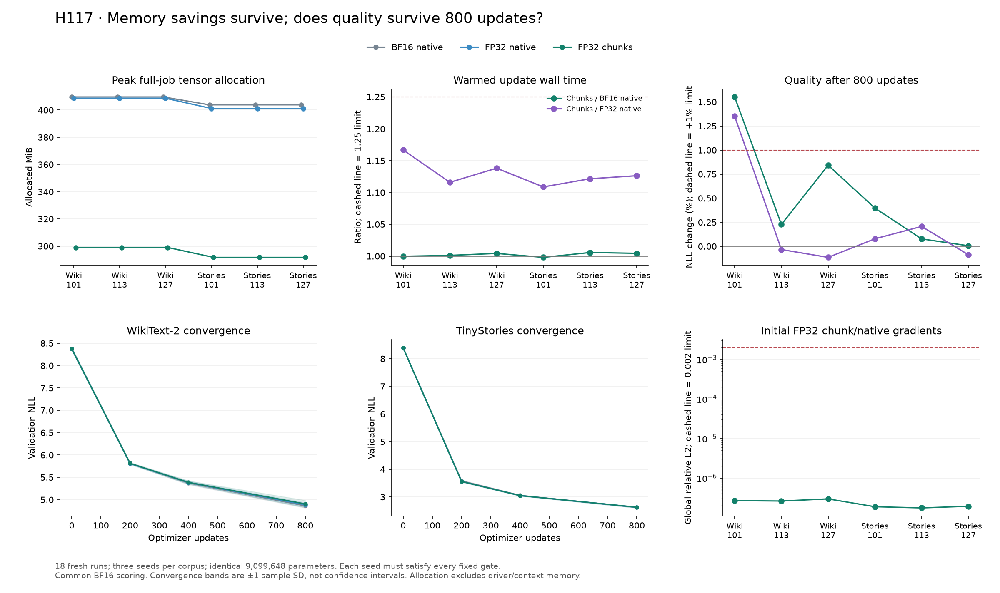

# H117 — fresh three-seed replication of the FP32 memory recipe

**The fixed two-corpus claim fails.**
FP32 decoder/classifier chunking saves **26.98–27.75% full-job tensor allocation**
versus BF16 native, with 0.9981–1.0057 times its warmed update cost.
Memory savings alone do not qualify the complete recipe. Every seed must meet
the predeclared final-quality limit against both references.

- **wikitext2: ELIMINATED from this fixed recipe.** Failed gates: final_quality_bf16, final_quality_native.
- **tinystories: VALIDATED IN THIS SCOPE.** Every frozen gate passes across its three seeds.

This is an execution-policy replication on an unchanged narrow GELU model,
with **zero parameter reduction** between arms. It establishes no new activation,
new FFN, general superiority or breakthrough. The broader research goal remains open.



## Experimental question and fixed controls

[H116](fp32_decoder_resource_results.md) passed a 50-update resource screen on
correlated saved states. H117 asks whether its promising default-attention FP32
recipe survives **800 updates from random initialization**, three seeds and two
corpora. [Original plan](fp32_training_replication_plan.md) and
[startup recovery plan](fp32_training_replication_recovery_plan.md) were frozen
before their respective execution. Quality, memory and runtime gates did not change.

The grid contains **18 fresh runs / 14,400 optimizer updates / 58,982,400 training
target presentations**. Seeds are 101, 113 and 127. All three arms within each
corpus/seed use the identical CPU step-zero model, empty Adam state and sampled
batches. The policy order rotates/reverses as recorded in the protocol. No
best-seed or best-checkpoint selection occurs.

- Model: width 384, FFN hidden 456, eight layers, six heads, vocabulary 4096,
  batch 8, context 512; **9,099,648 total / 2,801,664 FFN parameters** in every arm.
- Policies: BF16 native decoder/classifier; FP32 native decoder/classifier;
  FP32 decoder with checkpointed 512-token FP32 classifier chunks. All use
  default SDPA and whole-block checkpointing. Native FP32 isolates chunking;
  native BF16 is the complete practical reference.
- Training: fixed LR 0.0006, AdamW betas (0.9, 0.95), epsilon 1e-8, matrix decay 0.1,
  existing non-decay groups, norm clip 1; FP32 parameters and moments throughout.
  No precision-specific tuning or width calibration.
- Data: unchanged hashed WikiText-2 and TinyStories caches with separate
  train-only BPE tokenizers. Full development validation is scored at 0/200/400/800
  with one streamed BF16/default scorer. Attention context and target weighting
  match across arms. No test set is used and raw corpus NLLs are not pooled.
- Hardware: one RTX 4070 Laptop GPU, approximately 8 GiB; PyTorch 2.14.0+cu132,
  Python 3.12.9, Windows 11, four CPU threads, TF32 disabled. The UV-managed
  interpreter uses the existing locked environment. No concurrent GPU worker.

The fixed acceptance rule requires, **for every seed**, NLL no more than 1% above
both references, at least 15% lower allocated job peak, no more than 25% longer
median update time, stable timing and finite values. Initial paired gradients,
independent replays, native scores and state/batch integrity must also pass.
A favorable average cannot override a failed seed.

## What can be proved, and what must be measured

For fixed hidden states and classifier weights, partition the valid token set
into disjoint chunks. Let M be the total valid-target count and S_j the summed
cross-entropy for chunk j. Then in exact arithmetic:

```text
L = (sum over all valid tokens of token loss) / M
  = (sum over chunks j of S_j) / M
gradient(L) = (sum over chunks j of gradient(S_j)) / M.
```

The equalities follow by partitioning a finite sum and linearity of
differentiation. They require the same hidden states, parameters, valid-target
mask and global denominator; averaging unequal chunk means would be wrong.
Checkpoint recomputation preserves this function when it reproduces the same
forward calculation. The CPU-double qualification tests that implementation,
including ignored targets and partial chunks.

At this batch/context/vocabulary, a single dense FP32 logits tensor contains
4096×4096 values and occupies 64 MiB. A 512-token chunk contains 512×4096 values
and occupies 8 MiB: an **87.5% reduction in that one tensor's size**. Decoder
states, parameters, optimizer moments, gradients, other loss buffers and
workspaces remain. Consequently this calculation does not prove an 87.5%
whole-job saving; only the measured allocation tables support that claim.

Neither finite-sum identity proves bitwise GPU equivalence or convergence to
the same learned model. Rounding, reduction order and nonlinear optimizer
trajectories require separate numerical and learning tests. These are elementary
properties of token-separable loss, not a new theorem or unexplored architecture.

## Quality: every final endpoint

Lower NLL is better. Positive changes are worse. Only step 800 is the primary
endpoint; earlier checkpoints describe convergence and cannot rescue a failed run.

| Corpus | Seed | BF16 NLL | FP32 native NLL | FP32 chunks NLL | Δ vs BF16 | Δ vs FP32 native | Quality |
|---|---|---|---|---|---|---|---|
| wikitext2 | 101 | 4.910505 | 4.920221 | 4.986730 | +1.5523% | +1.3518% | FAIL |
| wikitext2 | 113 | 4.817135 | 4.829684 | 4.828070 | +0.2270% | -0.0334% | PASS |
| wikitext2 | 127 | 4.862321 | 4.908949 | 4.903315 | +0.8431% | -0.1148% | PASS |
| tinystories | 101 | 2.643828 | 2.652257 | 2.654331 | +0.3972% | +0.0782% | PASS |
| tinystories | 113 | 2.618629 | 2.615249 | 2.620651 | +0.0772% | +0.2065% | PASS |
| tinystories | 127 | 2.611645 | 2.614077 | 2.611802 | +0.0060% | -0.0870% | PASS |

Three seeds provide limited statistical power. The reported seed variation is
descriptive, not a confidence interval or an equivalence proof. The failure of
a fixed recipe does not prove that all chunking or all FP32 training must fail.

## Measured memory and runtime

| Corpus | Seed | Allocation saved vs BF16 | Saved vs FP32 native | Time / BF16 | Time / FP32 native |
|---|---|---|---|---|---|
| wikitext2 | 101 | 26.984% | 26.816% | 0.9998 | 1.1667 |
| wikitext2 | 113 | 26.984% | 26.816% | 1.0012 | 1.1160 |
| wikitext2 | 127 | 26.984% | 26.816% | 1.0043 | 1.1381 |
| tinystories | 101 | 27.750% | 27.265% | 0.9981 | 1.1087 |
| tinystories | 113 | 27.750% | 27.265% | 1.0057 | 1.1215 |
| tinystories | 127 | 27.750% | 27.265% | 1.0045 | 1.1263 |

Every allocation below is an observed **per-job tensor peak**, including
construction, CUDA corpus caches, optimizer state, the initial gradient probe,
training, validation, diagnostics and serialization. Normal library workspaces
are charged. Driver/context memory is outside PyTorch's allocator measurement.
Allocated and reserved memory are distinct; they are not added together.
The frozen qualification uses allocated memory, not reserved memory.

| Corpus | Seed | Policy | Job allocated MiB | Job reserved MiB | Update median ms | CUDA forward / backward / optimizer ms |
|---|---|---|---|---|---|---|
| wikitext2 | 101 | BF16 native | 409.624 | 516.000 | 81.094 | 24.180 / 51.945 / 4.854 |
| wikitext2 | 101 | FP32 native | 408.686 | 502.000 | 69.489 | 21.102 / 43.797 / 4.423 |
| wikitext2 | 101 | FP32 chunks | 299.091 | 398.000 | 81.076 | 23.403 / 53.130 / 4.372 |
| wikitext2 | 113 | BF16 native | 409.624 | 516.000 | 81.195 | 24.287 / 51.897 / 4.876 |
| wikitext2 | 113 | FP32 chunks | 299.091 | 398.000 | 81.292 | 23.520 / 53.178 / 4.317 |
| wikitext2 | 113 | FP32 native | 408.686 | 502.000 | 72.845 | 21.296 / 47.084 / 4.248 |
| wikitext2 | 127 | FP32 chunks | 299.091 | 398.000 | 81.732 | 23.472 / 53.767 / 4.269 |
| wikitext2 | 127 | BF16 native | 409.624 | 516.000 | 81.382 | 24.407 / 51.986 / 4.893 |
| wikitext2 | 127 | FP32 native | 408.686 | 502.000 | 71.814 | 21.205 / 46.188 / 4.259 |
| tinystories | 101 | FP32 chunks | 291.780 | 414.000 | 81.437 | 23.422 / 53.550 / 4.256 |
| tinystories | 101 | FP32 native | 401.157 | 498.000 | 73.449 | 21.272 / 47.876 / 4.243 |
| tinystories | 101 | BF16 native | 403.845 | 512.000 | 81.593 | 24.503 / 52.102 / 4.900 |
| tinystories | 113 | FP32 native | 401.157 | 498.000 | 73.156 | 21.462 / 47.146 / 4.272 |
| tinystories | 113 | FP32 chunks | 291.780 | 414.000 | 82.048 | 23.509 / 54.056 / 4.265 |
| tinystories | 113 | BF16 native | 403.845 | 512.000 | 81.580 | 24.472 / 52.129 / 4.887 |
| tinystories | 127 | FP32 native | 401.157 | 498.000 | 72.585 | 21.264 / 46.830 / 4.242 |
| tinystories | 127 | BF16 native | 403.845 | 512.000 | 81.389 | 24.419 / 52.027 / 4.888 |
| tinystories | 127 | FP32 chunks | 291.780 | 414.000 | 81.752 | 23.657 / 53.633 / 4.309 |

Training updates 2–800 tie for the allocated job peak in all 18 runs.
All **28,998 memory intervals** are recorded before resets. Nineteen study
boundaries and 25 independent-audit boundaries verify zero allocated/reserved
tensor storage between jobs. Audit memory is not mixed into a training-job peak.

Twenty updates warm up; all remaining 780 contribute timing with no outlier
removal. Timed wall updates include forward/backward/clipping/Adam and CUDA
synchronization; batch hashing, scalar diagnostics and disk I/O are outside.
The optimizer CUDA column includes clipping. Component medians do not necessarily
sum to the median full update. The largest three-block timing-stability ratio is
1.030913, below the 1.25 limit.

Study elapsed time is **1301.99s (21.70min)**,
excluding initial-state creation, CPU qualification and independent audit.
Complete training-loop wall time sums to 1238.70s and includes intermediate
validation/checkpoints plus logging; it is not pure optimizer time. These are
training measurements, with no new inference-latency result.

## Variation, convergence and diagnostics

All groups contain three seeds. Sample variance uses denominator n−1.
The compact summary also contains mean/median/variance/range for memory,
runtime, clipping and each paired ratio; the tables retain every run.

| Corpus | Policy | NLL mean | Median | Sample variance | Mean peak allocated MiB | Mean of seed update medians ms |
|---|---|---|---|---|---|---|
| wikitext2 | BF16 native | 4.863321 | 4.862321 | 0.00218024 | 409.624 | 81.224 |
| wikitext2 | FP32 native | 4.886284 | 4.908949 | 0.00243450 | 408.686 | 71.383 |
| wikitext2 | FP32 chunks | 4.906038 | 4.903315 | 0.00629887 | 299.091 | 81.367 |
| tinystories | BF16 native | 2.624701 | 2.618629 | 0.00028659 | 403.845 | 81.521 |
| tinystories | FP32 native | 2.627194 | 2.615249 | 0.00047145 | 401.157 | 73.064 |
| tinystories | FP32 chunks | 2.628928 | 2.620651 | 0.00050356 | 291.780 | 81.746 |

The figure shows mean validation trajectories with ±1 sample standard deviation.
All 72 validation points and 14,400 update records are available as compressed CSV.
Layer-gradient statistics are recorded at updates 1/20/200/400/800, plus the
initial unclipped probe; final sampled activations use the common BF16 forward.
All recorded losses, gradient norms and sampled diagnostics are finite, as are
final parameters/gradients/Adam states. Clipping fractions range from
2.375% to 18.500% across runs. This does not establish a global
absence of vanishing/exploding gradients. Activations are fixed GELU, so there
are no learned activation-curve coefficients in this experiment.

## Independent audit and failure accounting

Independent audit passes.
It regenerates six initial CPU states exactly, verifies all 54 trained
model/Adam/sampler checkpoints and 18 saved initial-gradient hashes, reproduces
all 14,400 sampled batches and computes 60 complete native validation scores.
The largest native/streamed score relative error is
**1.677e-08** against a 1e-6 limit.

All 12 independent FP32 initial-gradient replays are recorded.
Bitwise-equal replays: 1 of 12. Maximum replay global relative L2 is
5.904e-08; maximum per-tensor error is
1.314e-07. The fixed limits are 1e-5 and 1e-4.
No BF16 gradient-replay qualification or full 800-update trajectory replay is claimed.

At matched initialization, FP32 chunks versus native FP32 have maximum loss
relative error 2.264e-07, global-gradient error 2.961e-07 and per-tensor
error 4.375e-07, below 1e-6/0.002/0.02 respectively. Initial local gradient
agreement is insufficient evidence of endpoint agreement after 800 updates.
The present experiment lacks duplicate 800-update runs under identical policies,
so it cannot uniquely attribute an endpoint gap to chunking instead of ordinary
floating-point trajectory variability. The observed fixed endpoint gate still applies.

The first attempt failed before generating any initial checkpoint or taking any
training update. Environment metadata initialized CUDA before the initializer's
CPU-only guard. It completed 24 CPU qualification backwards and then stopped.
The original source, traceback, logs and exit 1 remain preserved. A prospectively
frozen recovery moved CPU initialization ahead of environment metadata and
qualification; the scientific recipe, seeds and limits stayed unchanged.
No training was repeated. This startup ordering bug is distinct from earlier
Windows native access violations; no general native-runtime cure is claimed.

After successful training, audit and analysis, the first plotting process hit
a Windows access violation during a Matplotlib import (raw exit 3221225477).
It produced no figure. The failed log, source and result inputs were frozen
in `plot_recovery_protocol.json` before one separate CPU process imported the
unchanged plotting code successfully. The rendered figure was visually checked.
No training, gradient replay, scoring, tolerance or scientific input was changed
or repeated. The cause of this native import failure remains unresolved.

Total accounting: 14,418 main backwards (14,400 updates plus 18 initial probes),
24 successful CPU-qualification backwards, 24 from the failed startup and 12 audit
backwards = **14,478 backwards across both attempts**. The recovery has 18 completed
fresh runs. The reused `continuation_steps` checkpoint field is 800; source step 0,
regenerated initialization and empty Adam prove these runs began fresh.

## Decision and next discriminator

- **wikitext2: ELIMINATED from this fixed recipe.** Failed gates: final_quality_bf16, final_quality_native.
- **tinystories: VALIDATED IN THIS SCOPE.** Every frozen gate passes across its three seeds.

Keep the measured memory observation and close any failed fixed quality claim.
Do not promote a new default or allocate another large training sweep merely
because the short screen passed. A useful next diagnostic would compare paired
and within-policy trajectory variability under a prospectively fixed budget,
before changing precision, tolerances or optimizer settings. This report allocates
no such run. It also does not establish a new theoretical guarantee: the loss
is token-separable in exact arithmetic, while finite-precision accumulation and
nonlinear optimization can change the trained endpoint.

Classifier memory reduction is established prior work; see
[Cut Your Losses](https://arxiv.org/abs/2411.09009). The relevant numerical limits
are described in [PyTorch numerical accuracy](https://docs.pytorch.org/docs/2.14/notes/numerical_accuracy.html)
and [reproducibility](https://docs.pytorch.org/docs/2.14/notes/randomness.html).
These sources do not establish the cause of our specific endpoint difference.
H117 is an empirical replication, not a novelty claim.

## Reproducibility and retained artifacts

- [Frozen protocol](../results/fp32_training_replication_recovery_v1/protocol.json),
  [audit protocol](../results/fp32_training_replication_recovery_v1/audit_protocol.json),
  [complete summary](../results/fp32_training_replication_recovery_v1/summary.json).
- [Source guide](../results/fp32_training_replication_recovery_v1/source/README.md),
  [metrics](../results/fp32_training_replication_recovery_v1/metrics.csv.gz),
  [updates](../results/fp32_training_replication_recovery_v1/updates.csv.gz),
  [curves](../results/fp32_training_replication_recovery_v1/curves.csv.gz).
- Lossless compressed result/audit/logs and a
  [final verification receipt](../results/verification/fp32_training_replication_final_v1.json)
  preserve source hashes, arithmetic, 78 tensor-artifact hashes and 18 raw metric hashes.
- Initial/trained checkpoints, raw gradients, raw per-run histories and dataset
  caches remain local and ignored. They are not deleted. Independent tensor
  replay requires those artifacts; compact results alone cannot reconstruct them.
- All 61 maintained code/config/test/lock hashes remain unchanged: two model
  folders, five variants and eight recipes. The earlier 116-test pass is preserved
  separately; this round does not rerun or inflate that maintained-suite count.

The broad VRAM/quality/runtime goal and architectural parameter-efficiency
requirements remain unmet beyond the limited components explicitly qualified.
