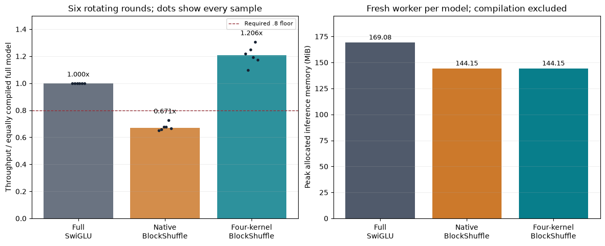

# Four-kernel BlockShuffle: the measured serving gap closes

The fused implementation passes the frozen full-model accuracy and speed gates. At width384/layer8, seed17, 800 steps, it reaches **1.206x** the throughput of equally compiled full SwiGLU (1.098-1.306 across six rotating rounds), and **1.780x** native compiled BlockShuffle. The result applies to one trained checkpoint and the stated full-sequence workload. It does not establish architectural novelty or the complete research objective.

Read the [frozen plan and implementation scope](fused_execution_plan.md), [raw full-model audit](../results/fused_serving_scale384_v1/result.json), and [trained correctness/microbenchmark](../results/fused_probe_v1/result.json). All use the original checkpoint, without the later condition-floor edit.

| Compiled model | Validation NLL | Median throughput/full | Range | Isolated peak MiB | First compile + forward seconds |
|---|---:|---:|---:|---:|---:|
| Full SwiGLU | 2.775915 | 1.000 | 1.000-1.000 | 169.08 | 10.97 |
| Native BlockShuffle | 2.772725 | 0.671 | 0.650-0.727 | 144.15 | 12.26 |
| Four-kernel BlockShuffle | 2.772754 | 1.206 | 1.098-1.306 | 144.15 | 47.29 |

## What changed and what was counted

Each FFN uses four custom launches: paired square input factors; paired rectangular expansion plus SiLU/product; rectangular down factor; square down factor. Each stage writes the permutation needed by the next stage directly. The six mathematical factors remain; paired factors execute inside shared launches. Original FP32 parameter objects are retained, and BF16 casts happen inside the kernels. No persistent packed or dense-product cache is added.

The FFN still has 2801664 learned weights versus 9437184 in full SwiGLU, a 70.3125% reduction. Total model weights are 9099648 versus 15735168, a 42.17% reduction. Logical FFN matrix work is 5603328 FLOPs/token over eight layers. Padded tile work is 7864320 scalar matrix FLOPs/token, 58.33% below the full reference's 18874368. Padded arithmetic is greater than the logical factorized count; pointwise operations, memory movement and backend instruction scheduling are additional. These are arithmetic counts, not hardware counter measurements.

Matrix accumulations use FP32 with BF16 factor outputs and explicit BF16 SiLU/product boundaries. All 24 trained eager FFN checks and three fresh whole-model logit checks have zero measured error. Eager validation NLL matches the native checkpoint exactly at 2.772705555. These sampled equalities are not a universal bitwise-equivalence proof. The compiled fused model has NLL2.772753686 and fresh-logit RMS error at most .008555, maximum absolute error .0625 versus native eager. All declared BF16 tolerances pass before/after warmup and after paired timing.

## Protocol and limits

The initial seven optional kernel/guard tests covered fresh inputs and non-tile-aligned shapes. The compiled isolated-FFN speedup was 2.597x, earning this full-model comparison. Tile32, four warps and two stages were retained; no tile search or autotuning sweep was used. All full models receive default Inductor fullgraph/static-shape compilation with no fallback.

Memory is measured in a fresh process for each model after compilation and correctness. Each worker has one GPU weight set and 48 MiB of native eager reference logits on CPU; CPU storage is excluded from GPU allocation and disclosed in raw records. Peaks include compiled validation/forward tensors, with no optimizer. The parent holds all three models only for rotating paired timing. Compile time is excluded from throughput and is affected by existing disk caches; it is not a cold-install benchmark. Driver/compiler allocations outside PyTorch's allocator are not measured by allocated-VRAM peaks.

The first successful serving source archive retains its original kernel argument name O. The current source renames that argument OUTPUT_WIDTH for readability without changing expressions, tiles or arithmetic; subsequent kernel checks and the diagnostic profile use the current source. Source archives distinguish these versions.

This implementation resolves the measured speed gap on the selected larger checkpoint and workload. The small-model three-seed accuracy gap remains, and the larger-model native quality result now has [three-seed confirmation](scale_replication_results.md) and an [additional validation-tail check](validation_tail_results.md). Convergence, equal tuning effort and broader data remain untested. The [joint three-checkpoint audit](joint_conditioning_results.md) now passes the moderate condition floor with this path; combined serving speed remains unmeasured. Training still uses the original native FFN; no training speedup or full-network gradient lower bound is proved. Established structured projections and fusion do not constitute a verified new primitive.

Reproduce this report with `uv run python -m src.core.fused_report`.

The measured kernel rows contain eight paired-input, eight paired-expansion and sixteen down-factor calls per forward: 32 FFN kernels across eight layers, or four per FFN. No aten::bmm dispatch remains in this fused trace. The 17 common aten::mm calls remain. Duplicate host/kernel rows are counted once.

The [compiled operator profile](../results/profiles/scale384_blockshuffle_fused_compiled.json) retains instrumented CPU/device events. Host ranges and CUDA kernel rows overlap; its timing must not be summed or substituted for the paired serving measurement.
