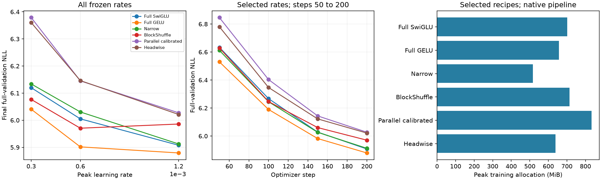

# H047: Router-free headwise SwiGLU

**Memory passes; quality fails.** The simpler layer uses exactly the BlockShuffle parameter budget and reduces allocated training peak, but it does not earn longer training. The best rate remains on the upper boundary of the frozen grid.

[Frozen protocol](headwise_screen_plan.md), [equations and proof](archive/retired/src/multihead_ffn/headwise.md), [raw decisions](../results/headwise_screen_v1/result.json), [parallel comparison](multihead_screen_results.md).

## Complete frozen screen

Width 384, eight layers, 24 FFN heads of width 16, private hidden width 48; seed 17, context 128, batch 16, native BF16, uniform AdamW and 200 steps. Each trial sees 409,600 sampled training tokens and all 322,688 validation targets. Three trials total 1,228,800 new screen tokens. Official test stays unscored. All twelve earlier control cells are retained with matched per-recipe three-rate tuning; historical architecture search effort is unequal.

| Rate | Headwise NLL | Calibrated parallel NLL | Headwise peak MiB | Clipped steps | Training tokens/s (descriptive) |
|---|---:|---:|---:|---:|---:|
| 0.0003 | 6.360489 | 6.378923 | 638.37 | 39.5% | 31,817 |
| 0.0006 | 6.146283 | 6.145288 | 638.37 | 16.0% | 31,804 |
| 0.0012 | 6.021328 | 6.027381 | 638.37 | 7.0% | 31,822 |

| Same-rate NLL difference | Full SwiGLU | Full GELU | Calibrated narrow | Plain BlockShuffle |
|---|---:|---:|---:|---:|
| 0.0003 | +3.9273% | +5.2944% | +3.6937% | +4.6684% |
| 0.0006 | +2.3513% | +4.1445% | +1.9190% | +2.9424% |
| 0.0012 | +1.9235% | +2.4161% | +1.8418% | +0.5906% |

Selected NLL is **6.021328**: +1.9235% versus full SwiGLU, +2.4161% versus full GELU, +1.8418% versus calibrated narrow and +0.8496% versus selected plain BlockShuffle. Positive means worse. The 800-step stronger plain result is a separate budget.

FFN weights are **2,801,664**, total weights **9,099,648**, and FFN reduction **70.3125%**. Peak is **638.37 MiB**, 23.33% below the parallel adaptation's 832.58 MiB. Both full-control memory gates pass. This allocation saving is measured in the native pipeline; no paired speed claim follows from cross-session descriptive throughput.

| Frozen gate | Decision |
|---|---|
| at least 70 percent fewer ffn weights | PASS |
| beats calibrated narrow | FAIL |
| within one percent full swiglu | FAIL |
| memory within ten percent full swiglu | PASS |
| within one percent full gelu | FAIL |
| memory within ten percent full gelu | PASS |
| at least point two percent better than calibrated narrow | FAIL |



## Qualification and verification

All **30 earlier variants** retain exact CPU parameters, logits, loss, gradients and FLOP counts. Gaussian first-FFN output RMS is 0.013577532 versus full 0.012921236, ratio **1.050792**, within the frozen [0.5,2] interval. The GPU qualification's initial BF16/FP32 logit relative L2 is **0.007937**. Its ten fixed-batch updates lower pre-update loss from **8.375597** to **6.370470**, with all recorded parameter gradients finite and nonzero. All ten steps clip. Those 20,480 repeated training-token exposures contain no validation targets.

Only config, factory/initialization and matrix-work counting changed among pre-existing sources. Data, optimizer, trainer, diagnostics and prior architectures remain byte-identical. A fresh GPU worker reproduced all four original control initial NLLs within 1e-7. All three new checkpoint/config counts, source archives, data/optimizer metadata, complete histories and final sampling state verify. Final sampling equals the controls. Every recorded layer diagnostic is finite. The complete qualification and screen finished without retries.

## Interpretation and next requirement

Eliminate this local recipe from longer training under the frozen quality rule. Preserve the measured memory benefit and the simpler implementation. It is not a proof of better learning, a new primitive, or evidence against the published architecture at larger head dimensions. The near-equal parallel/headwise NLL does not isolate routing: head width, subnetwork count and optimization geometry also differ.

The accompanying proof identifies a separate structural property: in fixed head coordinates, a linear combination of head-local nonlinear maps has zero cross-head mixed second derivatives, regardless of scalar activation flexibility. Learned input mixers and stacked layers limit this statement; it is not an observed causal explanation of the NLL gap. Additional activation coefficients have not earned promotion from these results.

The stronger plain BlockShuffle model remains the practical control. The next evidence requirement is equal-budget optimizer and convergence testing for it and the full/narrow controls, before broader superiority or novelty claims. The corrected affine activation benefit remains 0.101% across three seeds at the same rate.

```powershell
uv run --extra compile --extra data python -m src.core.headwise_screen_report
```
