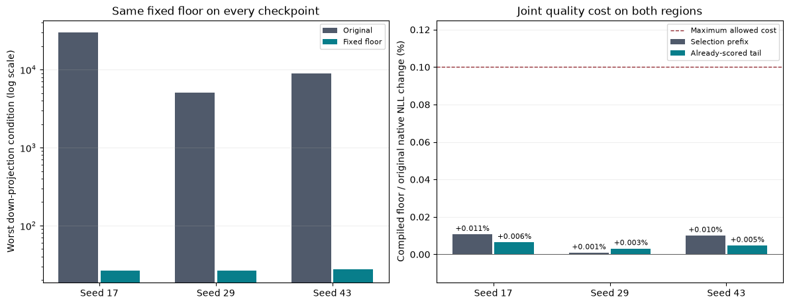

# Fixed condition floor with fused execution: three checkpoints

The frozen joint decision is **PASS** across all three larger 800-step checkpoints. This round tests an existing post-training weight adjustment with the existing inference implementation. Read the [plan](joint_conditioning_plan.md) and [raw six-case evidence](../results/joint_conditioning_scale384_v1/result.json).

## Projection condition and intervention cost

The fixed strength is 0.1, selected in the earlier seed-17 study. Only the eight square down factors change. FP64 SVD flooring preserves aggregate Frobenius norm, returns FP32 weights and adds no parameters. Down projections remain rectangular; their input nullspaces remain. Condition numbers below refer to nonzero singular values of the full down projection, not a whole-network Jacobian.

| Seed | Worst condition before | After | Improvement | Native prefix NLL change | Native tail NLL change |
|---|---:|---:|---:|---:|---:|
| 17 | 30134.36 | 26.53 | 1136.0x | +0.01118% | +0.00671% |
| 29 | 5067.67 | 26.68 | 189.9x | -0.00075% | +0.00336% |
| 43 | 8972.73 | 27.49 | 326.4x | +0.00676% | +0.00418% |

## Actual compiled model quality

The four-kernel model is compiled with default Inductor, a static full graph and the unchanged tile settings. Kernel errors are measured against the native implementation of the same weights. Separately, combined quality changes below compare compiled floored weights to original native weights. Both regions must satisfy every quality gate.

| Seed | Compiled floor prefix NLL | Compiled floor tail NLL | Combined prefix change | Combined tail change | All joint gates |
|---|---:|---:|---:|---:|---|
| 17 | 2.772999 | 2.803144 | +0.01060% | +0.00636% | PASS |
| 29 | 2.768071 | 2.798763 | +0.00080% | +0.00301% | PASS |
| 43 | 2.773718 | 2.807408 | +0.00996% | +0.00462% | PASS |

Every native original score reproduced the prior prefix/tail result within the frozen tolerance. Evaluation uses 32,768 prefix targets and 167,936 disjoint tail targets, with per-window tail losses retained. These are the same TinyStories stories and the tail was already scored before this intervention; this is no longer a fresh holdout.

All three original and all three floored cases passed finite sampled-gradient and fused numerical checks. Stored factor hashes, unchanged source checkpoint hashes, parameter objects/counts, source archives, target positions and weighted loss aggregation were verified. All comparisons use 2,801,664 unique FFN weights and 9,099,648 total weights. The original full controls have 9,437,184 FFN weights: reduction remains 70.3125%.

## Limits and retained failure

The first seed-17 floor worker terminated with Windows access violation 3221225477 during PyTorch import, before setup or measurement. Three fresh unchanged imports passed. The five unmeasured cases were then resumed once with all experimental sources/settings unchanged. The [original failure](../results/joint_conditioning_scale384_v1/failure.json), import log, probes and [continuation record](../results/joint_conditioning_scale384_v1/continuation.json) remain archived. Root cause is unresolved.

This experiment supplies no paired timing, inference-memory or training-efficiency comparison. The earlier 1.206x serving result belongs to the original seed-17 checkpoint, not this combined option. The fixed-batch CPU FP32 gradients are sampled loss directions; better projection conditioning does not prove better full-network gradient propagation. No new architectural novelty, convergence, equal tuning or second-corpus result is established. Native training remains unchanged.
