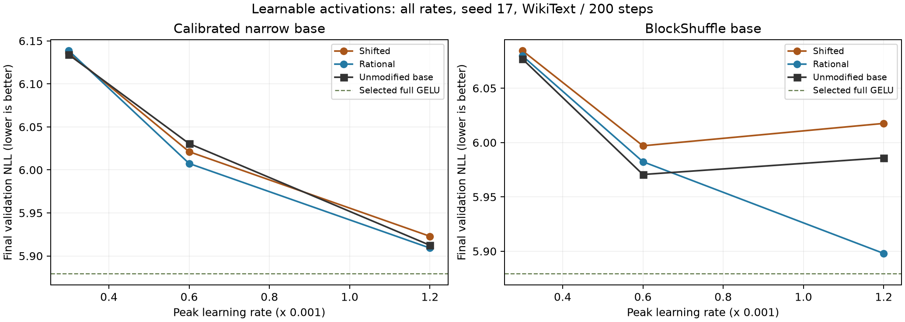
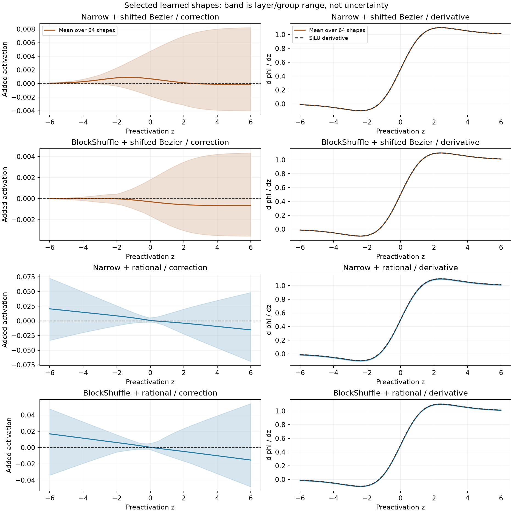

# Learnable activations on the compressed front-runners

**BlockShuffle with a rational activation improves selected NLL to 5.898003: 1.216% below its unmodified base and 0.244% below calibrated narrow.** It retains 70.3091% fewer FFN weights. Eager training peak is 883.17 MiB, so memory still blocks promotion.

Frozen promotion result: **NONE**. Twelve new trials compare two activation families on calibrated narrow SwiGLU and BlockShuffle. All completed with finite recorded diagnostics. This is a seed-17, 200-step WikiText selection screen, not convergence or a universal expressiveness result.

Read the [domain guide](learnable_activation_domain.md), [equations and scoped proofs](archive/retired/src/learnable_activation_ffn/model.md), [frozen plan](learnable_activation_plan.md), [raw decisions](../results/activation_screen_v1/result.json) and [preflight](../results/activation_screen_v1/preflight.json).

## Selected final checkpoints

| Recipe | Peak LR | NLL | Change vs own base | FFN weights | Peak MiB | Longer training |
|---|---:|---:|---:|---:|---:|---|
| full gelu | 0.0012 | 5.879278 | reference | 9,437,184 | 656.62 | reference |
| full swiglu | 0.0012 | 5.907694 | reference | 9,437,184 | 702.19 | reference |
| calibrated narrow | 0.0012 | 5.912434 | reference | 2,801,664 | 516.28 | reference |
| blockshuffle | 0.0006 | 5.970604 | reference | 2,801,664 | 714.12 | reference |
| Narrow + shifted Bezier | 0.0012 | 5.922844 | +0.1761% | 2,802,240 | 921.83 | FAIL |
| BlockShuffle + shifted Bezier | 0.0006 | 5.997020 | +0.4424% | 2,802,240 | 1190.88 | FAIL |
| Narrow + rational | 0.0012 | 5.909193 | -0.0548% | 2,801,984 | 751.88 | FAIL |
| BlockShuffle + rational | 0.0012 | 5.898003 | -1.2160% | 2,801,984 | 883.17 | FAIL |

Negative NLL changes are improvements. Shifted curves add 576 weights across eight layers; rational curves add 320. Total weights are 9,100,224 and 9,099,968, respectively, versus 9,099,648 for either unmodified compressed base. FFN reduction remains above 70%.

## Every allocated trial

| Recipe | Peak LR | Final NLL | Peak MiB | Clipped steps |
|---|---:|---:|---:|---:|
| Narrow + shifted Bezier | 0.0003 | 6.136401 | 921.83 | 71.5% |
| Narrow + shifted Bezier | 0.0006 | 6.021157 | 921.83 | 44.0% |
| Narrow + shifted Bezier | 0.0012 | 5.922844 | 921.83 | 8.5% |
| BlockShuffle + shifted Bezier | 0.0003 | 6.084478 | 1190.88 | 57.0% |
| BlockShuffle + shifted Bezier | 0.0006 | 5.997020 | 1190.88 | 20.0% |
| BlockShuffle + shifted Bezier | 0.0012 | 6.017607 | 1190.88 | 13.5% |
| Narrow + rational | 0.0003 | 6.138570 | 751.88 | 71.0% |
| Narrow + rational | 0.0006 | 6.007458 | 751.88 | 48.0% |
| Narrow + rational | 0.0012 | 5.909193 | 751.88 | 9.5% |
| BlockShuffle + rational | 0.0003 | 6.079647 | 883.17 | 58.5% |
| BlockShuffle + rational | 0.0006 | 5.982363 | 883.17 | 21.5% |
| BlockShuffle + rational | 0.0012 | 5.898003 | 883.17 | 9.5% |

## What blocked promotion

- **Narrow + shifted Bezier:** beats calibrated narrow, memory within ten percent full swiglu, memory within ten percent full gelu, at least point two percent better than own base.
- **BlockShuffle + shifted Bezier:** beats calibrated narrow, within one percent full swiglu, memory within ten percent full swiglu, within one percent full gelu, memory within ten percent full gelu, at least point two percent better than own base.
- **Narrow + rational:** memory within ten percent full gelu, at least point two percent better than own base.
- **BlockShuffle + rational:** memory within ten percent full swiglu, memory within ten percent full gelu.

Grid-boundary winners: Narrow + shifted Bezier, Narrow + rational, BlockShuffle + rational. This grid was not extended after inspecting losses.

## Execution costs

| Selected recipe | Serial training tokens/s | Eager inference ms | Training peak / full GELU |
|---|---:|---:|---:|
| Narrow + shifted Bezier | 33248 | 86.143 | 1.404 |
| BlockShuffle + shifted Bezier | 6181 | 91.385 | 1.814 |
| Narrow + rational | 41781 | 13.756 | 1.145 |
| BlockShuffle + rational | 10561 | 34.379 | 1.345 |

These are serial descriptive timings, not a simultaneous paired speed comparison. New pointwise kernels, FP32 intermediates and activation/product recomputation add real costs. Narrow uses eager backward; BlockShuffle uses non-reentrant checkpointing. The old native SiLU-only derivative and fused serving kernels cannot evaluate these functions. Matrix work stays 5,603,328 FFN FLOPs per token; activation arithmetic and memory traffic are additional.

## What the learned shapes do

| Selected recipe | Grid correction RMS across all layers/groups | Largest absolute correction | NLL after reset | Reset cost |
|---|---:|---:|---:|---:|
| Narrow + shifted Bezier | 0.001857 | 0.008219 | 5.922913 | +0.0012% |
| BlockShuffle + shifted Bezier | 0.001411 | 0.004342 | 5.997042 | +0.0004% |
| Narrow + rational | 0.020521 | 0.072629 | 5.909077 | -0.0020% |
| BlockShuffle + rational | 0.017315 | 0.053989 | 5.898334 | +0.0056% |

The grid is uniform on [-6,6]; it is not weighted by the training preactivation distribution. Bands span all 64 layer/group curves, not statistical confidence intervals. Full recorded shape parameters and sampled real-token slopes are retained. Nonzero curve movement establishes that parameters learned, not that the richer family caused a training benefit.

Reset sets every activation theta to zero in the selected trained checkpoint, restoring SiLU while keeping all other trained weights fixed. Original full-validation NLL reproduces before each intervention. Source checkpoints remain unchanged. This tests dependence of an already co-adapted checkpoint on its learned correction; it is not training a fixed-activation control or identifying the cause of any gain.

## Evidence limits and next decision

Both compressed bases start with the exact same common initial tensors, logits, loss and gradients as their respective controls on the real-token BF16 preflight. All 22 pre-existing model behaviors remain exact on the archived CPU cases. Projection/data/optimizer sources and assignments are preserved; richer activation recomputation is disclosed. Each recipe receives three rates and 409,600 tokens per run. The reused controls received the same three-rate budget; historical architecture search remains unequal.

Validation covers 322,688 targets, including the final partial batch. Selection and reset use that same validation split; it is no longer unscored evidence for these choices. The official test remains unfetched. No three-seed or TinyStories-transfer claim follows from this cohort. Local activation derivative bounds are not a full-network stability or convergence proof. Novelty remains unverified.

No recipe earns the frozen longer-training budget. Preserve the learned shapes and isolate the limiting quality or execution cost before proposing another hypothesis; do not relax the gates after the result.

Execution follow-up: pointwise fusion passes the [isolated memory audit](activation_execution_results.md), but the [full training repeat](activation_training_repeat_results.md) fails quality. This preserves the original no-promotion decision.
