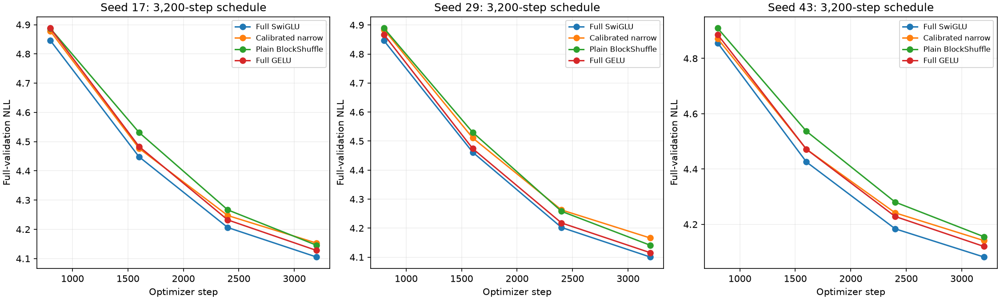

# H051: Three-seed 3,200-step comparison

**Primary quality/memory replication: FAIL. Late-plateau qualification: FAIL.** The primary rule requires every seed individually; a passing average cannot rescue a failed seed. These are fixed-duration results, not converged or globally tuned superiority.

[Frozen plan](long_duration_replication_plan.md), [raw evidence](../results/long_duration_replication_v1/result.json), [retained seed-17 comparison](long_duration_results.md).

Seeds 29/43 add eight fresh trials, retaining all four seed-17 outcomes. Each uses width 384, eight layers, attention heads 6, context 128, vocabulary 4096, batch 16, native BF16, peak LR 0.0012, 320-step warmup and cosine decay to 0.1 peak. Only seed changes from H050. Each new model trains 6,553,600 sampled tokens; eight allocations total 52,428,800. Every evaluation scores all 322,688 validation targets. The primary endpoint is final step 3,200. Official test is unscored.

## Every final endpoint

| Seed | Recipe | NLL | FFN weights | Peak MiB | Clipped steps | Training tokens/s (descriptive) |
|---|---|---:|---:|---:|---:|---:|
| 17 | Full SwiGLU | 4.105417 | 9,437,184 | 702.19 | 9.4% | 35,079 |
| 17 | Calibrated narrow | 4.153048 | 2,801,664 | 516.28 | 11.4% | 37,695 |
| 17 | Plain BlockShuffle | 4.145726 | 2,801,664 | 714.12 | 30.5% | 26,384 |
| 17 | Full GELU | 4.127881 | 9,437,184 | 656.62 | 27.5% | 37,902 |
| 29 | Full SwiGLU | 4.100553 | 9,437,184 | 702.19 | 9.8% | 34,083 |
| 29 | Calibrated narrow | 4.166103 | 2,801,664 | 516.28 | 16.5% | 37,139 |
| 29 | Plain BlockShuffle | 4.141140 | 2,801,664 | 714.12 | 36.9% | 26,118 |
| 29 | Full GELU | 4.115460 | 9,437,184 | 656.62 | 33.1% | 37,820 |
| 43 | Full SwiGLU | 4.082021 | 9,437,184 | 702.19 | 10.1% | 34,525 |
| 43 | Calibrated narrow | 4.141344 | 2,801,664 | 516.28 | 11.1% | 34,879 |
| 43 | Plain BlockShuffle | 4.155463 | 2,801,664 | 714.12 | 33.2% | 24,358 |
| 43 | Full GELU | 4.120228 | 9,437,184 | 656.62 | 25.0% | 36,485 |

The complete source records retain total weights, logical matrix FLOPs, parameter and optimizer-state bytes. These counts do not imply a training-speed win. Throughput spans sessions and is descriptive; no paired speed claim follows.

## Per-seed gates

| Seed | Primary gates | NLL vs full SwiGLU | vs full GELU | vs narrow | >=0.2% narrow margin |
|---|---|---:|---:|---:|---|
| 17 | PASS | +0.9819% | +0.4323% | -0.1763% | FAIL |
| 29 | PASS | +0.9898% | +0.6240% | -0.5992% | PASS |
| 43 | FAIL | +1.7992% | +0.8552% | +0.3409% | FAIL |

Positive relative NLL means worse. The original gates require >=70% fewer FFN weights, <=1% NLL cost versus both full controls, strictly beating narrow, finite verified diagnostics, and allocated peak <=1.1 times each full control. The 0.2% narrow margin is a separate, predeclared diagnostic.

Seed 43 failed: beats calibrated narrow, within one percent full swiglu.

## Three-seed means and paired differences

| Recipe | Mean NLL | Sample SD | Maximum peak MiB |
|---|---:|---:|---:|
| Full SwiGLU | 4.095997 | 0.012345 | 702.19 |
| Calibrated narrow | 4.153498 | 0.012386 | 516.28 |
| Plain BlockShuffle | 4.147443 | 0.007315 | 714.12 |
| Full GELU | 4.121190 | 0.006266 | 656.62 |

| Plain relative to control | Mean NLL difference | Paired SD | Exploratory 95% t interval | Strict seed wins | Relative mean NLL |
|---|---:|---:|---|---:|---:|
| Full SwiGLU | +0.051446 | 0.019050 | [+0.004124, +0.098768] | 0/3 | +1.2560% |
| Calibrated narrow | -0.006055 | 0.019572 | [-0.054675, +0.042564] | 2/3 | -0.1458% |
| Full GELU | +0.026253 | 0.008709 | [+0.004619, +0.047888] | 0/3 | +0.6370% |

Separate >=0.2% mean narrow margin: **FAIL**. Each paired difference is candidate minus control at the same seed. Intervals use n=3, df=2 and t=4.302653. These small-sample summaries are exploratory, not proof of universal superiority, equivalence or independently replicated rate ranking.

## Late trajectory evidence

| Seed | Recipe | Last-800-step NLL change | Final cost over best endpoint | Late screen |
|---|---|---:|---:|---|
| 17 | Full SwiGLU | -2.3960% | +0.0000% | FAIL |
| 17 | Calibrated narrow | -2.2179% | +0.0000% | FAIL |
| 17 | Plain BlockShuffle | -2.8318% | +0.0000% | FAIL |
| 17 | Full GELU | -2.4655% | +0.0000% | FAIL |
| 29 | Full GELU | -2.4307% | +0.0000% | FAIL |
| 29 | Plain BlockShuffle | -2.7452% | +0.0000% | FAIL |
| 29 | Calibrated narrow | -2.2675% | +0.0000% | FAIL |
| 29 | Full SwiGLU | -2.4247% | +0.0000% | FAIL |
| 43 | Full SwiGLU | -2.4362% | +0.0000% | FAIL |
| 43 | Calibrated narrow | -2.3649% | +0.0000% | FAIL |
| 43 | Plain BlockShuffle | -2.9220% | +0.0000% | FAIL |
| 43 | Full GELU | -2.5615% | +0.0000% | FAIL |

The operational screen requires absolute last-800-step NLL change <=0.2% and final NLL <=0.2% above the best recorded endpoint. Negative change means continued improvement. Passing this screen still cannot prove optimal convergence. No 800-step checkpoint inside these stretched schedules is treated as equivalent to a separately trained shorter model.



## Verification and retained failures

H050's four outcomes, the twelve selected 800-step reference cells, all immutable data hashes and the complete validation stream verify. Current computation matches the passing 227-test snapshot. Separate CUDA workers reproduce each new seed's retained 800-batch RNG state and reconstruct its 3,200-batch state; they perform no optimizer updates or validation scoring. Every completed checkpoint matches its sampler state. Initial validation NLL and first pre-update training loss reproduce the corresponding seed's short reference within 1e-7. Exact configurations, schedules, parameter/FLOP counts, optimizer/init metadata, source archives, finite weights/gradients/layer diagnostics and all checkpoint hashes verify.

Numerical cells: 0. Preserved audit failures: 1. Failed launcher processes: 2 (including the audit failure propagated to its launcher; these counts overlap). The first launch crashed in Python inspect.cleandoc during Matplotlib import, before creating any audit directory or sampling/training output. Its [explicit source-identical continuation](../results/verification/long_duration_replication_startup_qualification_v1.json) retains the fatal log. The first training worker also crashed during Matplotlib import before creating a run. Its qualified continuation dispatches the identical frozen configuration to a [minimal worker](../src/core/frozen_train_worker.py) that directly calls the unchanged trainer and imports no report/plot driver. The original audit and its verification functions remain exact; the operational dispatcher change is explicitly recorded. No root cause or permanent fix is claimed. Numerical and infrastructure failures are distinct; every attempted run remains retained.

## Next decision

The single-seed H050 local pass does not replicate under the frozen all-seed rule. Preserve the earlier 800-step evidence with its duration limits. Investigate duration-specific optimization and representation before further promotion; this failure does not reject the whole structured family.

The corrected same-rate affine activation benefit remains only 0.101% at 800 steps; this study adds no activation variant and supplies no new activation-specific evidence. No universal-optimality, converged-SOTA, novel-primitive or full-network nonvanishing-gradient claim follows.

```powershell
uv run --extra compile --extra data python -m src.core.long_duration_replication_report
```
