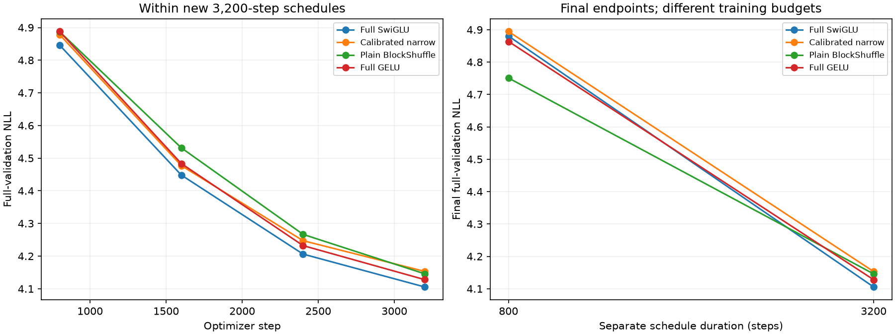

# H050: Fixed-recipe 3,200-step comparison

**Local quality/memory promotion: PASS. Operational late-plateau screen: FAIL.** Neither outcome is a proof of optimal convergence. This round trains the four selected recipes for four times the earlier duration, with unchanged peak rate and optimizer treatment.

[Frozen protocol](long_duration_plan.md), [raw decisions](../results/long_duration_v1/result.json), [complete 800-step rate grid](optimizer_lower_results.md).

All models use width 384, eight layers, context 128, batch 16, vocabulary 4096, seed 17, native BF16 and peak LR 0.0012. Only steps and proportional logging change from the selected short recipes: 3,200 steps and logging every 800. The relative schedule stretches to 320 warmup steps and cosine decay to 0.1 peak. Each complete trial trains 6,553,600 sampled tokens, about 2.125 cache-token exposures; replacement sampling is not an ordered epoch. Four allocations total 26,214,400 tokens. Every evaluation scores all 322,688 validation targets. Official test stays unscored.

## Final endpoints and resources

| Recipe | Earlier 800-step NLL | New 3,200-step NLL | FFN weights | Total weights | Peak MiB | Clipped steps | Training tokens/s (descriptive) |
|---|---:|---:|---:|---:|---:|---:|---:|
| Full SwiGLU | 4.880372 | 4.105417 | 9,437,184 | 15,735,168 | 702.19 | 9.4% | 35,079 |
| Calibrated narrow | 4.894435 | 4.153048 | 2,801,664 | 9,099,648 | 516.28 | 11.4% | 37,695 |
| Plain BlockShuffle | 4.750900 | 4.145726 | 2,801,664 | 9,099,648 | 714.12 | 30.5% | 26,384 |
| Full GELU | 4.863755 | 4.127881 | 9,437,184 | 15,735,168 | 656.62 | 27.5% | 37,902 |

Earlier and new final endpoints use different token budgets and schedule lengths. The 800-step point inside a new run is not equivalent to a separately trained 800-step model: warmup/decay differ. Within the four new runs, duration and data order match. Source/checkpoint metadata retain logical matrix FLOPs, parameter bytes and optimizer-state bytes; these do not imply a training-speed win. Cross-session throughput is descriptive.

## Frozen final-step gates

| Gate | Decision |
|---|---|
| at least 70 percent fewer ffn weights | PASS |
| beats calibrated narrow | PASS |
| within one percent full swiglu | PASS |
| memory within ten percent full swiglu | PASS |
| within one percent full gelu | PASS |
| memory within ten percent full gelu | PASS |

| BlockShuffle relative final NLL | Difference |
|---|---:|
| vs Full SwiGLU | +0.9819% |
| vs Calibrated narrow | -0.1763% |
| vs Full GELU | +0.4323% |

Separate >=0.2% narrow margin: **FAIL**. Positive relative NLL means worse. These are engineering gates, not statistical significance tests.

## Late trajectory evidence

The frozen diagnostic requires absolute NLL change from 2,400 to 3,200 steps <=0.2%, and final NLL <=0.2% above the best recorded endpoint, for every recipe. This is a limited operational screen, not a convergence theorem or proof that more training/rate tuning cannot help.

| Recipe | Relative NLL change, last 800 steps | Final cost over best recorded endpoint | Late screen |
|---|---:|---:|---|
| Full SwiGLU | -2.3960% | +0.0000% | FAIL |
| Calibrated narrow | -2.2179% | +0.0000% | FAIL |
| Plain BlockShuffle | -2.8318% | +0.0000% | FAIL |
| Full GELU | -2.4655% | +0.0000% | FAIL |

Negative last-interval changes indicate continued improvement during the schedule. The primary quality decision always uses the final endpoint, not whichever intermediate validation loss was best.



## Verification

H049's complete sixteen-cell grid verifies and retains an interior 0.0012 winner for every recipe. Current computation matches the passing 225-test snapshot, with no NN, trainer, data, optimizer or diagnostic source change. A separate read-only GPU worker reconstructs 3,200 CUDA sampler calls: the first batch matches the retained qualification hash, its 800-call state matches every selected old checkpoint, and all complete new checkpoints match its 3,200-call state. CPU and CUDA generators are not substituted for each other. That worker performs zero optimizer updates and scores no validation targets.

All eight immutable data hashes, the complete validation stream including the final nine-window batch, exact source archives, checkpoint counts/weights and configurations verify. Each new initial full-validation loss and first pre-update training loss reproduce their reference within 1e-7; the first optimizer update then differs because warmup is stretched. Full histories, actual schedules, optimizer metadata and finite gradients/layer statistics verify. No bitwise long-trajectory or full-network gradient lower-bound claim is made.

Numerically failed cells: 0; preserved infrastructure audit failures: 0. Every training log, failure, checkpoint and source record remains retained. Completed or numerically failed runs are not repeated.

## Next decision

The compressed recipe retains the local quality/memory gates at this longer fixed duration. Independent-seed longer controls must be frozen before a replication claim. The rate grid was selected at 800 steps; duration-specific rate ranking is not established. A failed late-plateau screen requires continued convergence qualification rather than a claim that the quality is final.

The earlier same-rate affine activation result is unchanged; no learnable-activation variant is added to this duration comparison. No new primitive, universal optimality, state-of-the-art superiority or breakthrough is established by these local controls.

```powershell
uv run --extra compile --extra data python -m src.core.long_duration_report
```
