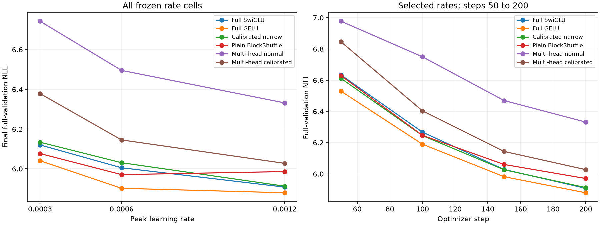

# H046: Multi-head FFN validation screen

**Both local adaptations fail quality and memory promotion.** Calibrating initialization helps at every tested rate, but the best calibrated result still trails all four selected controls. This is a small-head, 200-step result, not a refutation of the published architecture at its larger dimensions or training budgets.

[Frozen protocol](multihead_screen_plan.md), [raw decisions](../results/multihead_screen_v2/result.json), [initialization qualification](multihead_integration_results.md), [budget derivation](multihead_budget_geometry.md).

All trials use WikiText-2, width 384, eight layers, context 128, batch 16, seed 17, native BF16, 409,600 sampled training tokens and all 322,688 validation targets. Six new trials use 2,457,600 training tokens in total. Official test is unscored. Each initialization receives three rates independently; twelve frozen control trials are reused. Historical architecture-search effort is unequal.

| Recipe | NLL at 0.0003 | NLL at 0.0006 | NLL at 0.0012 | Selected rate | FFN weights | Total weights | Peak MiB |
|---|---:|---:|---:|---:|---:|---:|---:|
| Full SwiGLU | 6.120134 | 6.005087 | 5.907694 | 0.0012 | 9,437,184 | 15,735,168 | 702.19 |
| Full GELU | 6.040670 | 5.901685 | 5.879278 | 0.0012 | 9,437,184 | 15,735,168 | 656.62 |
| Calibrated narrow | 6.133922 | 6.030559 | 5.912434 | 0.0012 | 2,801,664 | 9,099,648 | 516.28 |
| Plain BlockShuffle | 6.076798 | 5.970604 | 5.985974 | 0.0006 | 2,801,664 | 9,099,648 | 714.12 |
| Multi-head normal | 6.743500 | 6.495495 | 6.331841 | 0.0012 | 2,807,808 | 9,105,792 | 832.58 |
| Multi-head calibrated | 6.378923 | 6.145288 | 6.027381 | 0.0012 | 2,807,808 | 9,105,792 | 832.58 |

## Same-rate differences

Positive values mean worse candidate NLL. The complete rate matrix prevents selection from hiding a rate-specific failure.

| Candidate | Rate | vs full SwiGLU | vs full GELU | vs narrow | vs BlockShuffle |
|---|---:|---:|---:|---:|---:|
| Multi-head normal | 0.0003 | +10.1855% | +11.6350% | +9.9378% | +10.9713% |
| Multi-head normal | 0.0006 | +8.1665% | +10.0617% | +7.7097% | +8.7913% |
| Multi-head normal | 0.0012 | +7.1796% | +7.6976% | +7.0937% | +5.7780% |
| Multi-head calibrated | 0.0003 | +4.2285% | +5.5996% | +3.9942% | +4.9718% |
| Multi-head calibrated | 0.0006 | +2.3347% | +4.1277% | +1.9025% | +2.9257% |
| Multi-head calibrated | 0.0012 | +2.0259% | +2.5191% | +1.9442% | +0.6917% |

## Gates and diagnosis

| Gate | Normal | Calibrated |
|---|---|---|
| at least 70 percent fewer ffn weights | PASS | PASS |
| beats calibrated narrow | FAIL | FAIL |
| within one percent full swiglu | FAIL | FAIL |
| memory within ten percent full swiglu | FAIL | FAIL |
| within one percent full gelu | FAIL | FAIL |
| memory within ten percent full gelu | FAIL | FAIL |
| at least point two percent better than calibrated narrow | FAIL | FAIL |

Both winners are at the upper grid boundary; neither optimum is bracketed. No post-result rate extension or automatic 800-step promotion is performed. Normal-versus-calibrated initialization changes parameter scales and optimization geometry, so the benefit cannot be assigned solely to output variance.

| Candidate | Rate | Final layer entropy range (nats) | Maximum sigmoid saturation | Clipped steps | Training tokens/s (descriptive) |
|---|---:|---:|---:|---:|---:|
| Multi-head normal | 0.0003 | 0.6913 to 0.6927 | 0.000% | 26.0% | 25,198 |
| Multi-head normal | 0.0006 | 0.6907 to 0.6925 | 0.000% | 13.5% | 25,014 |
| Multi-head normal | 0.0012 | 0.6736 to 0.6931 | 0.000% | 8.5% | 25,117 |
| Multi-head calibrated | 0.0003 | 0.6929 to 0.6931 | 0.000% | 32.0% | 25,189 |
| Multi-head calibrated | 0.0006 | 0.6906 to 0.6931 | 0.000% | 24.0% | 25,137 |
| Multi-head calibrated | 0.0012 | 0.6738 to 0.6929 | 0.000% | 7.5% | 25,219 |

Routing diagnostics sample the first 256 tokens per layer outside timed training. All recorded activations, routing statistics and gradient norms are finite. This does not provide a lower gradient bound or establish whole-network stability. Training throughput is recorded for transparency; the archived controls were timed in different sessions, so no causal speed comparison is made. No FlashMHF kernel is implemented.



## Verification and decision

All six checkpoint/config counts, histories, data hashes, archives, optimizer metadata and final sampling RNG match the frozen protocol. The final sampling state equals all twelve controls. Current-code initial validation losses reproduced all four controls within 1e-7. The first baseline worker crashed during PyTorch import before evaluation or candidate training; its explicitly recorded, source-identical continuation completed all six trials without retries. Both records remain retained. Root cause of the intermittent native import failures remains unresolved.

Retain this small-budget parallel adaptation as negative local evidence. The budget derivation identifies a separately testable simplification: one headwise SwiGLU, no router, twice the head width, and exactly the BlockShuffle parameter budget. It halves the parallel model's hidden feature count. That changes several capacity dimensions, so any gain would be a recipe comparison rather than an isolated router ablation. The stronger plain 800-step result and the corrected 0.101% three-seed activation benefit are unchanged.

```powershell
uv run --extra compile --extra data python -m src.core.multihead_screen_report
```
