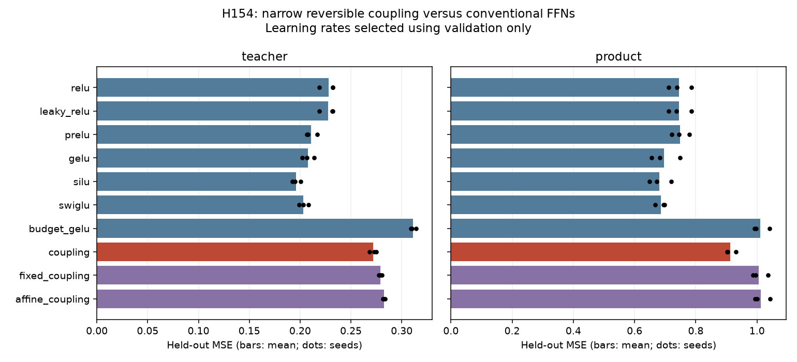
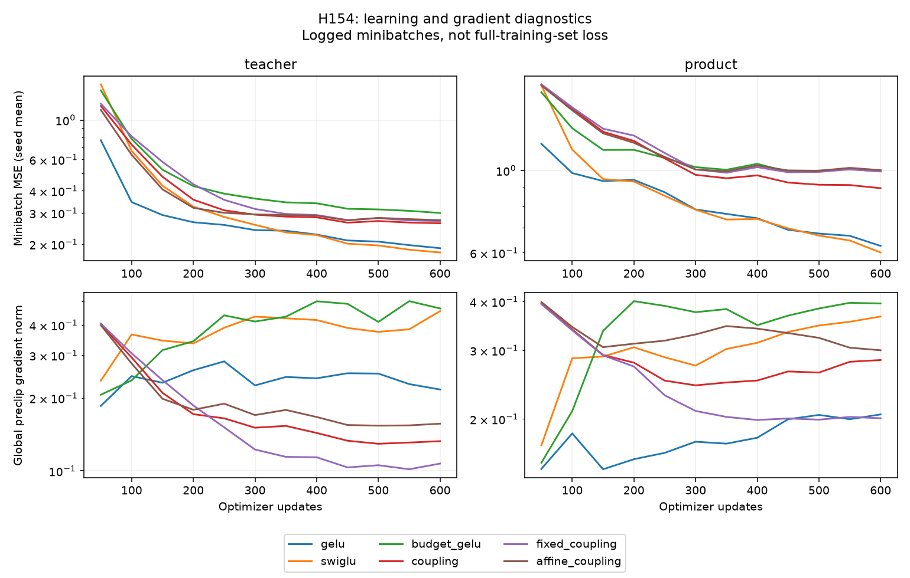

# H154: learned narrow coupling must earn its compression

**NO PROMOTION from narrow coupling.** Completed 120 fits and 72,000 optimizer updates on an RTX 4070
Laptop GPU using UV-managed Python. Task qualification: teacher: qualified; product: qualified.
The broad VRAM/quality research goal remains open. No claim of architecture
novelty, universal dominance, or real-data validation follows from this screen.

## What changed and why

H153's even scalar controls mostly overlapped existing bias tangent directions.
This study learns projection directions inside a narrow, invertible additive
coupling core. Four blocks each permute 32 features into halves (a,b), apply

    a_new = a + (V GELU(U b + c) + e) / 2
    b_new = b

and undo the permutation. U maps 16 -> 8, V maps 8 -> 16. A full learned
32 -> 32 readout follows. Coupling has 2,176 trainable parameters, including
readout: 74.24% fewer than full GELU's 8,448. Narrow GELU has 2,208.
The fixed-hidden control freezes U and c while training V, e and readout.
The affine control replaces GELU by identity with the same parameterization.
Learned and fixed-hidden coupling have exactly the same initial function.

## Mathematical scope

Each coupling block is exactly invertible in real arithmetic: recover a by
subtracting the update computed from unchanged b. Its Jacobian, in permuted
coordinates, is [[I,K],[0,I]], with determinant one. An SVD of K reduces this
to independent two-dimensional shears; for each singular value k their singular
values are sqrt(1+k^2/4) +/- k/2. Thus k=||K|| gives valid extremal bounds.
Products of the block bounds apply to the core. Unconstrained learned matrices
provide no uniform depth-independent gradient bound; the readout can be singular.
No claim about optimizer gradients or stable inversion after arbitrary training
is established by the initialization checks.

Zeroing all down maps makes the core identity. Setting readout W=M and bias zero
then represents every linear map M exactly; the FP64 witness passes.
Nine FP64 inverse checks at input scales 0.1, 1 and 10 have maximum absolute
roundtrip error 3.553e-15. Small-model input and parameter
finite differences pass. Three GPU input/parameter-gradient comparisons against
CPU FP64 pass, maximum relative error 1.998e-07. These are correctness
checks, not empirical proof of memory savings from reconstruction. Training uses
ordinary autograd and does not implement reconstructed backward.

Additive coupling is prior art: [NICE](https://arxiv.org/abs/1410.8516).
Activation reconstruction is also established: [RevNets](https://arxiv.org/abs/1707.04585).
The experiment tests this repository's narrow budget and learning bottleneck.
It differs from the earlier scalar-controlled rational twist and weight-shared
recurrence, but these differences do not establish novel priority.

## Post-hoc exact-representation obstruction

This argument was added during the run; it does not change the frozen gates or
explain the observed MSE quantitatively. Write the predictor as W R(x) + b with
R an invertible map from R^32 to R^32. If W is nonsingular, the predictor is
injective and cannot give identical outputs for x and -x. If W is singular, its
outputs lie in a proper affine subspace.

For T(x)_i = x_i x_(i+1), T(x)=T(-x). Also T(0)=0 and
T(e_i+e_(i+1))=e_i for all 32 cyclic indices. These outputs affinely span R^32.
Thus neither case for W can exactly represent this target, even on the finite
witness set containing zero and those signed pairs. Orthogonal output mixing,
translation and nonzero target scaling preserve both collision and affine-span
properties. A separate integer-arithmetic check verifies every witness.

This is **not a nonzero lower bound on attainable MSE**, nor proof that the
observed optimization gap is inevitable. It applies to the H152 square-readout
family too. It motivates testing an augmented reversible state with a rectangular
readout, or an explicitly noninvertible terminal map, rather than assuming that
any square learned readout removes every limitation of invertibility. The extra
state/readout must still earn its VRAM cost. Augmentation for representational
limitations is established prior art in
[Augmented Neural ODEs](https://arxiv.org/abs/1904.01681); no novel priority is claimed.

## Controlled protocol

Two nonlinear tasks from H152: a fixed random wide GELU teacher and an
orthogonally mixed cyclic-product target. New input/model seeds 347, 359, 373.
Functions are held fixed across seeds; this is not three independent teachers.
Each fixture has 4,096 training, 2,048 validation and 2,048 reporting examples.
Training-only target mean/RMS normalization. All arms share saved 600 x 128
batch indices, AdamW betas (0.9, 0.95), zero decay, global clipping at 1,
FP32 and disabled TF32. Rates 0.001 and 0.003 receive equal budgets. Biases start
at zero; coupling readout starts at identity. Structurally different arms cannot
share every tensor, but learned/fixed-hidden coupling initialization is matched.

A rate is selected per task/arm by mean validation MSE over all three seeds.
Reporting examples never select rates. Qualification requires both full GELU and
SwiGLU to beat zero prediction by at least 20% on every seed. Promotion requires
candidate reporting MSE within 1% of each full baseline and narrow GELU, and at
least 5% below both fixed-hidden and affine coupling, for every seed and both
qualified tasks. Failed qualification is inconclusive, not an impossibility result.
This 600-step budget is larger than H152's 300; cross-study numbers are not paired.

## All selected held-out results

| Task | Arm | Trainable parameters | LR | Mean MSE | Median MSE | Sample variance |
|---|---|---:|---:|---:|---:|---:|
| teacher | relu | 8,448 | 0.003 | 0.22784 | 0.23218 | 5.778e-05 |
| teacher | leaky_relu | 8,448 | 0.003 | 0.22773 | 0.23182 | 5.579e-05 |
| teacher | prelu | 8,452 | 0.003 | 0.21049 | 0.20776 | 3.053e-05 |
| teacher | gelu | 8,448 | 0.003 | 0.20756 | 0.20657 | 3.373e-05 |
| teacher | silu | 8,448 | 0.003 | 0.19593 | 0.19520 | 1.653e-05 |
| teacher | swiglu | 8,360 | 0.003 | 0.20325 | 0.20296 | 2.095e-05 |
| teacher | budget_gelu | 2,208 | 0.003 | 0.31105 | 0.30994 | 7.445e-06 |
| teacher | coupling | 2,176 | 0.003 | 0.27193 | 0.27284 | 1.188e-05 |
| teacher | fixed_coupling | 1,632 | 0.003 | 0.27910 | 0.27910 | 2.428e-06 |
| teacher | affine_coupling | 2,176 | 0.003 | 0.28240 | 0.28205 | 1.349e-06 |
| product | relu | 8,448 | 0.003 | 0.74526 | 0.73892 | 1.398e-03 |
| product | leaky_relu | 8,448 | 0.003 | 0.74462 | 0.73715 | 1.389e-03 |
| product | prelu | 8,452 | 0.003 | 0.74833 | 0.74514 | 8.230e-04 |
| product | gelu | 8,448 | 0.003 | 0.69540 | 0.68242 | 2.332e-03 |
| product | silu | 8,448 | 0.003 | 0.68062 | 0.67244 | 1.284e-03 |
| product | swiglu | 8,360 | 0.003 | 0.68673 | 0.69521 | 2.892e-04 |
| product | budget_gelu | 2,208 | 0.003 | 1.00988 | 0.99670 | 7.159e-04 |
| product | coupling | 2,176 | 0.003 | 0.91269 | 0.90346 | 2.726e-04 |
| product | fixed_coupling | 1,632 | 0.003 | 1.00567 | 0.99460 | 6.794e-04 |
| product | affine_coupling | 2,176 | 0.003 | 1.01280 | 1.00112 | 6.936e-04 |

Candidate/comparator ratios below 1 favor coupling. The fixed/affine ablations
must be <= 0.95; all other ratios must be <= 1.01.

| Task | Seed | / GELU | / SwiGLU | / narrow GELU | / fixed-hidden | / affine | All ratio gates |
|---|---:|---:|---:|---:|---:|---:|---|
| teacher | 347 | 1.349 | 1.344 | 0.868 | 0.983 | 0.967 | False |
| teacher | 359 | 1.330 | 1.321 | 0.889 | 0.979 | 0.969 | False |
| teacher | 373 | 1.254 | 1.348 | 0.865 | 0.961 | 0.953 | False |
| product | 347 | 1.244 | 1.340 | 0.895 | 0.900 | 0.893 | False |
| product | 359 | 1.379 | 1.353 | 0.910 | 0.915 | 0.908 | False |
| product | 373 | 1.324 | 1.295 | 0.906 | 0.908 | 0.902 | False |

## Memory and optimization diagnostics

The following are means over selected seeds. Peak allocated memory includes
resident training inputs/targets and optimizer state. The evaluation peak is
measured after resetting peak counters, while training data, optimizer state and
final gradients remain resident. It is **not isolated deployment inference VRAM**.
Reserved peaks and all fit measurements are in result.json. Fit wall time includes
Python overhead and optimizer updates; no warmed paired timing, backward-only
latency, or equal-checkpoint resource gate was attempted at this small scale.
Do not extrapolate these numbers to d384 or claim reconstruction savings.

| Task | Arm | Training peak MiB | Evaluation peak MiB | 600-step seconds | Final preclip gradient norm |
|---|---|---:|---:|---:|---:|
| teacher | relu | 18.145 | 18.368 | 2.87 | 0.288 |
| teacher | leaky_relu | 18.208 | 18.368 | 2.87 | 0.282 |
| teacher | prelu | 18.213 | 18.375 | 3.08 | 0.126 |
| teacher | gelu | 18.208 | 18.368 | 2.84 | 0.217 |
| teacher | silu | 18.208 | 18.368 | 2.86 | 0.177 |
| teacher | swiglu | 18.264 | 18.370 | 3.81 | 0.456 |
| teacher | budget_gelu | 18.043 | 18.227 | 2.85 | 0.468 |
| teacher | coupling | 18.062 | 18.278 | 4.45 | 0.133 |
| teacher | fixed_coupling | 17.988 | 18.266 | 3.98 | 0.107 |
| teacher | affine_coupling | 18.047 | 18.278 | 4.26 | 0.157 |
| product | relu | 18.145 | 18.368 | 2.84 | 0.224 |
| product | leaky_relu | 18.208 | 18.368 | 2.86 | 0.222 |
| product | prelu | 18.213 | 18.375 | 3.11 | 0.227 |
| product | gelu | 18.208 | 18.368 | 2.87 | 0.205 |
| product | silu | 18.208 | 18.368 | 2.87 | 0.199 |
| product | swiglu | 18.264 | 18.370 | 3.83 | 0.366 |
| product | budget_gelu | 18.043 | 18.227 | 2.85 | 0.395 |
| product | coupling | 18.062 | 18.278 | 4.49 | 0.283 |
| product | fixed_coupling | 17.988 | 18.266 | 3.98 | 0.201 |
| product | affine_coupling | 18.047 | 18.278 | 4.29 | 0.300 |

| Arm | Trainable parameters | Fixed buffer bytes |
|---|---:|---:|
| relu | 8,448 | 0 |
| leaky_relu | 8,448 | 0 |
| prelu | 8,452 | 0 |
| gelu | 8,448 | 0 |
| silu | 8,448 | 0 |
| swiglu | 8,360 | 0 |
| budget_gelu | 2,208 | 0 |
| coupling | 2,176 | 2,048 |
| fixed_coupling | 1,632 | 4,224 |
| affine_coupling | 2,176 | 2,048 |

Core projection forward MACs are 4 * 2 * 16 * 8 = 1,024; readout adds 1,024,
so the candidate has 2,048 dense MACs/example versus full GELU's 8,192 and narrow
GELU's 2,048. These counts exclude activation, indexing, biases and launch costs;
GELU/shear composition depth and memory traffic differ. They are not measured FLOPs
or a speed prediction. Fixed-hidden parameters are counted as buffers, not free.

## Evidence and decision

Independent explicit CPU FP64 formulas re-score all 120 saved checkpoints on
validation and reporting splits (240 scores, batch 257, relative tolerance 1e-5).
All datasets regenerate bitwise; permutations and frozen weights match originals.
All 120 Adam states have step 600 and finite moments; all logged losses and gradient
norms are finite. There are 121 clean GPU allocation/reservation boundaries.
Source hashes, prior receipt, frozen protocol and maintained code hashes verify.
Raw checkpoints, per-fit histories, all rates and audit errors remain available.

This is a bounded screening decision for this architecture, initialization and
training recipe. The candidate does not earn a reconstructed-backward implementation or a language-model run. Preserve this negative/inconclusive result and move beyond this exact narrow recipe.

Reproduce with the UV Python path and launch.py stages prepare, worker, audit,
finish in that order in a fresh output directory after updating ROOT/module paths;
the existing directory intentionally refuses to overwrite its evidence. Hardware:
NVIDIA GeForce RTX 4070 Laptop GPU, 610.62, 8188 MiB. Python 3.12.9,
PyTorch 2.14.0+cu132. The frozen plan contains the full budget and gates.
