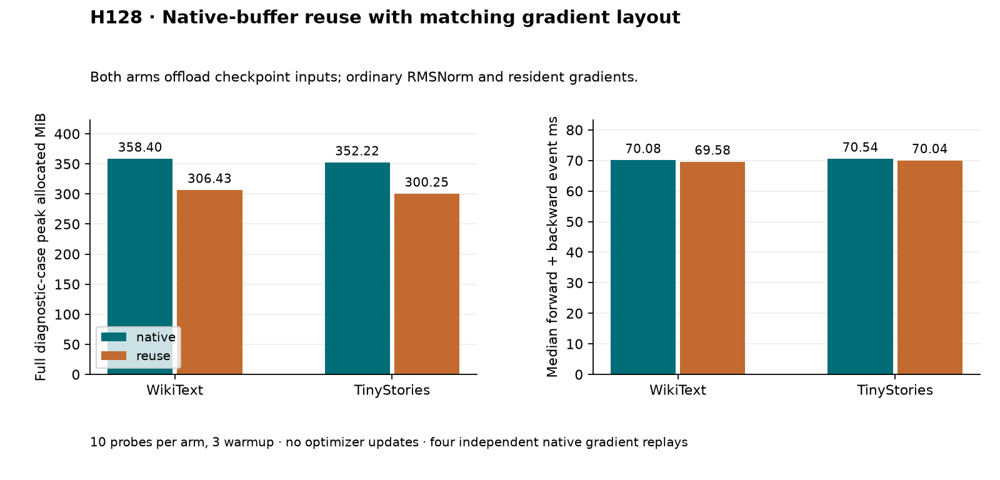

# H128: buffer reuse saves memory; full-model exactness remains unresolved

**FAIL combined acceptance gate.** The revised classifier passes every
operator exactness check and all resource gates, but independent full-model
bitwise replay fails for both candidate and native control. This is useful
memory evidence, not qualification for longer training or proof of quality.

| Corpus | Arm | Diagnostic peak MiB | Median event ms | Median wall ms |
|---|---|---:|---:|---:|
| wikitext2 | native | 358.398 | 70.084 | 76.891 |
| wikitext2 | reuse | 306.430 | 69.578 | 75.135 |
| tinystories | reuse | 300.251 | 70.038 | 75.904 |
| tinystories | native | 352.219 | 70.543 | 75.519 |

| Corpus | CUDA allocation saved | Event ratio | Wall ratio | Full-model bitwise gate |
|---|---:|---:|---:|---|
| wikitext2 | 14.50% | 0.9928x | 0.9772x | failed |
| tinystories | 14.75% | 0.9928x | 1.0051x | failed |

Both arms use CPU checkpoint-input offload, ordinary RMSNorm, resident gradients,
FP32 native classifier arithmetic, default attention and original Adam state.
Only the classifier implementation changes. Peak pinned-host allocation is
64.000 MiB in both arms, additional to GPU allocation. Parameters stay at
9,099,648; there is no parameter reduction. The measured 51.968 MiB GPU saving
is incremental to input offloading, not a comparison with the unmodified
no-offload model. CUDA allocation excludes driver/context and other processes.

## What changed after H127

H127 reused native log-softmax/NLL buffers but calculated every input gradient
as G W. PyTorch's [matrix backward implementation](https://raw.githubusercontent.com/pytorch/pytorch/main/torch/csrc/autograd/FunctionsManual.cpp)
uses (W^T G^T)^T when the hidden input is column-major. H128 follows that layout
choice while preserving the other kernels. All eight original FP32/FP64 cases
now match native loss and both gradients bitwise. A ninth case covers the
actual contiguous [8,512,384] hidden tensor and [4096,384] classifier, also
bitwise equal. All six directional derivatives pass, inputs/upstream gradients
remain unchanged and all outputs are finite. These results support the layout
explanation for H127's isolated failure. They do not establish whole-model
numerical identity across arbitrary shapes, backends or versions.

The scope is first derivatives, no autocast, contiguous weights, and 2D or
contiguous 3D hidden tensors. Native logits are privately allocated before
reuse; caller inputs and saved log-probabilities are not overwritten by backward.
[In-place classifier prior art](https://github.com/mgmalek/efficient_cross_entropy)
and [Cut Cross-Entropy](https://arxiv.org/abs/2411.09009) precede this study.
No new activation, FFN architecture or algorithmic novelty is claimed.

## Why the gate still fails

All four independent native replays reproduce loss exactly, but none reproduces
every saved parameter gradient bitwise, including the two ordinary native
controls. Final-normalization gradients match in every replay. For example,
the WikiText native-control replay matches the last FFN and attention-output
projection but differs at the last attention QKV projection and earlier layers.
This makes attention/backward reproducibility a targeted next diagnostic;
the current data do not isolate nondeterministic kernels, scheduling, storage
changes or another cause. It would be incorrect to attribute all differences
to the classifier or to claim a proven nondeterminism cause.

A separately frozen CPU-only analysis compares the already saved candidate and
native gradients, without replaying any GPU cases:

| Corpus | Whole-gradient relative L2 | Bitwise-equal parameter tensors |
|---|---:|---:|
| wikitext2 | 6.739e-08 | 5/50 |
| tinystories | 5.198e-08 | 35/50 |

Those small differences do not rescue the predeclared exactness gate and do
not predict long-run loss. Independent replay recorded equality rather than
numeric magnitudes, so this table describes stored arm pairs, not replay error.

## Evidence, budget and next decision

H128 executed 18 qualification, 40 model-probe and four replay backwards:
**62 backwards, zero optimizer updates**, plus 12 finite-difference forwards.
The model probes process 163,840 diagnostic targets and replays 16,384; neither
is training exposure. Four saved gradient artifacts, all 172 diagnostic
memory intervals, all 11 zero GPU allocator boundaries and source/input hashes
verify. All 61 maintained files are unchanged. Median timing uses repetitions
4–10; raw values, means and variances are retained. The memory peak includes
construction, all probes, transfers, serialization and state checking. No
optimizer update, validation sweep or full training-job peak was measured.

H127 additionally used 16 backwards and 12 finite-difference forwards before
its gate stopped model work. This research iteration therefore used 78
backwards and no training updates. No completed scientific case was retried.
A read-only PowerShell process crashed while inspecting audit JSON; a fresh
read succeeded. Scientific stages completed normally and were not restarted.

Next: a prospective reproducibility test with native-versus-native controls
and explicit attention-backward execution policy. Establish a trustworthy
reference before judging candidate-induced drift or committing to training.
Keep the original failures and thresholds. No defaults change. The broader
VRAM/quality and parameter-efficient FFN goal remains open.

[Plan](native_buffer_layout_plan.md),
[summary](../results/native_buffer_layout_v1/summary.json),
[CPU pair analysis](../results/native_buffer_layout_v1/pair_analysis.json),
[receipt](../results/native_buffer_layout_v1/receipt.json),
[rejected predecessor](native_buffer_loss_results.md).
