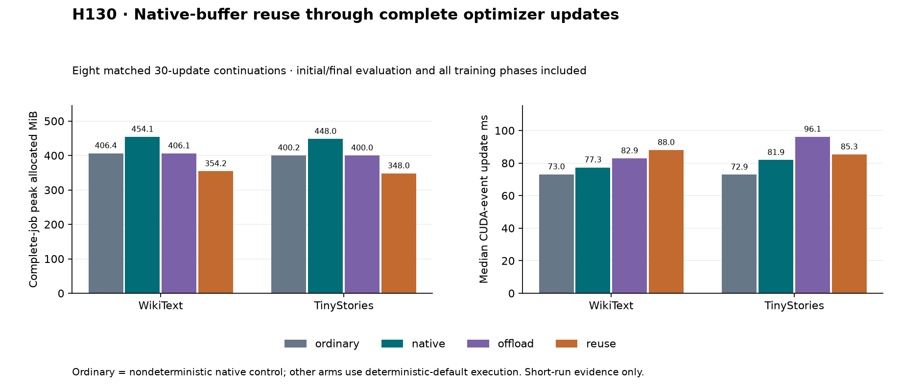

# H130: native-buffer classifier through complete optimizer updates

**FAIL combined short-training gate.** Eight 30-update continuations compare ordinary native execution
with three deterministic arms on two corpora. These are fixed seed-101
continuations from trained step-800 states, not fresh training or multiseed proof.
Independent numerical/data/score and deterministic-equality audit: **True**.

| Corpus | Arm | Final validation NLL | Job peak MiB | Median event ms | Median wall ms | Timing stability |
|---|---|---:|---:|---:|---:|---:|
| wikitext2 | ordinary | 4.96339634 | 406.399 | 73.041 | 80.147 | 1.007 |
| tinystories | ordinary | 2.62770528 | 400.220 | 72.858 | 79.965 | 1.033 |
| wikitext2 | native | 4.96339125 | 454.149 | 77.294 | 84.496 | 1.011 |
| wikitext2 | offload | 4.96339125 | 406.149 | 82.878 | 90.421 | 1.007 |
| wikitext2 | reuse | 4.96339125 | 354.181 | 87.987 | 97.156 | 1.005 |
| tinystories | reuse | 2.62768186 | 348.001 | 85.285 | 92.954 | 1.045 |
| tinystories | offload | 2.62768186 | 399.970 | 96.111 | 105.744 | 1.104 |
| tinystories | native | 2.62768186 | 447.970 | 81.861 | 89.804 | 1.025 |

Candidate (`reuse`) comparisons; positive NLL change is worse:

| Corpus | Control | GPU allocation saved | Event ratio | Wall ratio | NLL change | Failed gates |
|---|---|---:|---:|---:|---:|---|
| wikitext2 | ordinary | 12.85% | 1.2046x | 1.2122x | -0.00010% | event, wall |
| wikitext2 | native | 22.01% | 1.1383x | 1.1498x | +0.00000% | none |
| wikitext2 | offload | 12.80% | 1.0616x | 1.0745x | +0.00000% | none |
| tinystories | ordinary | 13.05% | 1.1706x | 1.1624x | -0.00089% | event, wall |
| tinystories | native | 22.32% | 1.0418x | 1.0351x | +0.00000% | none |
| tinystories | offload | 12.99% | 0.8874x | 0.8790x | +0.00000% | none |

`ordinary` uses native classifier loss and resident checkpoint inputs with the
original nondeterministic policy. `native` changes only to H129's reproducible
deterministic-default policy. `offload` additionally offloads checkpoint inputs
to CPU. `reuse` also uses H128's layout-aware native-buffer classifier.
All use ordinary RMSNorm, resident gradients and unchanged global clipping and
default AdamW. No compact RMSNorm or gradient staging. Parameter count is
9,099,648 in every arm. Pinned host allocation peaks at 64.000 MiB and is
additional RAM; the cache can persist across arms within each process.

The candidate saves 12.85%/13.05% complete-job GPU allocation versus ordinary
execution on WikiText/TinyStories, while final validation NLL stays within
0.001% of the ordinary control. CUDA-event update overhead is 20.46%/17.06%;
wall overhead is 21.22%/16.24%. These exceed the fixed 15% runtime limit, so
the combined gate fails despite passing memory, quality, state and stability
checks. All comparisons against the two deterministic controls pass.

## Equality and independent checks

The predeclared deterministic comparison requires equal first raw/clipped
gradients, all 30 loss/gradient-norm pairs, initial/final validation NLL, and
model/optimizer/sampler hashes at saved steps 801 and 830:

| Corpus | Compared with deterministic native | All exactness checks |
|---|---|---|
| wikitext2 | offload | pass |
| wikitext2 | reuse | pass |
| tinystories | offload | pass |
| tinystories | reuse | pass |

The independent inherited audit recomputes clipping and the first AdamW update
and moments in NumPy, verifies all saved model/optimizer hashes and finiteness,
reconstructs all 240 batches/sampler endpoints, and scores every final model
through the native evaluator. Maximum native-score relative discrepancy is
1.667e-08. The strict equality checks concern the saved checkpoints and
recorded losses/norms; unrecorded intermediate model states were not directly
compared. Ordinary-versus-deterministic trajectories are not required to match
bitwise and use the predeclared +1% final-NLL limit.

## Resource accounting and scope

**240 updates/backwards, 983,040 training targets**, 16 full study scores and
eight independent native scores. Twenty-four tensor artifacts hold first
raw/clipped gradients and model/optimizer checkpoints at 801/830. All 1,256
memory intervals and 19 zero GPU allocator boundaries verify. Source/dataset
hashes and all 61 maintained file hashes verify; no completed case was retried.

The existing H120 update loop is reused unchanged. Its peak includes construction,
initial/final evaluation, warmup, all training/transfers, clipping, optimizer,
diagnostics and serialization. Independent native replay is separate audit
work. CUDA allocation excludes driver/context memory and other processes.
Timing uses updates 11–30, retaining mean, median, variance and every raw step;
there is no profiler in timed regions. Original controls run in a separate
process before deterministic arms, so order/thermal effects remain a limitation.
Within deterministic execution arm order reverses across corpora. Each arm's
half-window timing stability must be within 1.15; that check does not eliminate
all runtime uncertainty.

The classifier implementation retains the native full-batch matrix products
and loss kernels while reusing private buffers, with H128's layout correction.
This storage experiment introduces no new activation or FFN. See
[H128](native_buffer_layout_results.md) for equations, qualification and prior
art, and [H129](attention_reproducibility_results.md) for the execution policy.
Earlier failed gates remain unchanged. No maintained defaults change.

## Next decision

Do not expand the training matrix yet. The deterministic native arm adds exactly 47.75 MiB over ordinary native on both corpora. Isolate the deterministic policy bundle, especially cuBLAS workspace allocation, before more training: test a lower-workspace deterministic configuration with matched controls, exactness checks, and full resource accounting. This is a causal hypothesis, not an attribution established by the present experiment. Preserve the current failures and thresholds.
The broader VRAM/quality and parameter-efficient FFN goal remains open.

[Plan](native_buffer_training_plan.md),
[summary](../results/native_buffer_training_v1/summary.json),
[audit](../results/native_buffer_training_v1/audit.json),
[evidence receipt](../results/native_buffer_training_v1/receipt.json).
