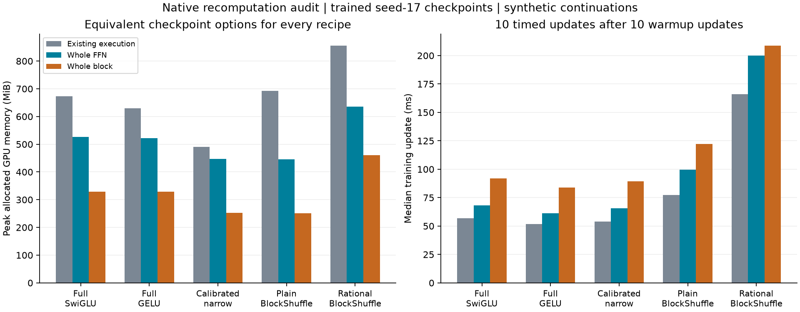

# H063: native recomputation results

**Exact local execution qualification passes; rational memory promotion fails.**
Whole-block recomputation reduces rational allocation by **46.17%**, from
**855.194 to 460.333 MiB**, but equivalent dense controls use about **328.8 MiB**.
The rational candidate remains about **40% above** both full controls, exceeding
the 10% allowance. Neither tested scope earns a full native-training repeat.

The [frozen plan](native_recompute_plan.md) adds no model variant, parameter,
activation, compiler or offload. Existing inner gate recomputation stays enabled
where the original recipe uses it. Every model receives the same options:
existing execution (none), whole FFN (ffn), and whole decoder block (block).

## Measured memory and cost

| Recipe | Existing peak MiB | Whole FFN MiB | Whole block MiB |
|---|---:|---:|---:|
| full_swiglu | 673.045 | 526.170 | 328.788 |
| full_gelu | 630.233 | 521.608 | 328.866 |
| calibrated_narrow | 490.077 | 446.608 | 251.975 |
| blockshuffle | 691.952 | 446.233 | 251.663 |
| rational | 855.194 | 636.207 | 460.333 |

| Recipe | Existing update ms | Whole FFN ms | Whole block ms |
|---|---:|---:|---:|
| full_swiglu | 57.008 | 68.147 | 91.924 |
| full_gelu | 51.819 | 61.268 | 83.842 |
| calibrated_narrow | 54.049 | 65.593 | 89.336 |
| blockshuffle | 77.164 | 99.679 | 122.164 |
| rational | 166.089 | 199.823 | 208.623 |

[Export SVG](figures/native_recompute.svg). Timing uses ten synchronized updates
after ten warmup updates in fresh sequential workers. Scope order rotates by
recipe. These short windows describe this device/session, not general speed.

For rational, whole-FFN memory falls **25.61%** but update time rises **20.31%**.
Whole-block memory falls **46.17%** but update time rises **25.61%**. Against
equally checkpointed full SwiGLU/GELU, its memory costs are **20.91%/21.97%**
for FFN and **40.01%/39.98%** for block. Both scopes pass the 10% reduction
against their own native execution, but fail both full-control memory limits.
No comparison to an uncheckpointed dense model is used for promotion.

Rational still has 2,801,984 FFN weights and 9,099,968 total weights:
70.3091% fewer FFN weights. Recomputing does not change the logical model-forward
matrix count; it adds forward work during backward, including attention for
whole-block scope. Timing captures that cost. There is no inference speed claim.

## What was verified

Fifteen full-size GPU workers start from the five selected seed-17, 200-step
language checkpoints, including their AdamW moments. Each performs one synthetic
forward/backward with no optimizer update, then 20 synthetic updates at its
recorded peak LR. Within each recipe, both scopes match existing execution for:

- initial logits/loss and every parameter-gradient hash;
- all 20 recorded losses and pre-clip gradient norms;
- every final model weight and optimizer-state value;
- initial weights/groups, synthetic tokens and CPU/CUDA RNG state.

All ten scope/reference comparisons pass bitwise. The saved result field
`all_updates_exact_across_scopes` summarizes these checks; intermediate model
tensors were not separately saved at every update. It is not a proof of an
arbitrarily long trajectory. The earlier compiled-backend failures remain valid.

All recorded values, final weights and moments, and initial/final layer
diagnostics are finite. Clipping fractions are 20% full SwiGLU, 25% full GELU,
30% narrow, 25% plain BlockShuffle and 20% rational, identical across scopes.
This does not establish nonvanishing gradients or general deep-model stability.

The local scope tests cover all six variants at seeds 17/29/43 on CPU FP32 and
CUDA BF16, including nonzero rational coefficients and every weight/moment after
two AdamW updates. Evaluation/no-grad bypass, unchanged parameter identities and
strict checkpoint loading pass. All twelve pre-cleanup default CPU/GPU signatures
remain exact. The full active suite passes **104 tests in 25.29 seconds**.

## Scope and records

The resource models use width 384, eight layers, vocabulary 4096, context 128 and
batch 16 on the RTX 4070 Laptop GPU. The token tensor is synthetic and shared by
all workers. This adds **300 synthetic updates / 614,400 target exposures**, plus
**30,720 no-update probe targets**. Diagnostics use synthetic inputs without
labels. No corpus validation/test targets are scored, and no completed LM cell
is retrained. Synthetic continuation checkpoints are marked as update 220 and
stored outside the language-model run directory.

GPU peaks cover the synthetic training phase, including all twenty updates.
Loaded optimizer moments are already resident; the corpus token cache is absent.
Consequently these peaks are not replacements for the original native rational
883.17 MiB corpus-training measurement. All comparisons here share this setup.

The first preflight process stopped in CPython `ast.dump` with
`SystemError: unknown opcode 186`, before resource dispatch. A fresh standard-
library-only AST comparison passed; one explicit retry with unchanged sources
then passed the entire preflight. The error and diagnostic are preserved.
All fifteen GPU workers and finalization complete on their first attempts.

[Protocol](../results/native_recompute_v1/protocol.json),
[preflight](../results/native_recompute_v1/preflight.json),
[result](../results/native_recompute_v1/result.json),
[executed source](../results/native_recompute_v1/source.zip),
[worker checkpoints and diagnostics](../results/native_recompute_v1/workers/),
[process records](../results/native_recompute_v1/processes/), and
[AST diagnostic](../results/native_recompute_v1/ast_runtime_diagnostic.json)
preserve the evidence. The [final audit](../results/verification/native_recompute_final_v1.json)
checks source, plans, input checkpoints, worker artifacts and documentation.

## Interpretation and next decision

Native recomputation preserves the measured computations and is reusable across
the retained models. It does not solve the rational candidate's resource deficit
against equally optimized controls. The remaining whole-block allocation gap
above plain BlockShuffle is **208.670 MiB**. This is a net full-model peak gap,
not yet an attribution to specific pointwise tensors or kernels.

Close this particular boundary-recomputation repair. No full language repeat,
offload, smaller batch, new activation or additional checkpoint search is earned
by this result. Any later remedy needs a separate hypothesis grounded in the
remaining allocation cost. The original quality, multi-seed, convergence, scaling
and broader-data requirements remain unmet.

Checkpoint recomputation is established practice; this is an execution result,
not architectural novelty. See the primary sources in the
[frozen plan](native_recompute_plan.md#mechanism-and-prior-art).
