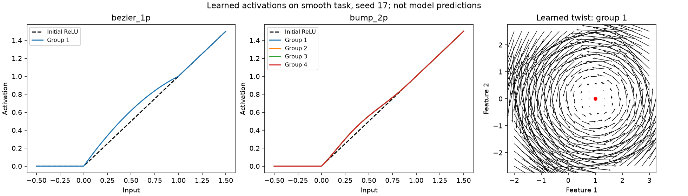
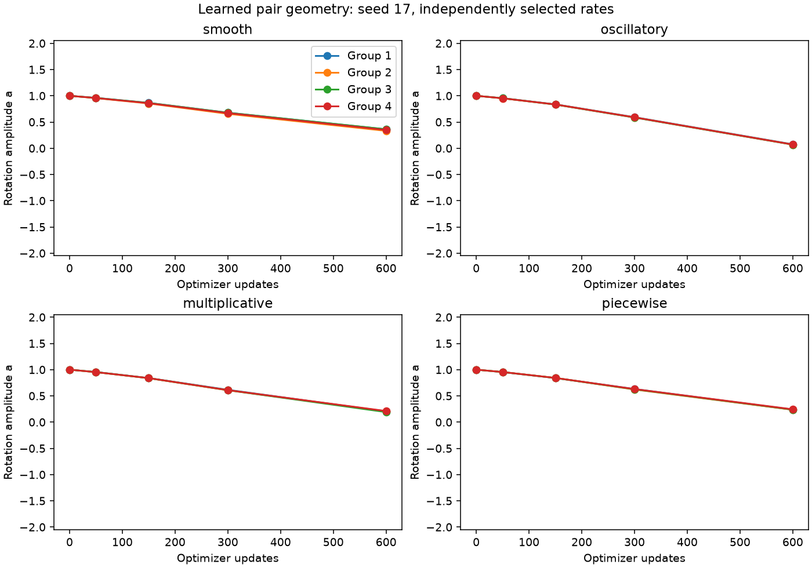

# H090: can a few learned geometry parameters replace FFN width?

**None of the four learned candidates passes the frozen promotion gates.**
The complete research goal remains unmet. This is a controlled synthetic fitting result,
not language-model validation or a claim about all learnable activations.

## What changed

A centered rational twist couples pairs of hidden features with an input-dependent
rotation. Four learned amplitudes are shared across the layer. We tested both a
nonzero curved start and an exact linear start, with a fixed twist as an ablation.
This differs from altering each scalar's GELU/ReLU curve independently.

We also tested the user's local quadratic Bezier correction (one parameter per
layer) and a residual bump with two coefficients in each of four groups (eight
parameters). Both scalar alternatives start exactly as ReLU. Full and narrow
GELU/ReLU/SwiGLU, GroupSort, a four-parameter GELU shift and a linear map serve
as controls. The [equations and prior work](research_direction_2026_09_10.md)
separate activation stability proofs from empirical learning claims.

## Dataset and budget

- Four analytic target families: smooth, oscillatory, multiplicative and piecewise.
- Fresh 384-dimensional inputs, seed 9814: 65,536 training examples, 4,096 for
  learning-rate selection and 4,096 held-out reporting examples per task.
- Targets mix cyclic input coordinates, then use a fixed orthogonal output
  rotation and training-only standard-deviation scaling. They are not class labels.
- Each run uses 600 updates, batch 256, and the same sampled index stream for
  each seed. That is 153,600 example presentations per run, about 2.34 training
  set exposures with replacement; these are not ordered epochs.
- Fourteen forms × four tasks × three optimization seeds (17/29/43) × two
  learning rates (0.001/0.003): 336 runs, 201,600 updates, 51,609,600 presentations.
- AdamW, constant base rates, clipping at 1, FP32 CUDA with TF32 off; the narrow
  down-projection rate uses the same declared fan-in calibration for every form.
- One RTX 4070 Laptop GPU. Qualify first, fit once, then audit; no training retry.

Fitting process: 2026-09-09T20:58:02.461466+00:00 to 2026-09-09T21:11:19.968759+00:00;
**13.29 minutes** including dataset preparation, checkpoints, evaluation and plots.
This wall time is not a measurement of GPU kernel time alone.

## Error, parameters and measured cost

The error column is the geometric mean of 12 paired held-out MSE ratios
(four tasks × three seeds), relative to narrow GELU. Lower is better; it is
not classification accuracy. Each recipe's rate is selected on its separate
selection split. Both rates and matched-rate comparisons remain in the results.

| Form | Trainable parameters | Extra activation parameters | MSE change vs narrow GELU | Update ms | Peak MiB |
|---|---:|---:|---:|---:|---:|
| full_gelu | 1,179,648 | 0 | -12.957% | 2.183 | 259.97 |
| full_relu | 1,179,648 | 0 | -2.697% | 2.176 | 259.97 |
| full_swiglu | 1,179,648 | 0 | +14.972% | 2.693 | 257.45 |
| narrow_gelu | 350,208 | 0 | +0.000% | 2.165 | 241.56 |
| narrow_relu | 350,208 | 0 | +5.417% | 2.184 | 241.56 |
| narrow_swiglu | 350,208 | 0 | +30.456% | 2.651 | 241.45 |
| groupsort | 350,208 | 0 | +0.532% | 2.509 | 241.60 |
| gelu_offset | 350,212 | 4 | -3.227% | 2.774 | 241.60 |
| twist_fixed | 350,208 | 0 | +3.517% | 4.493 | 243.01 |
| twist_learned | 350,212 | 4 | +1.298% | 4.879 | 243.23 |
| twist_identity | 350,212 | 4 | +0.715% | 4.867 | 243.23 |
| bezier_1p | 350,209 | 1 | +6.676% | 3.624 | 242.94 |
| bump_2p | 350,216 | 8 | +6.460% | 4.267 | 244.17 |
| linear | 350,208 | 0 | +51.392% | 2.082 | 241.12 |

Full references have 1,179,648 FFN weights; narrow bases have 350,208.
Including their learned controls, the four candidates use 350,209–350,216
parameters: 70.3118–70.3124% fewer than a full reference. These are isolated
FFN counts, not total Transformer parameter reductions.

Update times are means of per-run medians after 50 warmup updates. They
include forward, backward, clipping and optimizer work, with synchronization;
they exclude batch indexing and gradient clearing. Peak allocation includes
the staged task dataset. Native timing does not establish equally optimized
inference speed. Matrix-only FLOPs exclude activation operations and backward.

The strongest small control here is GELU with four learned shifts: 3.227%
lower aggregate MSE than narrow GELU, with about 28.1% longer native updates.
It still has 11.18% higher aggregate MSE than full GELU. This control result
does not meet the original objective and does not earn a new model claim.
The learned pair twists are about 2.25 times slower than narrow GELU in this
eager implementation while having slightly higher aggregate error.

## Per-task results and seed variability

Held-out MSE, mean ± sample standard deviation over three seeds. The JSON
also records every value, median, sample variance and selected learning rate.

| Form | Smooth | Oscillatory | Multiplicative | Piecewise |
|---|---:|---:|---:|---:|
| full_gelu | 0.48143 ± 0.00039 | 1.02287 ± 0.00023 | 0.89960 ± 0.00013 | 0.26446 ± 0.00126 |
| full_relu | 0.49008 ± 0.00039 | 1.03559 ± 0.00077 | 0.90699 ± 0.00066 | 0.39745 ± 0.00301 |
| full_swiglu | 0.66430 ± 0.00133 | 1.04459 ± 0.00046 | 0.99838 ± 0.00018 | 0.51480 ± 0.00924 |
| narrow_gelu | 0.53556 ± 0.00062 | 1.01125 ± 0.00024 | 0.90461 ± 0.00014 | 0.41659 ± 0.00253 |
| narrow_relu | 0.56630 ± 0.00020 | 1.01597 ± 0.00055 | 0.91969 ± 0.00032 | 0.47634 ± 0.00197 |
| narrow_swiglu | 0.82693 ± 0.00085 | 1.01862 ± 0.00019 | 1.00737 ± 0.00038 | 0.69666 ± 0.00136 |
| groupsort | 0.56062 ± 0.00047 | 1.01778 ± 0.00036 | 0.94466 ± 0.00064 | 0.38678 ± 0.00117 |
| gelu_offset | 0.46744 ± 0.00090 | 1.01661 ± 0.00044 | 0.90268 ± 0.00014 | 0.41729 ± 0.00228 |
| twist_fixed | 0.48107 ± 0.00056 | 1.03129 ± 0.00228 | 0.90888 ± 0.00223 | 0.51973 ± 0.00051 |
| twist_learned | 0.46616 ± 0.00018 | 1.01810 ± 0.00008 | 0.89697 ± 0.00034 | 0.50481 ± 0.00014 |
| twist_identity | 0.46377 ± 0.00047 | 1.01261 ± 0.00026 | 0.89350 ± 0.00038 | 0.50046 ± 0.00018 |
| bezier_1p | 0.55290 ± 0.00039 | 1.01335 ± 0.00057 | 0.91719 ± 0.00064 | 0.51434 ± 0.00290 |
| bump_2p | 0.55914 ± 0.00022 | 1.01470 ± 0.00057 | 0.91789 ± 0.00046 | 0.50342 ± 0.00131 |
| linear | 2.28066 ± 0.01060 | 1.01262 ± 0.00026 | 0.89350 ± 0.00038 | 0.51957 ± 0.00007 |

## Decisions

The frozen gate requires at least 2% lower aggregate MSE than **each** of
five narrow controls, improvement in every seed's task aggregate, no task
more than 5% worse than the best control, and at least 70% compression.
Learned twists must additionally beat the fixed twist by at least 1%.
Passing would earn only a separately budgeted resource/width study.

- **twist_learned: rejected at this budget.** Failed: two percent over each narrow control; every seed better than each control; per task regression cap.
- **twist_identity: rejected at this budget.** Failed: two percent over each narrow control; every seed better than each control; per task regression cap.
- **bezier_1p: rejected at this budget.** Failed: two percent over each narrow control; every seed better than each control; per task regression cap.
- **bump_2p: rejected at this budget.** Failed: two percent over each narrow control; every seed better than each control; per task regression cap.

These decisions close these fixed recipes at this budget. They do not rule
out every paired activation, polynomial basis, scale, sharing scheme or
optimizer. Reopening requires a distinct hypothesis and fresh evidence;
additional training is not automatically allocated.

## Learned shapes and training diagnostics

The shapes moved appreciably. On the smooth task, seed 17, Bezier's learned
coefficient reaches 0.4726 from zero. The four bump groups reach very similar
curves, with symmetric coefficients around 0.946 and asymmetric coefficients
around -1.055. Group specialization is not established by this example.
The nonzero-start twist's four amplitudes fall from 1 to 0.331?0.362;
they also shrink on the other tasks. None of these selected candidate endpoints
triggers the predefined control-saturation threshold.

This shows that the shape parameters were used. It does not show that their
learning caused an advantage: even the scalar alternatives finish about
0.99?1.19% worse than narrow ReLU in the aggregate comparison.

These figures show seed 17 and explicitly identified tasks/groups. They are
examples of learned functions, not averages or evidence of universal behavior.
The records retain shape coefficients, gradient norms, saturation, activation
statistics and all 600 losses/timings per run. All checkpoints, optimizer
step counts and recorded training losses/gradient norms pass finite checks.
A finite gradient is not proof of well-conditioned learning or convergence.

## Verification and limitations

H088 failed its first BF16 independent-gradient comparison before training.
H089 diagnosed the rounding boundary; H090 made one explicit precision
recovery, retaining the original tolerances. All 27 qualification checks
passed. The earlier failed artifacts and six original CPU tensor payloads
were preserved exactly. [Failure and recovery details](neuron_geometry_precision_results.md).

The independent audit reconstructed the data exactly, verified all 336
initializations and checkpoints, reproduced all 336 selection and 336
reporting scores exactly, checked all 168 selections, and independently
reduced every summary and promotion decision. Its 1e-12 summary tolerance
applies to floating-point reductions; checkpoint scores require exact equality.

Even full GELU fails to beat the zero predictor on the oscillatory task at
this budget: MSE 1.02287 versus 1.00272. The positive assay passes on the other
three tasks. This limits what the oscillatory result says about eventual
learnability and reinforces the fixed-budget scope of the rejection.

All 72 selected learned/fixed shape trajectories are also kept in a
[compact diagnostic summary](../results/neuron_geometry_audit_v1/summary.json),
including all groups and optimization seeds, so the retained evidence extends
beyond the example figures.

These are four reused analytic task families with fresh inputs and three
optimization seeds, not unrelated real datasets or independent dataset seeds.
We have not shown convergence, the 1% language-NLL allowance, total-model
resource gains, broader-corpus transfer or a breakthrough. No new active
model folder is justified solely by this synthetic screen.

Sources: [frozen fitting plan](neuron_geometry_plan.md),
[recovery plan](neuron_geometry_recovery_plan.md),
[complete endpoint results](../results/neuron_geometry_recovery_v1/result.json.gz),
[independent audit](../results/neuron_geometry_audit_v1/result.json).
Raw tensors, datasets and histories stay local under the
[artifact policy](ARTIFACTS.md); the compact clone preserves source and conclusions.
