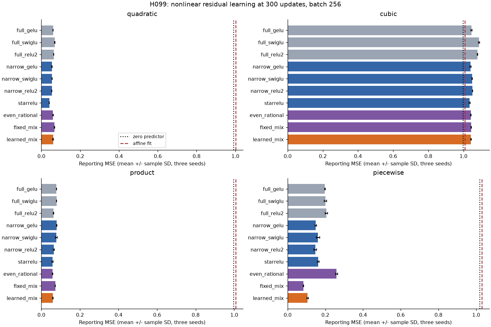
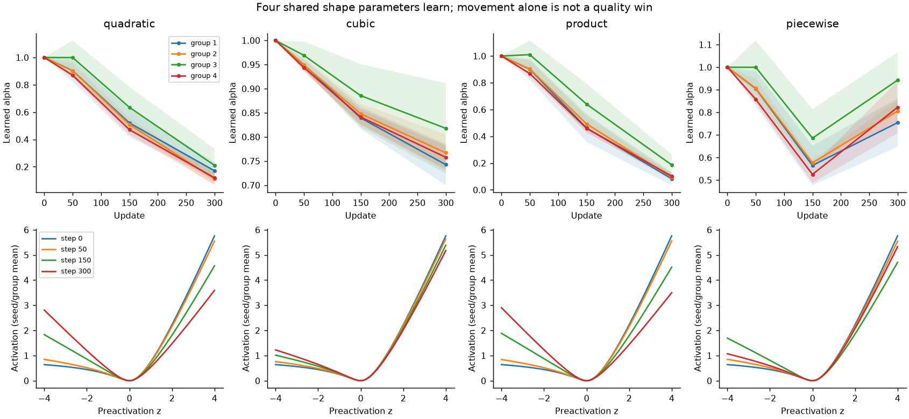
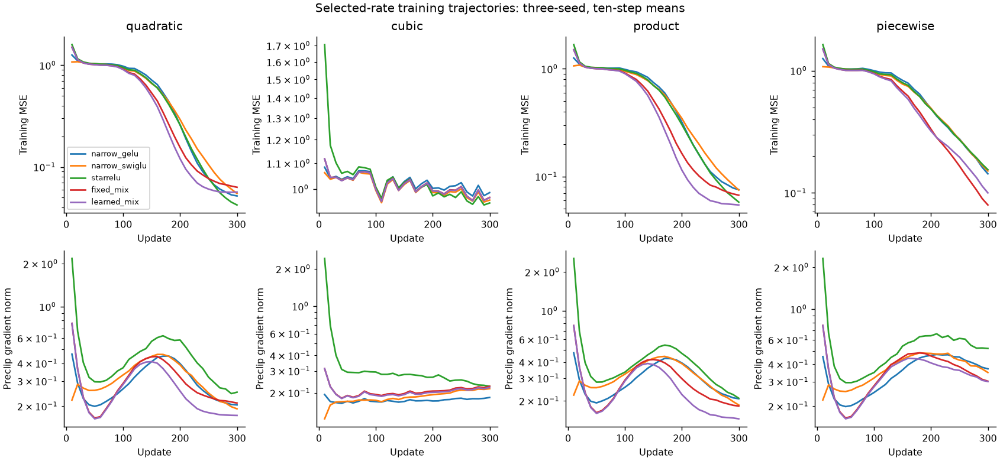

# H099: nonlinear learning survives; the learned mixture does not earn promotion

**Reject the four-parameter rational mixture at this 300-update budget.** Its
aggregate reporting MSE is 12.39% below narrow GELU and 13.79% below narrow
SwiGLU, with 70.29% fewer total FFN parameters than full GELU. However, it is
only 0.060% better than StarReLU, loses one seed to that control, and takes
40.49% longer per native update than narrow GELU. Its per-task regressions also
fail the frozen gate. The gold research goal remains unmet.

This experiment does establish nonlinear learning beyond an affine fit on three
of four tasks. That corrects the ambiguity in H094-H098. It does not establish
that the new learned activation is responsible for a practical advantage.

## What changed

The input is Gaussian rather than uniform. Targets have zero population mean
and zero population linear projection, so an affine fit cannot explain away
the intended nonlinear signal. There are four fresh target families: normalized
quadratic, cubic, cyclic pair products and a squared-ReLU residual with its
population affine component removed. Sixteen latent coordinates are mapped to
384 output dimensions. These deliberately structured synthetic tasks are not
language, images or tabular real-data benchmarks.

Every neural form has learned projection/output biases and starts with exactly
zero output. Hidden biases use the same name-local Uniform[-1,1] initialization
across comparable forms. Fixed and learned rational mixtures share their initial
weights and shape. Compared with previous assays, the distribution, targets,
biases and output initialization all change explicitly; cross-round MSE values
are not directly comparable.

The new scalar activation uses a single projected feature bank:

    s = z / (1 + |z|)
    phi_g(z) = z*s + a_g*z*s^2
    a_g = 2*tanh(theta_g), initially a_g = 1

There are four groups and four learned scalars, with 456 projected features.
Fixed a=1 and a=0 controls isolate the mixing benefit. The two basis derivatives
have magnitude at most one, giving |phi'| <= 3. This bounds the scalar
activation derivative, not the Jacobian of a complete learned network.

The learned mixture has 351,052 parameters; full GELU has 1,181,568 and full
SwiGLU has 1,182,080, including biases. Reductions are 70.289% and 70.302%.
Its activation overhead is four scalars. Parameter-free fixed rational controls
still store a fixed scalar buffer; that buffer is not a trained parameter.

Squared ReLU and learned-scale/offset StarReLU are established controls:
[Primer](https://arxiv.org/abs/2109.08668) and
[MetaFormer/StarReLU](https://arxiv.org/abs/2210.13452). StarReLU's scale and offset
can be absorbed into this biased readout; its gain here can therefore reflect
optimization rather than a larger represented function class. The rational
mixture builds on ordinary softsign/products. No novelty is claimed.

## Audited results

Each value below is mean reporting MSE across three optimization/sampling seeds.
The JSON also preserves median, sample variance, standard deviation and each seed.

| Form | Quadratic | Cubic | Product | Piecewise |
|---|---:|---:|---:|---:|
| Full GELU | 0.060250 | 1.045168 | 0.078334 | 0.197871 |
| Full SwiGLU | 0.069494 | 1.088708 | 0.078585 | 0.200218 |
| Full squared ReLU | 0.063611 | 1.079642 | 0.063256 | 0.205701 |
| Narrow GELU | 0.054517 | 1.039444 | 0.079490 | 0.149474 |
| Narrow SwiGLU | 0.055296 | 1.048808 | 0.076919 | 0.161329 |
| Narrow squared ReLU | 0.054057 | 1.051772 | 0.064860 | 0.146619 |
| StarReLU | 0.040939 | 1.035022 | 0.057940 | 0.162186 |
| Even rational | 0.060005 | 1.041546 | 0.058473 | 0.259870 |
| Fixed mixture | 0.067184 | 1.043679 | 0.072664 | 0.083786 |
| Learned mixture | 0.060312 | 1.042703 | 0.059479 | 0.106130 |
| Affine least squares | 1.001521 | 1.008620 | 1.008464 | 1.029670 |
| Known-feature readout (privileged) | 0.000012 | 0.000103 | 0.000009 | 0.000020 |

Aggregate comparisons are geometric means of paired reporting-MSE ratios over
the four tasks and three seeds, after selection of each recipe's learning rate
on a separate split. They are not accuracy percentages or statistical significance
tests. There is one fixed generated dataset; seeds vary optimization and sampling.

| Learned mixture compared with | Aggregate MSE ratio |
|---|---:|
| Narrow GELU | 0.876115 |
| Narrow SwiGLU | 0.862087 |
| Narrow squared ReLU | 0.925753 |
| StarReLU | 0.999396 |
| Even rational | 0.804043 |
| Fixed mixture | 0.981813 |
| Affine fit | 0.139437 |
| Full GELU | 0.798401 |
| Full SwiGLU | 0.759812 |
| Full squared ReLU | 0.816297 |

The apparent 20.16%/24.02% wins over full GELU/SwiGLU are short-budget synthetic
results under the recorded initialization and narrow-readout LR calibration.
They do not prove comparable convergence or language NLL. The new mixture loses
47.32% to StarReLU on quadratic error and 26.67% to fixed mixing on piecewise
error. Learning the shape gives only a 1.819% aggregate gain over fixing it,
below the preset 2% gate, and loses one of three seed aggregates.

## Learnability and failure interpretation

The known-feature readout receives the exact sixteen nonlinear features. It
learns all four targets, including cubic, well below the positive-control limit.
This checks the feature/readout pipeline; privileged feature knowledge makes it
unsuitable as a fair parameter-efficiency comparator.

All three full conventional forms halve zero-predictor error on quadratic,
product and piecewise tasks, so the overall assay's learnability gate passes.
None of the ordinary neural recipes learns the cubic task well: all finish above
the zero predictor's 0.996717 reporting MSE. A small parameter gap on cubic is
therefore not evidence of useful cubic learning. It also does not prove an
intrinsic representational impossibility. Input-feature discovery, initialization
and the short optimization budget remain possible bottlenecks.

The next mechanistic question is whether discovering interacting input directions
is limiting learning. An explicit feature-discovery experiment would need fresh
data, task-blind candidate construction and matched controls. The oracle's success
does not authorize hard-coding target features into a claimed general FFN.
No longer run or kernel refinement is allocated to this rejected mixture.

## What the activation learned

The four coefficients start at one. Across groups/seeds, their final means are
0.153 on quadratic, 0.771 on cubic, 0.117 on product and 0.831 on piecewise.
They move towards an even shape for the even targets; the piecewise trajectory
first decreases and then returns towards its initial asymmetry. These are
descriptive observations, not a causal demonstration of the performance gains.

Curve bands show sample SD across seeds. The lower row averages groups/seeds,
so it is not a claim that all groups learned an identical curve. The compact
diagnostics retain each group, activation statistics and sampled gradient norms.

All recorded losses, gradients and checkpoints are finite. The candidate's mean
clipping frequency is 0.472%. That does not prove absence of vanishing gradients
or stable training at greater depth. Several successful task losses are still
falling at the endpoint; convergence has not been established.

## Budget, resources and verification

The screen uses 65,536 training, 4,096 selection and 4,096 reporting examples,
384-dimensional inputs/outputs, batch 256 and 300 updates per run. Eleven forms,
four tasks, three seeds and two rates give 264 runs, 79,200 optimizer updates
and 20,275,200 example presentations, including the privileged controls.
Each run draws 76,800 training examples with replacement, about 1.17 training-set
exposures rather than an ordered epoch. Twelve fresh affine fits use exactly
those sampled multisets and a different solver; their time is not AdamW time.

FP32 CUDA, TF32 off, one RTX4070 Laptop GPU, four CPU threads; AdamW (.9,.95),
zero weight decay, clip 1, constant rates .001/.003. The narrow down-weight LR
multiplier is the reference hidden width divided by actual width. All other
parameters use the base LR. Rate selection does not use reporting labels.

The full study takes 345.88 seconds (5.76 minutes), including qualification,
data, fitting and saved evidence. Independent audit takes 17.67 seconds.
Study UTC: 2026-09-09 23:24:46 to 23:30:32; audit 23:31:26 to 23:31:44.

| Form | Mean median update ms | Forward ms | Backward ms | Peak allocated MiB |
|---|---:|---:|---:|---:|
| Full GELU | 2.669 | 0.333 | 0.570 | 258.866 |
| Full SwiGLU | 3.490 | 0.412 | 0.775 | 257.124 |
| Narrow GELU | 2.714 | 0.337 | 0.598 | 240.989 |
| StarReLU | 3.674 | 0.464 | 0.860 | 241.034 |
| Fixed mixture | 3.455 | 0.644 | 1.025 | 242.213 |
| Learned mixture | 3.813 | 0.646 | 1.150 | 242.214 |

These synchronized native training timings exclude fifty warmup updates.
Forward includes loss computation; it is not an isolated inference benchmark.
Peak allocation includes resident assay data and is not model-only VRAM.
Matrix-only forward cost is 700,416 FLOPs/example for the mixture versus
2,359,296 for full GELU/SwiGLU; activation, bias and backward costs are excluded.
The candidate fails the 1.25-times-narrow-GELU update-time gate at 1.405 times.

All 25 qualification checks and 163 saved tensor-pair checks pass. Independent
audit regenerates data/streams, verifies twelve affine fits, reproduces 264
initializations and all 528 checkpoint scores exactly, checks all 132 selections,
and independently reconstructs statistics and decisions. Frozen source/plan
hashes remain unchanged. Plot/export code is explicitly post-audit work.

The candidate passes finite evidence, both learnability gates, parameter reduction
and aggregate full-reference proxy gates. It fails material improvement over
every control, every-seed improvement, per-task cap and update-time cap.
No candidate is added to the maintained model registry. Source/evidence remain
with the experiment to avoid repeating a rejected recipe.

[Frozen plan](nonlinear_residual_plan.md),
[audited result](../results/nonlinear_residual_v1/result.json),
[all 264 endpoints](../results/nonlinear_residual_v1/metrics.csv.gz),
[learned-shape diagnostics](../results/nonlinear_residual_v1/diagnostics.json.gz),
[artifact policy](ARTIFACTS.md).
