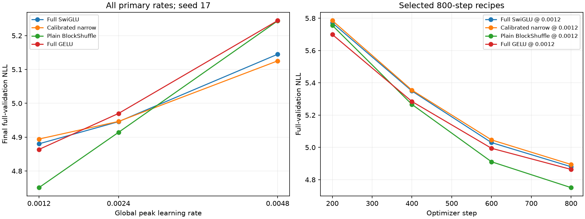

# H048: Extended 800-step optimizer comparison

**Selected-recipe local promotion: PASS.** The complete frozen grid gives each recipe rates 0.0012, 0.0024 and 0.0048. This tests stronger global-rate tuning at one seed and one duration; it does not establish convergence or a globally optimal rate.

[Frozen protocol](optimizer_bracket_plan.md), [raw decisions](../results/optimizer_bracket_v1/result.json), [prior corrected three-seed comparison](affine_rate_replication_results.md).

Eight new trials were allocated 800 steps each; four completed 0.0012 references are reused. Each complete trial trains 1,638,400 sampled tokens and scores all 322,688 validation targets. The new budget is at most 13,107,200 training tokens. Width 384, eight layers, context 128, batch 16, seed 17 and native BF16 are fixed. Official test remains unscored. Model code, data order, initialization, optimizer group treatment and recomputation are unchanged; only global peak LR differs within each recipe.

## All primary rate cells

| Recipe | NLL at 0.0012 | NLL at 0.0024 | NLL at 0.0048 | Selected rate | Grid position |
|---|---:|---:|---:|---:|---|
| Full SwiGLU | 4.880372 | 4.945777 | 5.144976 | 0.0012 | lower boundary |
| Calibrated narrow | 4.894435 | 4.946457 | 5.125380 | 0.0012 | lower boundary |
| Plain BlockShuffle | 4.750900 | 4.914226 | 5.243555 | 0.0012 | lower boundary |
| Full GELU | 4.863755 | 4.970042 | 5.244418 | 0.0012 | lower boundary |

Primary selection excludes the older plain 0.0006 cell and every affine/headwise trial. All historical results remain retained. Each primary recipe receives the same three global rates, but previous architecture/init/optimizer exploration effort differs. Narrow keeps width-calibrated down initialization/LR and product decay; BlockShuffle keeps factor LR calibration, parameter decay and native gate recomputation. Increasing global LR also increases AdamW's per-step decay amount.

## Same-rate and selected-recipe differences

Positive values mean worse BlockShuffle NLL. Comparing independently selected recipes asks a different question from comparing the same global rate.

| Comparison | vs full SwiGLU | vs full GELU | vs calibrated narrow |
|---|---:|---:|---:|
| Same rate 0.0012 | -2.6529% | -2.3203% | -2.9326% |
| Same rate 0.0024 | -0.6379% | -1.1230% | -0.6516% |
| Same rate 0.0048 | +1.9160% | -0.0165% | +2.3057% |
| Independently selected rates | -2.6529% | -2.3203% | -2.9326% |

| Local promotion gate | Decision |
|---|---|
| at least 70 percent fewer ffn weights | PASS |
| beats calibrated narrow | PASS |
| within one percent full swiglu | PASS |
| memory within ten percent full swiglu | PASS |
| within one percent full gelu | PASS |
| memory within ten percent full gelu | PASS |

Separate >=0.2% margin over selected narrow: **PASS**. These thresholds are engineering gates, not statistical significance tests.

## Resources and late training progress

| Selected recipe | FFN weights | Total weights | FFN forward matrix FLOPs/token | Peak MiB | Clipped steps | Training tokens/s (descriptive) | NLL improvement, steps 600-800 |
|---|---:|---:|---:|---:|---:|---:|---:|
| Full SwiGLU | 9,437,184 | 15,735,168 | 18,874,368 | 702.19 | 8.9% | 34,705 | +2.9708% |
| Calibrated narrow | 2,801,664 | 9,099,648 | 5,603,328 | 516.28 | 9.9% | 37,236 | +3.0142% |
| Plain BlockShuffle | 2,801,664 | 9,099,648 | 5,603,328 | 714.12 | 12.5% | 26,024 | +3.2624% |
| Full GELU | 9,437,184 | 15,735,168 | 18,874,368 | 656.62 | 6.1% | 37,584 | +2.6192% |

The [decay-only accounting](optimizer_rate_geometry.md) quantifies the fixed recipes' different represented-map shrinkage without claiming a measured cause. Matrix counts exclude nonlinearities, norms, loss and optimizer work. Timing is retained for transparency, but references and new trials were measured in different sessions; there is no paired training-speed claim. A declining final segment is evidence of remaining learning during this schedule, not a measurement of converged quality. Three discrete rates do not prove a continuous optimum.



## Every new trial

| Recipe | Rate | Outcome | Final NLL | Peak MiB | Clip fraction | Evidence |
|---|---:|---|---:|---:|---:|---|
| Full SwiGLU | 0.0024 | COMPLETE | 4.945777 | 702.19 | 3.8% | [metrics](../results/runs/wikitext2_full_swiglu_lr2400_s17_800/metrics.json) |
| Calibrated narrow | 0.0024 | COMPLETE | 4.946457 | 516.28 | 3.6% | [metrics](../results/runs/wikitext2_calibrated_narrow_lr2400_s17_800/metrics.json) |
| Plain BlockShuffle | 0.0024 | COMPLETE | 4.914226 | 714.12 | 5.8% | [metrics](../results/runs/wikitext2_blockshuffle_lr2400_s17_800/metrics.json) |
| Full GELU | 0.0024 | COMPLETE | 4.970042 | 656.62 | 4.9% | [metrics](../results/runs/wikitext2_full_gelu_lr2400_s17_800/metrics.json) |
| Full GELU | 0.0048 | COMPLETE | 5.244418 | 656.62 | 4.1% | [metrics](../results/runs/wikitext2_full_gelu_lr4800_s17_800/metrics.json) |
| Plain BlockShuffle | 0.0048 | COMPLETE | 5.243555 | 714.12 | 2.8% | [metrics](../results/runs/wikitext2_blockshuffle_lr4800_s17_800/metrics.json) |
| Calibrated narrow | 0.0048 | COMPLETE | 5.125380 | 516.28 | 3.2% | [metrics](../results/runs/wikitext2_calibrated_narrow_lr4800_s17_800/metrics.json) |
| Full SwiGLU | 0.0048 | COMPLETE | 5.144976 | 702.19 | 3.5% | [metrics](../results/runs/wikitext2_full_swiglu_lr4800_s17_800/metrics.json) |

## Verification and next decision

Current computation matches the passing 220-test snapshot. All 30 prior-model CPU snapshots retain exact parameters, logits, loss, gradients and matrix-work counts. Historical registry/factory/count/diagnostic additions are explicitly qualified; shared training, data, optimizer, dense/BlockShuffle/grouped implementations and execution ASTs match reference archives. All four current initial validation NLLs reproduce the old values within 1e-7. Every complete trial's data, source archive, config, optimizer metadata, schedule, finite diagnostics, checkpoint weights/counts and final sampling RNG verify. The complete validation target stream includes the final nine-window batch.

Numerically failed grid cells: 0. Preserved infrastructure audit failures: 0. Any continuation records are separate from the frozen protocol; completed or numerically failed cells are never rerun. No final score is assigned to an incomplete process failure.

The compressed plain recipe survives this expanded rate comparison. All selected recipes are unchanged at 0.0012, so their existing seed-29/43 measurements remain the historical independent-initialization evidence; repeating those same runs would not add a new control. This is not a new independent replication of the higher-rate ranking. Every primary winner is on the lower boundary. A separately frozen lower-rate comparison is still needed before treating the global rate as bracketed, followed by longer-budget testing. This pass does not establish convergence, broad superiority, a new primitive or a whole-network gradient guarantee.

The corrected 0.101% affine activation gain is measured at 0.0012 across three seeds. This grid does not test affine at higher rates or attribute any new rate gain to activation shape.

```powershell
uv run --extra compile --extra data python -m src.core.optimizer_bracket_report
```
