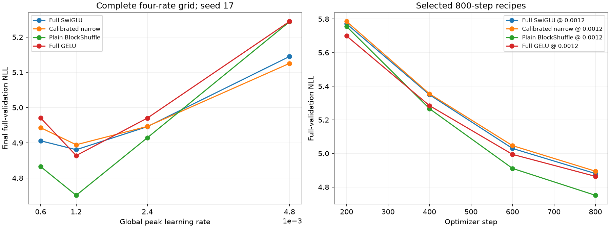

# H049: Complete four-rate optimizer comparison

**Local gold gates: PASS.** Three new lower-rate dense controls complete a sixteen-cell grid with equal four-rate selection per recipe. H048's original three-rate result remains unchanged; the old plain 0.0006 cell is explicitly added here.

[Frozen H049 plan](optimizer_lower_plan.md), [raw decisions](../results/optimizer_lower_v1/result.json), [H048 higher-rate result](optimizer_bracket_results.md), [decay-only accounting](optimizer_rate_geometry.md).

## Every rate and selected recipe

| Recipe | NLL at 0.0006 | NLL at 0.0012 | NLL at 0.0024 | NLL at 0.0048 | Selected rate | Grid position |
|---|---:|---:|---:|---:|---:|---|
| Full SwiGLU | 4.905673 | 4.880372 | 4.945777 | 5.144976 | 0.0012 | interior |
| Calibrated narrow | 4.942945 | 4.894435 | 4.946457 | 5.125380 | 0.0012 | interior |
| Plain BlockShuffle | 4.832481 | 4.750900 | 4.914226 | 5.243555 | 0.0012 | interior |
| Full GELU | 4.970483 | 4.863755 | 4.970042 | 5.244418 | 0.0012 | interior |

All trials use width 384, eight layers, context 128, batch 16, seed 17, BF16 and 800 steps, with 1,638,400 sampled training tokens and all 322,688 validation targets. H049 adds 4,915,200 tokens across three complete allocations; thirteen earlier cells are reused. Only global peak LR changes within a recipe. Initialization, optimizer/decay calibration, recomputation, model dimensions, data order and schedule length remain fixed. Official test stays unscored. Historical architecture/optimizer search effort is unequal.

An interior winner has measured grid points on both sides. This is a discrete bracket, not proof of a global continuous optimum. A single-seed rate search also does not establish convergence or rate ranking across seeds.

## Same-rate versus selected-recipe comparisons

Positive numbers mean worse BlockShuffle NLL. A missing numerical cell has no final score.

| Comparison | vs full SwiGLU | vs full GELU | vs calibrated narrow |
|---|---:|---:|---:|
| Same LR 0.0006 | -1.4920% | -2.7764% | -2.2348% |
| Same LR 0.0012 | -2.6529% | -2.3203% | -2.9326% |
| Same LR 0.0024 | -0.6379% | -1.1230% | -0.6516% |
| Same LR 0.0048 | +1.9160% | -0.0165% | +2.3057% |
| Selected rates | -2.6529% | -2.3203% | -2.9326% |

| Frozen gate | Decision |
|---|---|
| at least 70 percent fewer ffn weights | PASS |
| beats calibrated narrow | PASS |
| within one percent full swiglu | PASS |
| memory within ten percent full swiglu | PASS |
| within one percent full gelu | PASS |
| memory within ten percent full gelu | PASS |

Separate >=0.2% selected-narrow margin: **PASS**. These are engineering gates, not significance tests.

## New controls and retained resource evidence

| New lower-rate control | NLL | Peak MiB | Clipped steps | Training tokens/s (descriptive) | Evidence |
|---|---:|---:|---:|---:|---|
| Full SwiGLU | 4.905673 | 702.19 | 51.7% | 34,865 | [metrics](../results/runs/wikitext2_full_swiglu_lr600_s17_800/metrics.json) |
| Calibrated narrow | 4.942945 | 516.28 | 69.8% | 37,124 | [metrics](../results/runs/wikitext2_calibrated_narrow_lr600_s17_800/metrics.json) |
| Full GELU | 4.970483 | 656.62 | 11.4% | 39,955 | [metrics](../results/runs/wikitext2_full_gelu_lr600_s17_800/metrics.json) |

| Selected recipe | FFN weights | Total weights | FFN matrix FLOPs/token | Peak MiB |
|---|---:|---:|---:|---:|
| Full SwiGLU | 9,437,184 | 15,735,168 | 18,874,368 | 702.19 |
| Calibrated narrow | 2,801,664 | 9,099,648 | 5,603,328 | 516.28 |
| Plain BlockShuffle | 2,801,664 | 9,099,648 | 5,603,328 | 714.12 |
| Full GELU | 9,437,184 | 15,735,168 | 18,874,368 | 656.62 |

Matrix work excludes nonlinearities and other non-matrix operations. Cross-session training timings are descriptive, not paired speed measurements. Fewer parameters do not by themselves establish faster training or inference.



## Verification and interpretation

All thirteen retained cells verify before new training. The original plain 0.0006 checkpoint and metrics match their H039 hashes. H048's source archives, twelve cells and initial-function reproductions remain intact. Current computation matches the 223-test snapshot; no NN, trainer, data, optimizer or diagnostic code changes in this round. Each new run independently reproduces its reference initial NLL within 1e-7. Source archives, all eight data hashes, exact validation stream, schedules, optimizer metadata, finite layer/gradient histories, checkpoint counts/weights and final sampling states verify.

Numerical cell failures: 0; preserved infrastructure audit failures: 0. Completed and numerically failed trials are never rerun.

The stronger plain recipe survives the completed four-rate comparison, with every recipe still selected at 0.0012. Its existing seed-29/43 results remain the historical independent-initialization evidence; there is no reason to repeat identical runs. The newly expanded rate ranking itself has only seed-17 evidence. The next step is a separately frozen longer-budget comparison with the full and calibrated narrow controls, preserving the selected optimizer treatments. Late loss reductions in the 800-step curves show why a fixed-budget win is not converged superiority.

The learnable affine activation's corrected 0.101% mean benefit at 0.0012 is unchanged. These optimizer controls do not make it a material gain, prove a new nonlinear primitive or establish a whole-network gradient lower bound.

```powershell
uv run --extra compile --extra data python -m src.core.optimizer_lower_report
```
