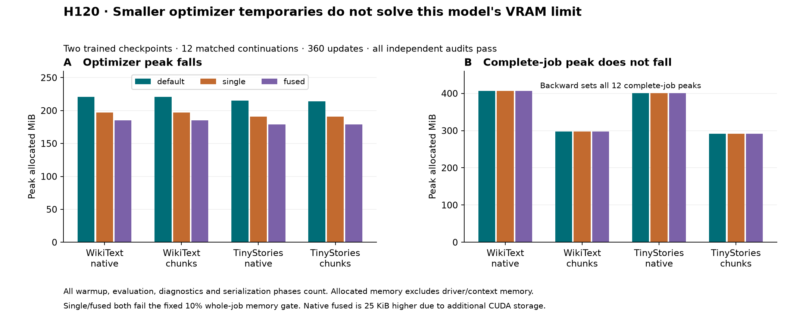

# H120 — optimizer temporaries are not the complete-job bottleneck

**Decision: both per-tensor and fused AdamW are ELIMINATED for this memory
gate.** They lower the optimizer-phase peak, but backward sets the largest
allocation in every one of the 12 profiles. Neither produces the required
10% complete-job reduction. All numerical, data and scoring audits pass.

Fused AdamW removes roughly 35–36 MiB from the optimizer-phase peak and has
2.7–3.6% lower median summed phase-event time in this instrumented screen.
Complete-job allocation is actually 25 KiB higher. Per-tensor AdamW leaves the
job peak identical and is slower. These measurements prevent promoting an
optimizer-only saving as a model-memory improvement.

## Controlled question and scope

The [prospective plan](optimizer_memory_plan.md) follows H119's sensitivity
diagnosis and returns to the primary VRAM objective. It compares three existing
native AdamW implementations: default (foreach/fused unspecified), single
(both false), and fused (fused true, foreach unspecified).
[PyTorch's AdamW documentation](https://docs.pytorch.org/docs/2.14/generated/torch.optim.AdamW.html)
motivates the test by describing foreach's extra temporary storage. This is
an implementation/resource experiment, not a novel optimizer or FFN.

Two H117 FP32-chunked checkpoints at update800, WikiText-2 and TinyStories
seed101, supply the same saved model, moments and sampler to every arm within
each corpus. Both native and chunked FP32 classifier losses are tested. Mode
order rotates across the four corpus/loss fixtures. Twelve cases each continue
30 updates; 10 are warmup and 20 contribute timing statistics.

The common maintained model is width384/FFN456/eight layers/six heads, B8/T512,
vocabulary4096, **9,099,648 total / 2,801,664 FFN parameters**. Default SDPA,
whole-block checkpointing, FP32 model/gradients/moments, AdamW LR0.0006,
betas(0.9,0.95), epsilon1e-8, matrix decay0.1, no norm-weight decay, norm clip1,
four CPU threads and disabled TF32 stay fixed. The UV-managed Python3.12.9 /
PyTorch2.14.0+cu132 runtime and RTX4070 Laptop GPU are unchanged.

Only optimizer implementation flags differ within each comparison. They are
applied to an in-memory copy before native state loading; no checkpoint file
is edited. All arms use one common profiling loop, maintained data/model/group
code and the existing loss/evaluation adapters. These are correlated
continuations of one seed per corpus, not a multi-seed quality qualification.

## Every case

NLL is the complete streamed BF16 validation score after update830. Timing is
median over updates11–30. Summed CUDA phase-event time excludes gaps between
measured operations; wall time includes synchronization/inventory overhead.
Neither is an uninstrumented throughput benchmark.

| Fixture | Mode | Optimizer peak MiB | Complete-job peak MiB | Reserved MiB | Final NLL | Event sum ms | Wall ms |
|---|---|---:|---:|---:|---:|---:|---:|
| WikiText / native | default | 220.820 | 406.399 | 478.0 | 4.96340461 | 71.600 | 78.277 |
| WikiText / native | single | 197.320 | 406.399 | 478.0 | 4.96339018 | 80.272 | 86.990 |
| WikiText / native | fused | 185.344 | 406.423 | 478.0 | 4.96339974 | 69.047 | 75.860 |
| WikiText / chunks | default | 220.820 | 297.428 | 386.0 | 4.96338976 | 81.943 | 88.697 |
| WikiText / chunks | single | 197.320 | 297.428 | 386.0 | 4.96338760 | 89.796 | 96.495 |
| WikiText / chunks | fused | 185.344 | 297.453 | 386.0 | 4.96338778 | 79.141 | 85.938 |
| TinyStories / native | default | 215.104 | 400.220 | 474.0 | 2.62772172 | 71.601 | 78.361 |
| TinyStories / native | single | 190.666 | 400.220 | 474.0 | 2.62767412 | 79.609 | 86.378 |
| TinyStories / native | fused | 178.690 | 400.244 | 474.0 | 2.62769049 | 69.418 | 76.368 |
| TinyStories / chunks | default | 214.166 | 291.249 | 382.0 | 2.62770159 | 81.401 | 88.074 |
| TinyStories / chunks | single | 190.666 | 291.249 | 382.0 | 2.62769982 | 89.922 | 96.679 |
| TinyStories / chunks | fused | 178.690 | 291.273 | 382.0 | 2.62767330 | 79.178 | 86.077 |

Mean, median, sample variance, minimum, maximum and split-half timing stability
are recorded for every case in the [full results](../results/optimizer_memory_v1/result.json.gz).
The [360-row update table](../results/optimizer_memory_v1/updates.csv.gz) retains
each loss, norm, batch hash and individual phase timing.

## Fixed gates: keep the failed comparisons

All four fixtures must pass numerical checks, a 10% complete-job memory saving,
NLL<=1.01×default, event and wall medians<=1.10×default and split-half timing
ratios<=1.15. Every numerical, quality and stability gate passes. Every memory
gate fails. Some single-mode timing gates also fail.

| Fixture | Mode | Job memory ratio | Event-time ratio | Wall-time ratio | NLL change | Failed gates |
|---|---|---:|---:|---:|---:|---|
| WikiText / native | single | 1.000000 | 1.1211 | 1.1113 | -0.00029% | memory, wall_time, event_time |
| WikiText / native | fused | 1.000060 | 0.9643 | 0.9691 | -0.00010% | memory |
| WikiText / chunks | single | 1.000000 | 1.0958 | 1.0879 | -0.00004% | memory |
| WikiText / chunks | fused | 1.000082 | 0.9658 | 0.9689 | -0.00004% | memory |
| TinyStories / native | fused | 1.000061 | 0.9695 | 0.9746 | -0.00119% | memory |
| TinyStories / native | single | 1.000000 | 1.1118 | 1.1023 | -0.00181% | memory, wall_time, event_time |
| TinyStories / chunks | single | 1.000000 | 1.1047 | 1.0977 | -0.00007% | memory, event_time |
| TinyStories / chunks | fused | 1.000084 | 0.9727 | 0.9773 | -0.00108% | memory |

No average or favorable optimizer-only peak overrides these per-fixture rules.
Neither mode earns the planned follow-on uninstrumented resource screen.
The small fused timing signal is retained as an observation, with no default
change or strong speed claim.

## Why the whole-job peak remains

Default-mode maximum allocated MiB by numerical phase:

| Fixture | Forward | Backward | Clipping | Optimizer |
|---|---:|---:|---:|---:|
| WikiText / native | 342.431 | 406.399 | 185.349 | 220.820 |
| WikiText / chunks | 239.232 | 297.428 | 185.349 | 220.820 |
| TinyStories / native | 336.251 | 400.220 | 178.695 | 215.104 |
| TinyStories / chunks | 232.298 | 291.249 | 178.695 | 214.166 |

Let P be parameter bytes and M the two FP32 moments. Here P=36,398,592 bytes
and M=72,797,184 bytes (34.71 and 69.42 MiB). Persistent moment payload is the
same in all three modes. Removing optimizer temporary storage does not remove
these moments from the backward phase. The job peak is the maximum of phase
peaks, not their sum. Holding other phases fixed, reducing a nonmaximal phase
cannot reduce that maximum. The measured profiles exhibit exactly this case.

Every phase boundary records unique CUDA storage belonging to parameters,
buffers, gradients, moments, step counters, data cache and current batch/loss.
Unattributed live bytes are the allocator total minus that known storage;
they may include workspaces, saved activations and allocator rounding. This is
a **boundary inventory**, not a transient allocation trace: it cannot assign
all allocations inside backward to a particular tensor or operation.
See the [1,884-row phase table](../results/optimizer_memory_v1/phases.csv.gz).

Fused mode places 50 four-byte step counters on CUDA instead of CPU (200 bytes
of payload). The observed complete-job increase is 25,600 bytes, consistent
with 50 allocations rounded to 512-byte blocks. This is a storage/accounting
explanation consistent with the source and measurements; no allocator-address
trace was captured to isolate it further. Reserved memory is reported separately
and is not substituted for allocated memory.

## Independent audit and accounting

The first actual update of each case supplies its saved raw/clipped gradient
and update801 model/moments. A separate NumPy FP64 calculation evaluates
general-step AdamW from the incoming update800 moments, including clipping,
bias correction, decoupled decay and epsilon. All 12 checks pass the frozen
tolerances. Maximum observed errors:

- parameter relative L2: 3.593347e-08;
- parameter absolute: 5.961696e-08;
- moment relative L2: 1.265175e-07;
- clipping relative L2: 0.000000e+00;
- same-fixture first raw-gradient global relative L2: 1.160069e-07;
- same-fixture maximum tensor relative L2: 2.269285e-07;
- native versus streamed final-score relative error: 1.219948e-08.

All first-step raw gradient norms are below one (about 0.819 for WikiText and
0.976 for TinyStories), so clipping is inactive in these saved first steps.
Their zero clipping error does not test an active clipping reduction or resolve
H119's failed active CPU clipping comparison.

All 36 new tensor artifact hashes, every first/final state and step counter,
all 360 sampled batches, and final sampler hashes verify. All states are finite.
Twelve independently evaluated native final scores match target counts/order
and pass the fixed1e-6 tolerance. Audit adds no optimizer update or backward.

Budget used: **360 training updates / 1,474,560 targets / 360 backwards**, plus
24 study validation scores and 12 native audit scores. All 1,884 memory intervals
include warmup, construction, validation, diagnostics and serialization. Study
and audit each have 13 zero-allocation/reservation boundaries. Profile wall time
is 80.793s, excluding interpreter startup and independent audit.
There was no failed scientific stage or repeated case. A later read-only
PowerShell display process had an internal CLR failure; its observation note
is retained, and no experiment was repeated.

## Decision and next question

Stop pursuing optimizer temporary storage as the VRAM solution for these
fixtures. H119's older CPU clipping failure and H117's older quality failure
remain unchanged; H120 does not requalify either. This result adds no new
parameter reduction, activation or architectural claim.

Backward is the next target. Whole-block checkpointing still retains block
inputs. Eight FP32 B8/T512/d384 input tensors contain 48 MiB in total, before
considering their actual lifetimes. A separate hypothesis should test selective
host storage of checkpoint inputs, while keeping arithmetic and optimizer
fixed. This is an upper-bound payload estimate, not an observed saving. It
requires actual saved-tensor/lifetime measurements, transfer-cost accounting
and gradient checks before language-quality promotion. Do not offload all
intermediates or alter the model without measuring the tradeoff.

All 152 frozen source hashes and 61 maintained source/config/test/lock hashes
are retained. The existing model tree and defaults remain unchanged. The earlier
116-test pass is historical; maintained tests were not rerun for this isolated
profile. New scripts pass lint. The full VRAM/quality and architectural research
goal remains open.

[Plan](optimizer_memory_plan.md) · [source guide](../results/optimizer_memory_v1/source/README.md) ·
[summary](../results/optimizer_memory_v1/summary.json) ·
[audit](../results/optimizer_memory_v1/audit.json.gz) ·
[verification receipt](../results/verification/optimizer_memory_final_v1.json).
