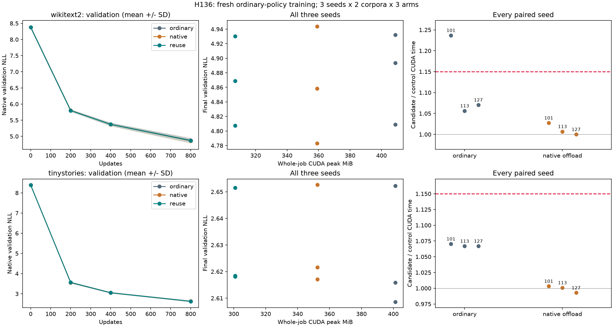

# H136: fresh three-seed ordinary-policy training

**FAIL three-seed long-training gate.** Independent initialization/native-gradient/checkpoint audit:
**True**. All twelve corpus/seed/control comparisons must pass.
This tests an architecture-independent memory implementation on two text corpora;
it does not prove a novel activation, parameter reduction or SOTA superiority.

| Corpus | Seed | Control | GPU allocation saved | Complete CUDA ratio | Wall ratio | Final NLL ratio | Failed gates |
|---|---:|---|---:|---:|---:|---:|---|
| wikitext2 | 101 | ordinary | 24.87% | 1.2368 | 1.2367 | 0.999677 | event, wall |
| wikitext2 | 101 | native | 14.48% | 1.0275 | 1.0275 | 0.997275 | none |
| wikitext2 | 113 | ordinary | 24.87% | 1.0564 | 1.0565 | 0.999671 | none |
| wikitext2 | 113 | native | 14.48% | 1.0069 | 1.0070 | 1.005108 | none |
| wikitext2 | 127 | ordinary | 24.87% | 1.0705 | 1.0705 | 0.994926 | none |
| wikitext2 | 127 | native | 14.48% | 1.0000 | 1.0000 | 1.002145 | none |
| tinystories | 101 | ordinary | 24.99% | 1.0703 | 1.0704 | 0.999740 | none |
| tinystories | 101 | native | 14.61% | 1.0032 | 1.0032 | 0.999582 | none |
| tinystories | 113 | ordinary | 24.99% | 1.0668 | 1.0668 | 1.000960 | none |
| tinystories | 113 | native | 14.61% | 1.0009 | 1.0008 | 1.000495 | none |
| tinystories | 127 | ordinary | 24.99% | 1.0669 | 1.0668 | 1.003628 | none |
| tinystories | 127 | native | 14.61% | 0.9928 | 0.9927 | 0.998657 | none |

Candidate `reuse` combines H128 buffer classifier with checkpoint-input CPU
offload. `native` uses native loss with the same offload; `ordinary` keeps native
loss and GPU checkpoint inputs. All share ordinary attention, default 8.125-MiB
workspace, FP32/TF32off, four threads, original AdamW/clipping and 9,099,648
parameters. These are fresh step-zero states, with empty optimizer moments,
not continuations from the favorable short-training fixtures.

## Independent seeds and aggregate results

Each of seeds 101, 113, 127 trains 800 updates per arm and corpus. Latin-square
arm order balances position across seeds and reverses for TinyStories. All
initial states are regenerated exactly by the independent audit. Means below
summarize all seeds; they never override an individual failed gate.

| Corpus | Arm | Mean final NLL | Median final NLL | Sample NLL variance | Mean GPU peak MiB | Mean complete CUDA ms |
|---|---|---:|---:|---:|---:|---:|
| wikitext2 | ordinary | 4.878123 | 4.893520 | 3.957e-03 | 408.686 | 75.031 |
| wikitext2 | native | 4.861661 | 4.858267 | 6.476e-03 | 358.999 | 82.686 |
| wikitext2 | reuse | 4.868787 | 4.868689 | 3.778e-03 | 307.030 | 83.604 |
| tinystories | ordinary | 2.625598 | 2.615914 | 5.454e-04 | 401.157 | 80.125 |
| tinystories | native | 2.630471 | 2.621630 | 3.741e-04 | 352.407 | 85.667 |
| tinystories | reuse | 2.629360 | 2.618425 | 3.692e-04 | 300.907 | 85.574 |

[Paired seed statistics](../results/ordinary_long_training_v1/paired_seed_statistics.json)
retain mean, median and sample variance of all memory/runtime/NLL ratios.
Three seeds are a limited replication, not a universal guarantee.

## Per-run resource and quality evidence

| Corpus | Seed | Arm | GPU peak MiB | Pinned host peak MiB | Complete CUDA ms | Wall ms | Final NLL | Timing block ratio |
|---|---:|---|---:|---:|---:|---:|---:|---:|---:|
| wikitext2 | 101 | ordinary | 408.686 | 0.000 | 65.959 | 65.995 | 4.931900 | 1.0810 |
| wikitext2 | 101 | native | 358.999 | 64.000 | 79.399 | 79.434 | 4.943778 | 1.0633 |
| wikitext2 | 101 | reuse | 307.030 | 64.000 | 81.579 | 81.616 | 4.930306 | 1.0401 |
| wikitext2 | 113 | native | 358.999 | 64.000 | 83.377 | 83.410 | 4.782937 | 1.0406 |
| wikitext2 | 113 | reuse | 307.030 | 64.000 | 83.949 | 83.989 | 4.807367 | 1.0424 |
| wikitext2 | 113 | ordinary | 408.686 | 0.000 | 79.467 | 79.501 | 4.808951 | 1.0390 |
| wikitext2 | 127 | reuse | 307.030 | 64.000 | 85.285 | 85.318 | 4.868689 | 1.0350 |
| wikitext2 | 127 | ordinary | 408.686 | 0.000 | 79.667 | 79.703 | 4.893520 | 1.0316 |
| wikitext2 | 127 | native | 358.999 | 64.000 | 85.283 | 85.315 | 4.858267 | 1.0316 |
| tinystories | 101 | reuse | 300.907 | 64.000 | 85.425 | 85.463 | 2.651545 | 1.0354 |
| tinystories | 101 | native | 352.407 | 64.000 | 85.154 | 85.192 | 2.652653 | 1.0379 |
| tinystories | 101 | ordinary | 401.157 | 0.000 | 79.812 | 79.845 | 2.652235 | 1.0353 |
| tinystories | 113 | ordinary | 401.157 | 0.000 | 80.373 | 80.407 | 2.615914 | 1.0312 |
| tinystories | 113 | reuse | 300.907 | 64.000 | 85.742 | 85.779 | 2.618425 | 1.0316 |
| tinystories | 113 | native | 352.407 | 64.000 | 85.669 | 85.706 | 2.617130 | 1.0392 |
| tinystories | 127 | native | 352.407 | 64.000 | 86.177 | 86.212 | 2.621630 | 1.0281 |
| tinystories | 127 | ordinary | 401.157 | 0.000 | 80.192 | 80.228 | 2.608644 | 1.0346 |
| tinystories | 127 | reuse | 300.907 | 64.000 | 85.553 | 85.585 | 2.618109 | 1.0406 |

Gates remain allocation ratio<=0.90, complete CUDA/wall<=1.15, final NLL<=1.01,
candidate pinned host peak<=128MiB, and timing stability<=1.15 for every run.
The latter uses three 260-update mean-wall-time blocks after 20 warmups. Timing
spans forward/backward/clipping/Adam including offload transfers and checkpoint
recomputation. It excludes sampling, gradient clearing, validation, serialization
and inventory. Whole-job allocated peak includes those phases. CUDA allocation
excludes driver/context and other processes; pinned host peak is not total RSS.
Reserved memory, complete histories, moments/grad norms and layer diagnostics
are retained. Native validation at0/200/400/800 tracks convergence throughout.

## Verification and limits

14,400 updates and 58,982,400 training targets. 18 initial gradient probes plus 18
independent native replays give14,436 total backwards. 72 full study scores and 60
independent native scores cover initial and200/400/800 checkpoints. 72 tensor
artifacts, 28,998 memory intervals, 61 zero allocator boundaries. All 61 maintained
files and frozen fixture/source/library hashes verify.

The independent audit regenerates all six step-zero models and empty Adam
states, replays every batch, checks model/optimizer/sampler hashes and finite
states at each saved endpoint, and scores through native code. Initial gradients
are recomputed without custom loss/offload under the existing 1e-5 global and 1e-4
tensor relative-L2 caps; loss/score relative error remains<=1e-6. Ordinary
attention is nondeterministic, so this is bounded numerical equivalence rather
than a claim of bitwise trajectory identity. H135's shorter numerical audit and
H128's exact operator qualification remain complementary evidence.

The H117 loop was reused with only timestamp fields added; its syntax tree was
checked against declared edits before freezing. Compact atomic JSON output
preserves numerical content and reduces exposure to previously observed Python
encoder failures. The UV-managed runtime and allocator choice are recorded.

Passive GPU telemetry runs every 200 ms per worker and stops in finally. Coverage
is required during measured updates; raw clocks, temperature and power are
retained with unavailable fields marked missing. No power/clock settings change.
Sensor correlation and cross-study timing differences cannot diagnose a kernel
or thermal cause. Two text corpora, this scale and 800 updates do not establish
cross-domain generality or final-convergence behavior. Historical failures stay
unchanged, and no maintained training default is changed by this experiment.

## Next decision

Do not promote the configuration. Identify the failing seed/gate from the table, retain all three seeds and choose one narrower follow-up. Do not change limits or substitute aggregate means for a failed individual run.
The broad research goal remains open.

[Prospective plan](ordinary_long_training_plan.md),
[summary](../results/ordinary_long_training_v1/summary.json),
[receipt](../results/ordinary_long_training_v1/receipt.json).
