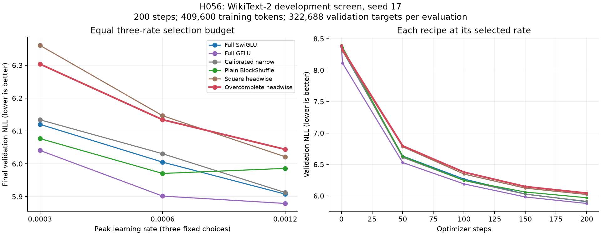

# H056: Overcomplete headwise fails the first language-quality screen

**Decision: REJECTED for promotion at this budget.** The best of three fixed rates
reaches NLL **6.043891**, 2.305% above full SwiGLU, 2.800% above full GELU and
2.223% above calibrated narrow. All three quality gates fail. Parameter and
memory gates pass; every new trial remains finite. This recipe earns no longer
run, added activation or automatic optimizer search.

The constructive representation proof remains valid. This experiment shows that
representing the excluded quadratic and matching initialization RMS did not
produce competitive language learning under the tested recipe. It does not
establish a general limit of rectangular mixing or a causal explanation.

## Equal three-rate development screen

All rows use d=384, eight layers, six attention heads, vocabulary 4096, context
128, batch 16, seed 17 and 200 optimizer steps. Each trial samples 409,600 training
targets and evaluates all 322,688 validation targets. Lowest final NLL selects
each recipe; exact ties select the lower rate. All three candidate cells complete.
The twelve original controls and three square-headwise controls are retained,
with verified hashes, source compatibility, actual groups and sampler states.

| Recipe | NLL at LR .0003 | NLL at LR .0006 | NLL at LR .0012 |
|---|---:|---:|---:|
| Full SwiGLU | 6.120134 | 6.005087 | 5.907694 |
| Full GELU | 6.040670 | 5.901685 | 5.879278 |
| Calibrated narrow | 6.133922 | 6.030559 | 5.912434 |
| Plain BlockShuffle | 6.076798 | 5.970604 | 5.985974 |
| Square headwise | 6.360489 | 6.146283 | 6.021328 |
| Overcomplete headwise | 6.303587 | 6.134152 | 6.043891 |

The candidate selects the upper boundary, LR .0012; an optimal rate is unproven.
It loses to full SwiGLU, full GELU, narrow and plain BlockShuffle at every matched
rate. It beats square headwise at .0003/.0006 but loses by 0.375% when each selects
its best rate. Against selected BlockShuffle (.0006), its cost is 1.227%.
The separate 0.2% narrow-margin diagnostic also fails. These are fixed engineering
gates on a development set used for selection, not significance or test-set claims.



## Parameter and systems measurements

| Selected recipe | FFN weights | Total weights | Training peak MiB | Clipped steps |
|---|---:|---:|---:|---:|
| Full SwiGLU | 9,437,184 | 15,735,168 | 702.187 | 10.5% |
| Full GELU | 9,437,184 | 15,735,168 | 656.624 | 12.0% |
| Calibrated narrow | 2,801,664 | 9,099,648 | 516.280 | 8.5% |
| Plain BlockShuffle | 2,801,664 | 9,099,648 | 714.118 | 16.0% |
| Square headwise | 2,801,664 | 9,099,648 | 638.368 | 7.0% |
| Overcomplete headwise | 2,801,664 | 9,099,648 | 676.931 | 7.0% |

The candidate retains **70.3125% fewer FFN weights** and
**42.170% fewer total-model weights** than either full control.
All three rates use **676.931 MiB** allocated training peak.
This passes both <=10% memory allowances and is distinct from H055's fixed-batch
qualification. The screen measures the real training loop, including Adam state,
gradients, validation and allocated workspaces before final diagnostics/timing.

New candidate clipping fractions are 42% / 20% / 7% across ascending rates.
All final weights, Adam moments, logged gradients and initial/final layer outputs
are finite. Clipping alone does not diagnose stable optimization or convergence.

The selected run records 24,093 timed training tokens/s
and 66,820 full-sequence inference tokens/s on the RTX
4070 Laptop. Training excludes the first ten steps, evaluation and checkpoint I/O;
inference uses the shared synchronized warmup/repeat procedure. These are descriptive
cross-session measurements; no paired speedup or generation-speed claim follows.
Logical FFN matrix forward FLOPs are 5,603,328 per token
across eight layers. The raw metrics retain model/training estimates and their
exclusions; factorization, nonlinear operations and wall-clock cost differ.

## What changed, and what the diagnostics show

The [frozen protocol](overcomplete_screen_plan.md) uses the H053/H054 module and
H055 native recomputed gate, with the existing factor fan-in LR policy. Input
mixer factor scales are 8/8, output scales 8/(32/3); private head tensors stay
at scale 1. Parameter decay is .1. This differs from H055's uniform-rate memory
qualification. All dense controls produce identical actual groups when their
factor-policy flag changes to fan_in, preserving narrow width calibration.
The architecture comparison changes mixer structure, head geometry and
initialization together; it is not an isolated expansion ablation.

At the selected rate, initial layer-0 FFN RMS is 0.012844, close to full SwiGLU
0.012627. By step 200 it reaches **13.7203**, versus **3.8765** for full SwiGLU
and **3.8589** for square headwise. The last logged candidate FFN gradient norms
in layers 1-7 are 0.00436-0.01028; full SwiGLU records 0.01744-0.06536.
All are finite and nonzero. These norms depend on parameterization and probe
inputs, so they do not prove vanishing gradients, capacity failure or causation.

| Layer | Candidate initial FFN RMS | Candidate final FFN RMS | Full SwiGLU final FFN RMS | Candidate last FFN gradient norm |
|---|---:|---:|---:|---:|
| 0 | 0.012844 | 13.720284 | 3.876500 | 0.110020 |
| 1 | 0.013014 | 1.083544 | 3.169733 | 0.009322 |
| 2 | 0.013014 | 1.089434 | 0.386837 | 0.010275 |
| 3 | 0.013025 | 0.332865 | 0.306195 | 0.005244 |
| 4 | 0.012909 | 0.337860 | 0.318348 | 0.004720 |
| 5 | 0.013134 | 0.362434 | 0.310390 | 0.004617 |
| 6 | 0.013284 | 0.377957 | 0.255130 | 0.004362 |
| 7 | 0.013247 | 0.227632 | 0.265518 | 0.005017 |

The candidate's last training-batch loss is 5.989406 versus full SwiGLU 5.859748
and narrow 5.851320 on the matched stream. One logged batch is not mean training
NLL. The joint training/validation deficit and scale growth give a concrete
optimization question; they do not establish its answer. A separate checkpoint
analysis of residual scale and factor geometry can precede any new hypothesis.
No longer run or activation repair is earned by this failed screen.

## Reproducibility and retained failure

All **245 tests pass** in the [recorded suite](../results/verification/overcomplete_screen_tests_v2.json)
(`245 passed in 37.29s`, `-p no:anyio`, all assertions/GPU checks enabled). Six
focused configuration/decision/worker checks pass. Existing computation is
unchanged from H055, preserving its 32-model exact-signature evidence. Three
new trials use **1,228,800 sampled training tokens**, with no numerical failures.
No official test data is fetched or scored.

The first preflight stopped before GPU training because it required byte-identical
diagnostics from before later architecture hooks existed. Its [failure log](../results/verification/overcomplete_screen_preflight_v1.log)
and [exact driver](../results/verification/overcomplete_screen_before_preflight_fix_v1.py)
are retained. After inspecting that diff, the corrected preflight compares old
and current diagnostics on each retained CPU probe, including gradient statistics,
unchanged weights and unchanged RNG. Those values match exactly. Training-step
AST, evaluation functions and shared forward/loss checks also pass. The frozen
plan/config/gates stay unchanged. This was one diagnosed verification failure;
all three training processes and the corrected full pipeline complete first attempt.

Artifacts: [decision](../results/overcomplete_screen_v1/result.json),
[preflight](../results/overcomplete_screen_v1/preflight.json),
[protocol](../results/overcomplete_screen_v1/protocol.json),
[source archive](../results/overcomplete_screen_v1/source.zip),
[layer observations](../results/overcomplete_screen_v1/observations.json),
[plot inputs](../results/verification/overcomplete_screen_plot_v1.json), and
[candidate config](archive/retired/configs/wikitext2_overcomplete_headwise_screen.json).
The result hashes every new checkpoint, history, metrics and diagnostic file.

To reproduce one cell into a fresh output directory:

```powershell
uv run --extra compile --extra data python -m src.core.cli train --config configs/wikitext2_overcomplete_headwise_screen.json --learning-rate 0.0012 --cache data/wikitext2_v1 --output results/runs/overcomplete_reproduction_s17_200
```

The complete archived experiment uses the qualified minimal worker; its protocol
and launcher prevent overwriting or silently retrying a cell. No novelty,
convergence, seed robustness, scale transfer or breakthrough is established.
The full research goal remains open; H051 and earlier activation failures remain.
