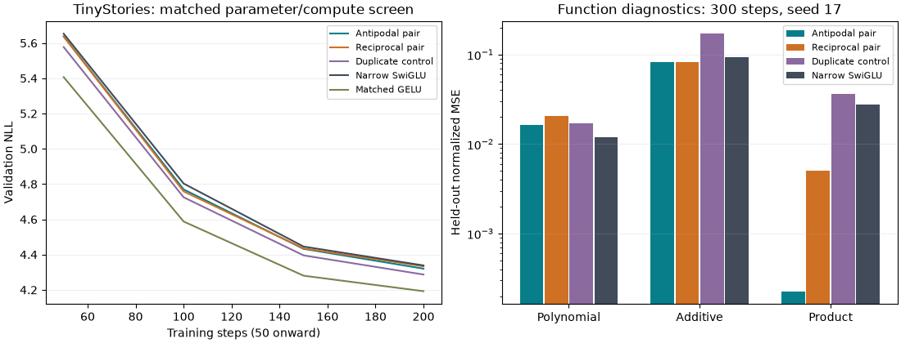

# Paired-feature FFN: frozen screen results

The exact signed-feature identities and scalar derivative bound pass independent checks. Their scope is limited to the feature map before the output projection; the full Jacobian can be singular. The language-model results determine whether the mechanism earns more compute.

## Matched language-model comparison

All five runs use seed 17, 200 steps, the same data order, 409,600 training tokens and 32,768 validation targets. They share uniform AdamW settings, precision and all non-FFN dimensions. Every FFN has 350,208 unique weights, 700,416 matrix FLOPs per token across four layers, and 1,728,192 total model weights. Pair modes and GELU also share the exact initial projection tensors.

| Method | Validation NLL | Peak training MiB | Training tokens/s | Full-sequence forward tokens/s |
|---|---:|---:|---:|---:|
| Antipodal pair | 4.320257 | 221.09 | 25,289 | 85,524 |
| Reciprocal pair | 4.333520 | 219.84 | 28,305 | 88,035 |
| Duplicate control | 4.287006 | 218.06 | 26,950 | 91,325 |
| Narrow SwiGLU | 4.338559 | 221.66 | 27,798 | 86,398 |
| Matched GELU | 4.192404 | 216.28 | 29,476 | 94,256 |

Timings here are separate-run screening observations. Laptop clocks and kernel overhead can change them; they do not establish a deployment-speed win. The [frozen plan](paired_feature_plan.md) defines the promotion gates before measurements.

## Promotion decision

- Antipodal pair: NLL difference versus matched SwiGLU -0.422%, versus GELU +3.050%. Failed gates: less than 1% improvement over matched SwiGLU, more than 1% behind matched GELU, worse than the duplicate control.
- Reciprocal pair: NLL difference versus matched SwiGLU -0.116%, versus GELU +3.366%. Failed gates: less than 1% improvement over matched SwiGLU, more than 1% behind matched GELU, worse than the duplicate control.

Selected for one 800-step check: **none**. This is a screening decision, not final acceptance.

## Function diagnostics

Each regressor has 49 learned parameters, including the same scalar bias. The three chosen targets are small mechanism diagnostics; an exact product identity should help the product task, but that is not evidence of broad language capability. This table retains every seed-17 result.

| Method | Polynomial MSE | Additive MSE | Product MSE |
|---|---:|---:|---:|
| Antipodal pair | 0.0163166 | 0.0820372 | 0.0002267 |
| Reciprocal pair | 0.0205929 | 0.0821578 | 0.0050391 |
| Duplicate control | 0.0172371 | 0.1713020 | 0.0363971 |
| Narrow SwiGLU | 0.0119010 | 0.0937735 | 0.0274855 |

The duplicate map collapses algebraically to ordinary SwiGLU at half the feature width, with the two output-weight blocks added. Its optimizer dynamics and redundant parameter count differ from a minimal narrow implementation. It checks whether the second feature carries useful function diversity.

Raw [decision JSON](../results/paired_screen_summary.json) records all metric hashes and gates. Function inputs, checkpoints, histories and source snapshot are in results/paired_functions_v1. No verified novelty, general superiority, larger-scale stability or gold result is established. Regenerate this report with `uv run python -m src.core.paired_report`.
