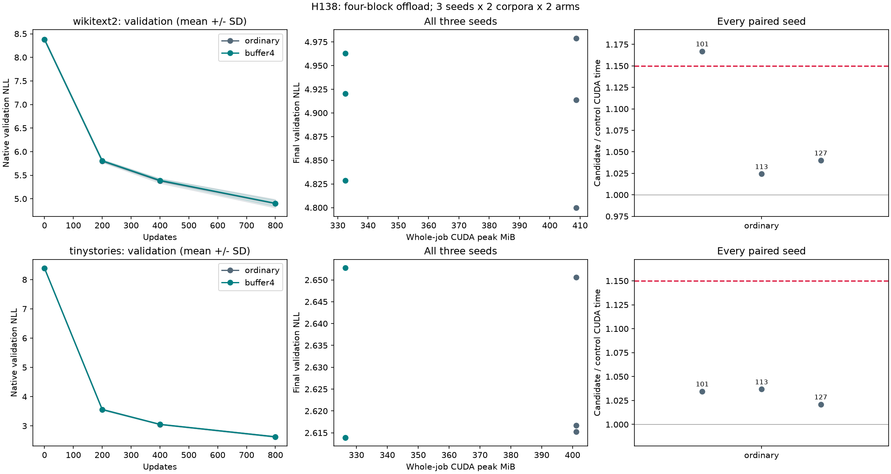

# H138: fresh validation of four-block offload

**FAIL four-block fresh-training gate.** Independent initialization/native-gradient/checkpoint audit:
**True**. All six seed/corpus comparisons must pass individually.
The candidate was selected prospectively by H137; H136's eight-block long-run
failure remains unchanged.

| Corpus | Seed | GPU allocation saved | Complete CUDA ratio | Wall ratio | Final NLL ratio | Failed gates |
|---|---:|---:|---:|---:|---:|---|
| wikitext2 | 101 | 18.65% | 1.1670 | 1.1669 | 0.996786 | event, wall |
| wikitext2 | 113 | 18.65% | 1.0243 | 1.0241 | 1.006048 | none |
| wikitext2 | 127 | 18.65% | 1.0401 | 1.0401 | 1.001405 | none |
| tinystories | 101 | 18.65% | 1.0346 | 1.0346 | 1.000835 | none |
| tinystories | 113 | 18.65% | 1.0368 | 1.0368 | 0.999482 | none |
| tinystories | 127 | 18.65% | 1.0210 | 1.0211 | 0.998952 | stability |

Candidate `buffer4` combines H128 buffer classifier with H137's unchanged CPU
checkpoint-input adapter on blocks 4-7. `ordinary` uses native loss and retains
checkpoint inputs on GPU. All other layer/optimizer/data operations remain
identical. There are 9,099,648 trainable parameters in both arms. This is a
memory optimization, not a novel activation or parameter-count reduction.

## Three independent seeds

Seeds 101, 113 and 127 start from six original step-zero states with empty Adam
moments and train 800 updates per arm/corpus. The audit regenerates every initial
state exactly. Arm order alternates by fixture: three ordinary-first and three
candidate-first pairs. No completed run is reordered, dropped or selected as
representative. Aggregates describe every seed and cannot rescue a failed gate.

| Corpus | Arm | Mean final NLL | Median final NLL | Sample NLL variance | Mean GPU peak MiB | Mean complete CUDA ms |
|---|---|---:|---:|---:|---:|---:|
| wikitext2 | ordinary | 4.897393 | 4.913578 | 8.225e-03 | 408.686 | 73.766 |
| wikitext2 | buffer4 | 4.904036 | 4.920480 | 4.704e-03 | 332.468 | 79.084 |
| tinystories | ordinary | 2.627504 | 2.616674 | 3.988e-04 | 401.157 | 79.926 |
| tinystories | buffer4 | 2.626876 | 2.613932 | 5.027e-04 | 326.344 | 82.382 |

## Per-run evidence

| Corpus | Seed | Arm | GPU peak MiB | Pinned host peak MiB | Complete CUDA ms | Wall ms | Final NLL | Timing block ratio |
|---|---:|---|---:|---:|---:|---:|---:|---:|---:|
| wikitext2 | 101 | ordinary | 408.686 | 0.000 | 65.445 | 65.475 | 4.978904 | 1.0761 |
| wikitext2 | 101 | buffer4 | 332.468 | 32.000 | 76.375 | 76.406 | 4.962904 | 1.0727 |
| wikitext2 | 113 | buffer4 | 332.468 | 32.000 | 79.256 | 79.288 | 4.828725 | 1.0445 |
| wikitext2 | 113 | ordinary | 408.686 | 0.000 | 77.378 | 77.419 | 4.799697 | 1.0474 |
| wikitext2 | 127 | ordinary | 408.686 | 0.000 | 78.475 | 78.507 | 4.913578 | 1.0427 |
| wikitext2 | 127 | buffer4 | 332.468 | 32.000 | 81.622 | 81.657 | 4.920480 | 1.0403 |
| tinystories | 101 | buffer4 | 326.344 | 32.000 | 81.910 | 81.944 | 2.652765 | 1.0351 |
| tinystories | 101 | ordinary | 401.157 | 0.000 | 79.173 | 79.208 | 2.650551 | 1.0359 |
| tinystories | 113 | ordinary | 401.157 | 0.000 | 79.905 | 79.937 | 2.615287 | 1.0332 |
| tinystories | 113 | buffer4 | 326.344 | 32.000 | 82.844 | 82.876 | 2.613932 | 1.0337 |
| tinystories | 127 | buffer4 | 326.344 | 32.000 | 82.393 | 82.433 | 2.613931 | 1.0461 |
| tinystories | 127 | ordinary | 401.157 | 0.000 | 80.699 | 80.731 | 2.616674 | 1.8196 |

Per-seed gates remain allocation ratio <=0.90, complete CUDA/wall <=1.15, final
NLL <=1.01, candidate pinned host peak <=128 MiB and timing stability <=1.15.
The latter compares three 260-update mean-wall-time blocks after 20 warmups.
All phase records, per-step histories and seed mean/median/sample variance are
retained. Complete timing spans forward/backward/clipping/Adam, recomputation
and transfers; sampling, gradient reset, validation, serialization and inventory
are excluded from timing but included in whole-job CUDA peak accounting.
Driver/context/other processes are excluded; pinned peak is not total CPU RSS.

## Independent audit and reproducibility

9,600 updates and 39,321,600 training targets. Twelve initial gradient probes
plus twelve independent native replays give 9,624 backwards. There are 48 full
study validation scores and 42 independent native scores, covering initial and
200/400/800 checkpoints. Forty-eight tensor artifacts, 19,332 memory intervals,
43 zero allocator boundaries; all 61 maintained files and frozen source/input/
library hashes verify. Recorded wrapped block indices must equal [4,5,6,7] for
the candidate and [] for ordinary training.

The unchanged H136 loop and H117 independent audit verify regenerated initial
states, every batch, saved model/optimizer/sampler hashes, finite states and native
validation at every checkpoint. Initial gradients are recomputed without custom
loss/offload under existing caps: 1e-5 global and 1e-4 tensor relative L2, with
loss/score relative error <=1e-6. Ordinary attention is nondeterministic; this is
bounded numerical equivalence rather than bitwise trajectory identity. H128's
operator proof and H137's short noise calibration remain supporting evidence.

FP32, TF32 off, ordinary attention, default 8.125-MiB workspace, four CPU threads,
UV-managed Python/PYTHONMALLOC=pymalloc, original AdamW/LR/clipping, batch 8 and
context 512 are shared. Raw-case aggregation preserves original numerical JSON
text. Passive GPU telemetry samples every 200 ms and stops in finally; all runs
require measured-window coverage. Missing sensors remain missing. No hardware
power or clock settings change, and sensor correlation cannot establish causation.

These are two text corpora at one model scale and 800 updates, not evidence of
cross-domain generality, final convergence, SOTA superiority or a new FFN.
All earlier failed gates remain recorded. No maintained default is changed by
this experiment.

## Next decision

Do not promote the configuration. Retain every seed and inspect the failed quality/runtime/resource gate. Choose a narrower falsifiable follow-up without relaxing limits, reordering completed runs or using aggregate means to rescue failures.

[Prospective plan](partial_offload_long_plan.md),
[summary](../results/partial_offload_long_v1/summary.json),
[receipt](../results/partial_offload_long_v1/receipt.json).
