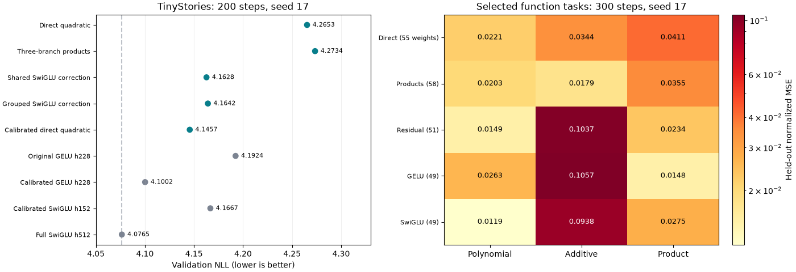

# Quadratic Bezier: measured screen and follow-up

No quadratic candidate passes its frozen promotion gates. The best residual gives only a 0.095% NLL improvement over calibrated SwiGLU. Applying width calibration to both direct quadratic and GELU improves both, with GELU remaining better. The full research target is unmet.

The requested equation and three-branch products are implemented in [quadratic.py](archive/retired/src/bezier_ffn/quadratic.py). Read the [frozen plan and scoped proofs](quadratic_bezier_plan.md). All runs use the common trainer, fixed TinyStories data and 32768 validation targets. Initial and follow-up optimizer recipes differ as declared; no candidate is selected using a changed threshold.

## Language-model screen

| Recipe | FFN weights | Total weights | NLL | Train peak MiB | Clipped steps |
|---|---:|---:|---:|---:|---:|
| Direct quadratic | 350,232 | 1,728,216 | 4.265256 | 243.63 | 60.0% |
| Three-branch products | 350,244 | 1,728,228 | 4.273424 | 254.33 | 64.0% |
| Shared SwiGLU correction | 350,216 | 1,728,200 | 4.162753 | 241.82 | 45.5% |
| Grouped SwiGLU correction | 350,272 | 1,728,256 | 4.164174 | 241.82 | 47.5% |
| Calibrated direct quadratic | 350,232 | 1,728,216 | 4.145671 | 243.63 | 32.0% |
| Original GELU h228 | 350,208 | 1,728,192 | 4.192404 | 216.28 | 50.5% |
| Calibrated GELU h228 | 350,208 | 1,728,192 | 4.100158 | 215.75 | 26.0% |
| Calibrated SwiGLU h152 | 350,208 | 1,728,192 | 4.166703 | 221.66 | 47.5% |
| Full SwiGLU h512 | 1,179,648 | 2,557,632 | 4.076455 | 256.82 | 36.5% |

All compressed rows use 700416 FFN matrix forward FLOPs/token; full SwiGLU uses 2359296. Learned scalar coefficients are included in weights. Nonlinear operations, temporary tensors and casts are excluded from those FLOP counts, but included in measured memory and timing.

## Frozen decisions

| Candidate | NLL change vs calibrated SwiGLU | NLL change vs its GELU control | Failed gates |
|---|---:|---:|---|
| Direct quadratic | +2.365% | +1.738% | >=.5% gain over SwiGLU; >=.5% gain over GELU |
| Three-branch products | +2.561% | +1.933% | >=.5% gain over SwiGLU; >=.5% gain over GELU; >=.2% gain from products |
| Shared SwiGLU correction | -0.095% | -0.707% | >=.5% gain over SwiGLU |
| Grouped SwiGLU correction | -0.061% | -0.673% | >=.5% gain over SwiGLU |
| Calibrated direct quadratic | -0.505% | +1.110% | >=.5% gain over GELU |

The initial four settings use original matched GELU for their frozen gate; calibrated direct uses equally calibrated GELU. Every quadratic setting also loses to the stronger calibrated GELU found in the follow-up. None earns an 800-step candidate run.

## Mechanism and stability

The direct quadratic has bounded outputs and an upper slope bound, but vanishing sigmoid tails. Three pair-product branches add a scoped mixed derivative; zero coefficients exactly recover the unmixed model. The residual begins exactly at SwiGLU, including BF16 outputs and initial common-weight gradients. Tests verify these statements; they do not prove universal expressivity or stable trained depth.

On the fixed final diagnostic batch, no quadratic module has t<.01 or t>.99, and no curve control reaches 98% of its bound. The direct and mixed controls remain close to initialization. Thus this sample does not support attributing their poorer NLL to sigmoid tail saturation. Complete per-layer controls, slope fractions, branch coefficients, activation statistics and gradient logs are retained. Older initial-screen raw keys named `activation_slope_below_1e3_fraction` mean |slope|<0.001; the follow-up source spells this threshold unambiguously.

The three-branch version improves all three selected function errors against direct quadratic but worsens LM NLL by 0.191%. Function-fit improvement therefore does not establish language-model improvement. Toy counts are 55/58/51 for direct/mixed/residual versus 49 for controls, so their coefficient overhead is explicitly material.

## Reproduction and limits

Run `uv run python -m src.core.quadratic_report` to regenerate the gates, hashes and this figure. Each candidate checkpoint also has `learned_curves.json` and `learned_curves.png`. The plot shows scalar activations before product mixing/value gating; full mixed behavior is not a scalar curve.

Timing changed sharply despite identical recorded GPU/software. The unchanged calibrated SwiGLU repeat is retained under `results/reproducibility/width_calibrated_200_repeat`; its final NLL differs by about 0.00000745. The comparison audit records complete logged differences and checkpoint differences. Consequently numerical trajectory bitwise identity and speed gains across these run dates are not claimed. All training runs were serial; absolute synchronized timing remains available in raw metrics.

These are elementary Bernstein-basis and gated-activation experiments with substantial prior art, not verified architectural novelty. The [plan](quadratic_bezier_plan.md) links primary sources. No broader-corpus, convergence or trained-scale claim follows from this screen.

## Paired checkpoint gradient audit

The calibrated direct curve and GELU control were audited on the same 256-target CPU FP32 batch, before and after training. Every recorded activation gradient is finite and all eight projection matrices per model retain maximal numerical rank. Final nonzero condition numbers span 23.42-73.83 for quadratic and 22.44-67.77 for GELU. FFN backward gains in that loss direction span .097-.221 and .111-.220 respectively. These local measurements show no demonstrated conditioning advantage; they are not extremal Jacobian singular values or a deep-network stability guarantee.

Raw [quadratic audit](../results/audits/quadratic_direct_calibrated_s17_200.json) and [GELU audit](../results/audits/gelu_h228_calibrated_s17_200.json) retain all spectra and invocation-specific gradients.

## Longer-budget conventional control

The separately frozen calibrated GELU h228 control reaches NLL 3.217538 at 800 steps, seed 17. At the same budget, calibrated SwiGLU h152 scores 3.126104, BlockShuffle 3.098956, full SwiGLU 3.065045 and full GELU 3.193122. Its strong 200-step relative ranking does not persist. This is a conventional-control check; no failed quadratic candidate was promoted.
