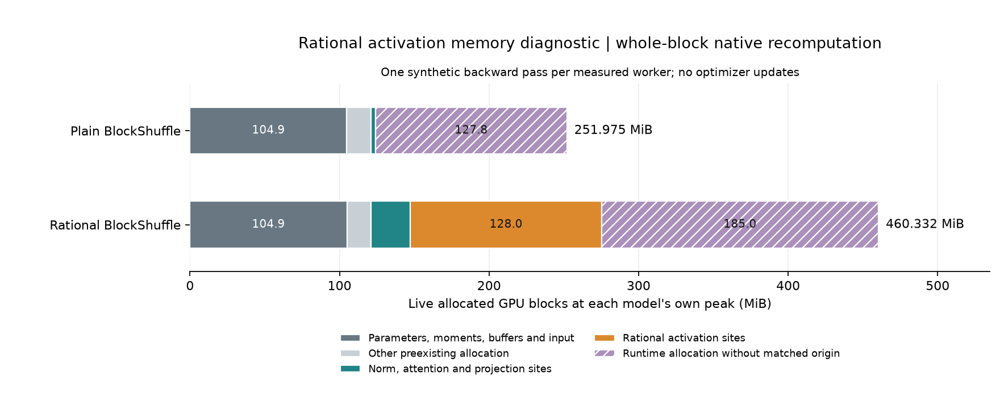

# H064: rational activation allocation diagnosis

**Completed with exact memory accounting and partial source attribution.**
At the rational model's 460.332 MiB peak, eight 16 MiB allocations originate in
its FP32 activation evaluation during checkpoint recomputation. These 128 MiB
of simultaneously live blocks identify a concrete transient cost. They do not
establish that a rewrite would remove 128 MiB, preserve gradients, or meet the
memory gate. The active shortlist stays at three folders and six variants.

## Fixed experiment and fidelity

The [frozen plan](rational_memory_plan.md) specifies four fresh workers: plain
untraced, plain traced, rational untraced, rational traced. Each loads H063's
original selected seed-17, 200-step checkpoint and AdamW moments. Both use native
whole-block recomputation, unchanged inner gate policies, d384/L8/V4096,
B16/T128, BF16 with FP32 parameters, and four CPU threads. One warmup pass precedes
one measured pass on H063's first synthetic batch, seed 60017.

All four workers finish on their first attempt. There are **zero optimizer
updates**, eight forward/backward evaluations and **16,384 synthetic target
exposures**, including warmup. No corpus training, validation or test scoring
occurs. Qualification tests are separate from this worker budget.

Within each recipe, traced and untraced loss, logits, every parameter gradient,
phase allocations and peak allocated bytes are exact. Weights, optimizer moments
and RNG are unchanged. The replay matches baseline, forward-end, forward-peak,
backward-end and global-peak counters byte for byte. It also reconstructs the
terminal allocator block layout, including inactive and pending-free blocks.
Trace lengths are 5,615 / 9,508 events, below the 50,000-event cap.

## Recorded memory

All quantities below are MiB. Both global peaks occur during backward, but at
different events in their own traces (plain 1,689; rational 8,159).

| Recipe | Baseline allocated | Forward peak allocated | Global peak allocated | Peak reserved |
|---|---:|---:|---:|---:|
| Plain BlockShuffle | 121.153 | 228.990 | 251.975 | 326.000 |
| Rational BlockShuffle | 121.177 | 352.553 | 460.332 | 526.000 |

The global peak gap is **208.357 MiB** for this one-batch, zero-update diagnostic.
It is distinct from H063's **208.670 MiB** gap over twenty synthetic updates.
Neither replaces the rational recipe's original **883.174 MiB** language-training
measurement. Reserved memory includes reusable allocator capacity and is not the
same quantity as allocated live blocks. No traced runtime claim is made.

[Standalone SVG](figures/rational_memory.svg).

| Origin of blocks live at the model's own peak | Plain | Rational |
|---|---:|---:|
| Parameters, moments, buffers and input | 104.903 | 104.927 |
| Other preexisting allocations | 16.250 | 16.250 |
| Norm, attention and projection sites | 3.008 | 26.165 |
| Rational activation sites | 0.000 | 128.001 |
| Runtime allocations without matched origin | 127.813 | 184.989 |

The rational bin contains eleven allocations: eight of exactly 16 MiB and three
512-byte blocks. All eleven stacks include the checkpoint `recompute_fn`. The
large sites are the FP32 cast at activation line 28 (16 MiB), reciprocal line 50
(16), product line 51 (16), denominator expression line 52 (32), and basis
expressions at lines 53, 54 and 55 (16 each), in the
[unchanged source](../src/rational_blockshuffle_ffn/__init__.py). Multi-operation
source lines identify allocation sites, not necessarily one uniquely named tensor.
At this shape a full FP32 hidden array contains 4,194,304 values, exactly 16 MiB.
The original tiny learned coefficient tensors do not explain this transient cost.

## Unresolved attribution and accounting limits

The installed Windows build reports that C++ allocation stacks are unsupported.
Of rational's **184.989 MiB** unmatched runtime category, **175.613 MiB** has empty
frames; another **9.376 MiB** has Python frames outside the frozen source mapping.
Plain has 64.000 MiB with empty frames and 63.813 MiB outside that mapping. Each
model also has 16.250 MiB of unidentified allocations already live before tracing.
These are deliberately not relabeled as rational derivative buffers or library
workspaces. Exact allocator accounting does not imply complete operator attribution.
Cross-model peaks occur at different times, so category differences do not measure
causal savings from changing or removing an operation.

The native allocator records **requested** sizes in allocation/free events, while
allocated counters include rounding and unsplit block padding. The replay applies
default native 512-byte rounding, pool-specific split rules and free coalescing.
It rejects unsupported allocator settings, truncation, invalid frees, pointer
collisions and terminal layout mismatch. Requested bytes at the allocated peak
are 251.160774 / 456.801903 MiB;
allocated padding at those events is 0.813835 / 3.530128 MiB.
These requested quantities need not equal the separately recorded maximum of
requested bytes over the pass. See the pinned
[allocator source audit](../results/rational_memory_v1/allocator_source_audit.json)
and [PyTorch memory documentation](https://docs.pytorch.org/docs/2.14/torch_cuda_memory.html).
Only PyTorch-managed CUDA allocations are covered, not all driver memory.

## Decision and verification

The pointwise allocation hypothesis is supported locally; full peak attribution
remains incomplete. Close this diagnostic. A separately specified execution
hypothesis would need to show real peak savings and exact numerical fidelity
against equally treated controls. This observation earns **no automatic repair
implementation, compiler experiment, new activation, reduced batch, offload or
longer training**. Prior quality, memory and compiled-trajectory failures remain.
The research goal is still unmet.

The full active suite passes **108 tests** in 25.41 seconds. The first full-suite
attempt had 107 passes and one existing Triton test fail inside PTXAS (exit code
3221225477 and an invalid-instruction diagnostic). One unchanged targeted rerun
passes, then the fresh full suite passes after the preflight's qualification-record
path is updated. The failure and passing records are preserved; root cause is not
established. No model, kernel, compiler setting or cache was changed.
The plan and every H063 source/configuration/test file remain byte-identical.
Four new parser tests cover rounding, unsplit large blocks, delayed frees and
pointer reuse, invalid histories, and precise source-region classification.

Artifacts: [protocol](../results/rational_memory_v1/protocol.json),
[result](../results/rational_memory_v1/result.json),
[source snapshot](../results/rational_memory_v1/source.zip),
[qualification recovery](../results/rational_memory_v1/qualification_recovery.json),
[final audit](../results/verification/rational_memory_final_v1.json).
Raw baseline/forward-end/backward-end pickles, their hashes, replay timelines,
live peak blocks, signatures and durable process logs remain under
`results/rational_memory_v1/workers` and `processes`.
