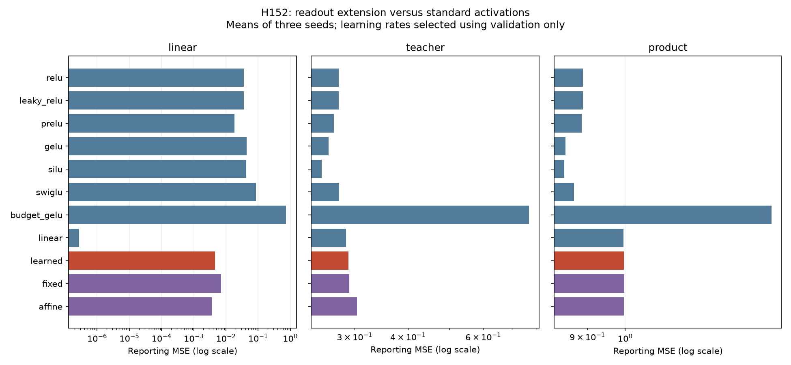

# H152: learned readout fixes linear capacity, but must earn nonlinear performance

**NO PROMOTION from the readout learning pilot.** All198 fits completed their fixed budget. Rate selection uses
validation only; reporting results below are held out from that selection.
Task status: linear: qualified, teacher: qualified, product: inconclusive (positive-control gate failed). Failure is scoped to this initialization,
optimizer/search and300-update budget. An inconclusive task does not establish
that every architecture failed in principle. The broad research goal remains open.

## What was tested

Add a learned32x32 readout and bias after four reversible scalar/orthogonal layers.
At zero shape/bias the core is A*x; W=M*A^-1 exactly represents any linear target.
The CPU FP64 witness passes with max absolute error
2.487e-14. Complete GPU core/readout/input gradients
agree with CPU FP64 native autograd within1e-4 per family (observed maximum
4.236e-07). This evades H151's fixed-tail bound,
but linear representability is not sufficient evidence for complex pattern learning.

The learned candidate uses the existing fused reconstruction backend. Fixed shape
and affine controls use the native reconstructed backend; inference equations and
matched initial core/readout tensors define their learning ablations. Core biases
start at zero, nonzero theta/Q are seeded identically; readout starts at A^T, which
approximately cancels rotation, not nonlinear shape. The fixed-shape control still
learns core biases and the final readout; only its scalar shape is frozen.

Standard controls are four residual FFN blocks x+FFN(x)/2, with hidden32 or
SwiGLU hidden21. Budget GELU hidden4 and a plain linear map test low-parameter
alternatives. ReLU, LeakyReLU(.01), layer-shared PReLU, GELU, SiLU and SwiGLU are
all included. Ungated standard models share seeded weight initialization; gate
shape changes make SwiGLU's initialization structurally different.

| Arm | Trainable parameters | Fixed buffer bytes |
|---|---:|---:|
| relu | 8,448 | 0 |
| leaky_relu | 8,448 | 0 |
| prelu | 8,452 | 0 |
| gelu | 8,448 | 0 |
| silu | 8,448 | 0 |
| swiglu | 8,360 | 0 |
| budget_gelu | 1,168 | 0 |
| linear | 1,056 | 0 |
| learned | 1,312 | 16,384 |
| fixed | 1,184 | 16,896 |
| affine | 1,312 | 16,384 |

This small d32 pilot measures learnability. Its allocated peaks and fit times are
retained as diagnostics, not evidence of production-scale VRAM savings. Inputs
are fixed training data and do not require upstream gradients during fitting;
input-gradient correctness was checked separately in preflight. The earlier
full-scale resource failures are not reclassified by this study.

## Data and matched training

Three fixed target functions: orthogonal linear map; hidden128 GELU teacher;
cyclic pairwise products followed by orthogonal mixing. Functions remain fixed
across seeds263/277/293 while input data and model initialization vary.
Each task/seed has8192 Gaussian samples:4096 training,2048 validation,2048 reporting.
Target mean and global RMS use training data only. Every arm and rate sees the
same300 batches of128 training indices. Batch order is saved and reproducible.

All11 arms receive rates.001 and.003,300 AdamW updates, betas(.9,.95), zero decay,
clip1, FP32/TF32off and four CPU threads. No augmentation, early stopping,
rate-specific extra steps, tuning based on reporting data, or failed-fit replacement.
The chosen rate minimizes mean validation MSE across the three seeds for each
arm/task; ties choose the lower rate. Reporting seeds are model/data repetitions
within the same target function, not three independent target functions.

## Selected reporting results

Means, medians and sample variances across three reporting seeds. MSE is measured
in training-normalized target units; the zero-predictor reporting loss is recorded
per dataset. All unselected rate results remain in result.json.

| Task | Arm | Parameters | Selected LR | Mean MSE | Median MSE | Sample variance |
|---|---|---:|---:|---:|---:|---:|
| linear | relu | 8,448 | 0.003 | 0.03556 | 0.04171 | 1.990e-04 |
| linear | leaky_relu | 8,448 | 0.003 | 0.03636 | 0.04162 | 1.583e-04 |
| linear | prelu | 8,452 | 0.003 | 0.01820 | 0.02404 | 2.467e-04 |
| linear | gelu | 8,448 | 0.003 | 0.04352 | 0.04387 | 1.735e-06 |
| linear | silu | 8,448 | 0.003 | 0.04267 | 0.04190 | 2.700e-06 |
| linear | swiglu | 8,360 | 0.003 | 0.08651 | 0.08581 | 1.770e-05 |
| linear | budget_gelu | 1,168 | 0.003 | 0.74022 | 0.73500 | 6.860e-04 |
| linear | linear | 1,056 | 0.003 | 0.00000 | 0.00000 | 2.680e-15 |
| linear | learned | 1,312 | 0.003 | 0.00462 | 0.00435 | 3.479e-07 |
| linear | fixed | 1,184 | 0.003 | 0.00698 | 0.00656 | 1.291e-06 |
| linear | affine | 1,312 | 0.003 | 0.00367 | 0.00367 | 3.510e-08 |
| teacher | relu | 8,448 | 0.003 | 0.27553 | 0.27514 | 9.553e-07 |
| teacher | leaky_relu | 8,448 | 0.003 | 0.27544 | 0.27505 | 8.402e-07 |
| teacher | prelu | 8,452 | 0.003 | 0.26786 | 0.26819 | 2.594e-06 |
| teacher | gelu | 8,448 | 0.003 | 0.26073 | 0.26036 | 4.720e-07 |
| teacher | silu | 8,448 | 0.003 | 0.25109 | 0.25222 | 4.443e-06 |
| teacher | swiglu | 8,360 | 0.003 | 0.27564 | 0.27502 | 3.446e-06 |
| teacher | budget_gelu | 1,168 | 0.003 | 0.76714 | 0.76287 | 6.972e-05 |
| teacher | linear | 1,056 | 0.003 | 0.28643 | 0.28643 | 4.699e-07 |
| teacher | learned | 1,312 | 0.003 | 0.29036 | 0.29012 | 7.900e-07 |
| teacher | fixed | 1,184 | 0.003 | 0.29121 | 0.29124 | 1.193e-06 |
| teacher | affine | 1,312 | 0.003 | 0.30367 | 0.30483 | 2.480e-05 |
| product | relu | 8,448 | 0.003 | 0.88876 | 0.88728 | 2.343e-04 |
| product | leaky_relu | 8,448 | 0.003 | 0.88834 | 0.88665 | 2.545e-04 |
| product | prelu | 8,452 | 0.003 | 0.88553 | 0.88548 | 1.780e-04 |
| product | gelu | 8,448 | 0.003 | 0.84628 | 0.84589 | 1.913e-04 |
| product | silu | 8,448 | 0.003 | 0.84411 | 0.84439 | 1.759e-04 |
| product | swiglu | 8,360 | 0.003 | 0.86689 | 0.87084 | 6.726e-05 |
| product | budget_gelu | 1,168 | 0.003 | 1.50224 | 1.50317 | 1.808e-04 |
| product | linear | 1,056 | 0.001 | 0.99478 | 1.00069 | 1.555e-04 |
| product | learned | 1,312 | 0.003 | 0.99625 | 1.00172 | 1.374e-04 |
| product | fixed | 1,184 | 0.003 | 0.99746 | 1.00288 | 1.380e-04 |
| product | affine | 1,312 | 0.003 | 0.99615 | 1.00111 | 1.349e-04 |

## Every candidate gate

A task qualifies only if both full GELU and SwiGLU beat zero-predictor reporting
MSE by at least20% in every seed. On qualified tasks the learned candidate must
be within1% of both full controls and budget GELU in every seed. On nonlinear
tasks it must additionally improve fixed-shape and affine controls by at least5%.
Ratios below are learned/control; lower is better. Inconclusive tasks cannot pass
promotion regardless of these diagnostic ratios.

| Task | Seed | Qualified | GELU ratio | SwiGLU ratio | Budget ratio | Fixed ratio | Affine ratio | Failed comparison gates |
|---|---:|---|---:|---:|---:|---:|---:|---|
| linear | 263 | True | 0.096 | 0.046 | 0.006 | 0.690 | 1.149 | none |
| linear | 277 | True | 0.103 | 0.051 | 0.006 | 0.663 | 1.250 | none |
| linear | 293 | True | 0.119 | 0.064 | 0.007 | 0.641 | 1.375 | none |
| teacher | 263 | True | 1.112 | 1.056 | 0.380 | 0.998 | 0.971 | gelu, swiglu, fixed, affine |
| teacher | 277 | True | 1.114 | 1.055 | 0.381 | 0.996 | 0.952 | gelu, swiglu, fixed, affine |
| teacher | 293 | True | 1.114 | 1.049 | 0.375 | 0.997 | 0.946 | gelu, swiglu, fixed |
| product | 263 | False | 1.184 | 1.150 | 0.666 | 0.999 | 1.001 | gelu, swiglu, fixed, affine |
| product | 277 | False | 1.167 | 1.151 | 0.663 | 0.999 | 1.000 | gelu, swiglu, fixed, affine |
| product | 293 | False | 1.180 | 1.146 | 0.660 | 0.999 | 1.000 | gelu, swiglu, fixed, affine |

## Evidence and decision

Independent CPU FP64 scoring implements the equations directly with batches257,
without model.forward or the custom backward. All396 validation/reporting scores
pass relative tolerance1e-5; maximum observed discrepancy is
3.203e-06.
All nine datasets regenerate bitwise. Fixed Q/frozen theta, parameter and buffer
counts, optimizer hyperparameters/counters300 and finite states/moments/recorded
gradient diagnostics verify. Histories record losses/pre-clipping global gradient
norm every25 steps; they do not establish depth-independent gradient health or
identify which parameter family limits learning. Final shapes are in saved states.

There were59,400 training backward/optimizer updates, one GPU and one CPU preflight
backward,199 clean training CUDA boundaries and a clean preflight boundary.
The independent scoring audit initialized no CUDA and ran no backward. One model
was resident at a time. Training wall seconds across all fits sum to
299.8; scoring, initialization, data
transfer/setup outside each timer and audit add further elapsed time.

This is a balanced but limited two-rate pilot, not exhaustive hyperparameter
optimization, a significance test, universal approximation proof, or a SOTA claim.
Do not allocate long language-model training on linear-capacity algebra alone.
The reported gates decide promotion for this recipe; deficits/inconclusive tasks
must guide a distinct hypothesis or a stronger positive-control benchmark, not
be concealed by averaging tasks or selecting a lucky seed. Prior resource and
capacity evidence, maintained source/defaults and receipt hashes remain intact.

[Plan](readout_learning_plan.md), [model](../results/readout_learning_v1/model.py),
[all runs](../results/readout_learning_v1/result.json),
[selection/audit](../results/readout_learning_v1/audit.json),
[receipt](../results/readout_learning_v1/receipt.json).
